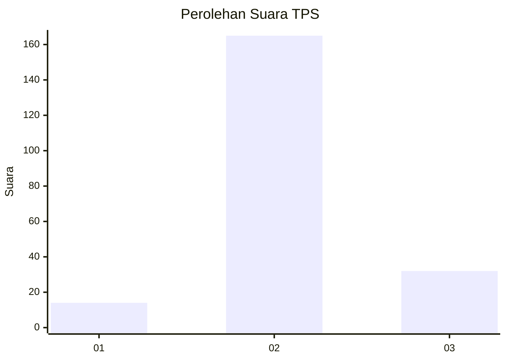

# Hasil

## Grafik

## Tabel

| No. | Nama Paslon    | Suara | Suara (raw) | Persentase |
|:--- |:-------------- | -----:| -----------:| ----------:|
| 1   | ANIES MUHAIMIN | 14    | [14][p-1]   | 6,64       |
| 2   | PRABOWO GIBRAN | 165   | [165][p-2]  | 78,20      |
| 3   | GANJAR MAHFUD  | 32    | [32][p-3]   | 15,17      |

[p-1]: https://github.com/gigit-pemilu/pemilu-2024/blob/main/pilpres/hitung-suara/sub/35-jawa-timur/sub/06-kediri/sub/15-purwoasri/sub/2014-klampitan/sub/001-tps/sub/paslon-1.txt
[p-2]: https://github.com/gigit-pemilu/pemilu-2024/blob/main/pilpres/hitung-suara/sub/35-jawa-timur/sub/06-kediri/sub/15-purwoasri/sub/2014-klampitan/sub/001-tps/sub/paslon-2.txt
[p-3]: https://github.com/gigit-pemilu/pemilu-2024/blob/main/pilpres/hitung-suara/sub/35-jawa-timur/sub/06-kediri/sub/15-purwoasri/sub/2014-klampitan/sub/001-tps/sub/paslon-3.txt

## Foto C Plano

https://sirekap-obj-formc.kpu.go.id/0908/pemilu/ppwp/35/06/15/20/14/3506152014001-20240214-210622--506c9a05-c35b-48fd-a770-72d7d258c7e0.jpg

https://sirekap-obj-formc.kpu.go.id/0908/pemilu/ppwp/35/06/15/20/14/3506152014001-20240214-214800--c01ee187-b4e7-4f7b-9a9c-0a2677cd72f8.jpg

https://sirekap-obj-formc.kpu.go.id/0908/pemilu/ppwp/35/06/15/20/14/3506152014001-20240214-214918--79127c11-184e-4c23-b8ce-dd62ad111357.jpg

## Metadata

| Key        | Value               |
| ---------- | ------------------- |
| Time Stamp | 2024-02-15 17:30:25 |

