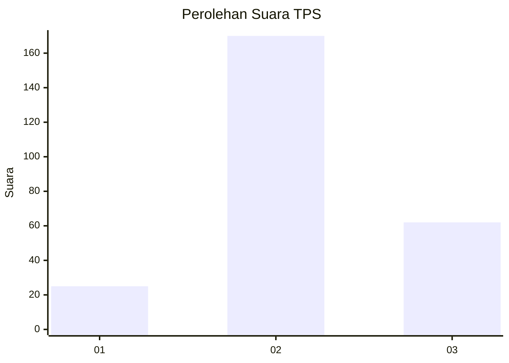
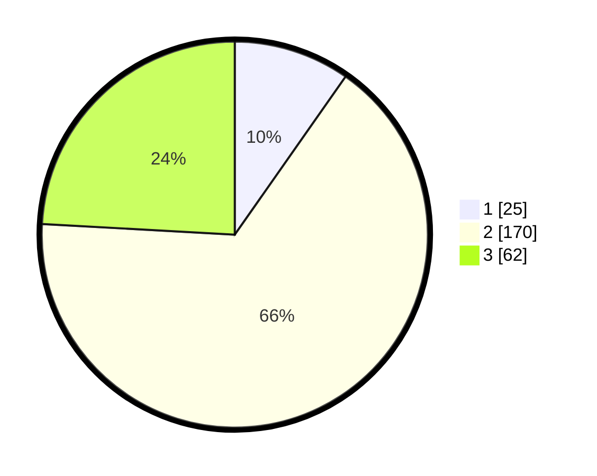

# Hasil

## Grafik

## Tabel

| No. | Nama Paslon    | Suara | Suara (raw) | Persentase |
|:--- |:-------------- | -----:| -----------:| ----------:|
| 1   | ANIES MUHAIMIN | 25    | [25][p-1]   | 9,73       |
| 2   | PRABOWO GIBRAN | 170   | [170][p-2]  | 66,15      |
| 3   | GANJAR MAHFUD  | 62    | [62][p-3]   | 24,12      |

[p-1]: https://github.com/gigit-pemilu/pemilu-2024/blob/main/pilpres/hitung-suara/sub/35-jawa-timur/sub/06-kediri/sub/15-purwoasri/sub/2015-woromarto/sub/008-tps/sub/paslon-1.txt
[p-2]: https://github.com/gigit-pemilu/pemilu-2024/blob/main/pilpres/hitung-suara/sub/35-jawa-timur/sub/06-kediri/sub/15-purwoasri/sub/2015-woromarto/sub/008-tps/sub/paslon-2.txt
[p-3]: https://github.com/gigit-pemilu/pemilu-2024/blob/main/pilpres/hitung-suara/sub/35-jawa-timur/sub/06-kediri/sub/15-purwoasri/sub/2015-woromarto/sub/008-tps/sub/paslon-3.txt

## Foto C Plano

https://sirekap-obj-formc.kpu.go.id/f85c/pemilu/ppwp/35/06/15/20/15/3506152015008-20240215-100452--6c5dac49-2707-4fa9-a1b4-daa811435025.jpg

https://sirekap-obj-formc.kpu.go.id/f85c/pemilu/ppwp/35/06/15/20/15/3506152015008-20240215-100558--12066afa-c422-420c-8cc0-2e6a64ae2387.jpg

https://sirekap-obj-formc.kpu.go.id/f85c/pemilu/ppwp/35/06/15/20/15/3506152015008-20240215-100801--fa87dfe4-3084-4aea-bcb7-d9edb39bca42.jpg

## Metadata

| Key        | Value               |
| ---------- | ------------------- |
| Time Stamp | 2024-02-17 16:00:02 |

