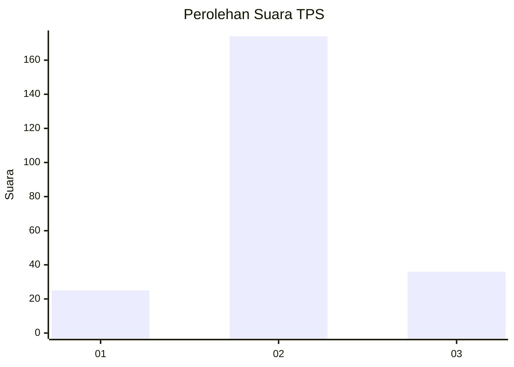
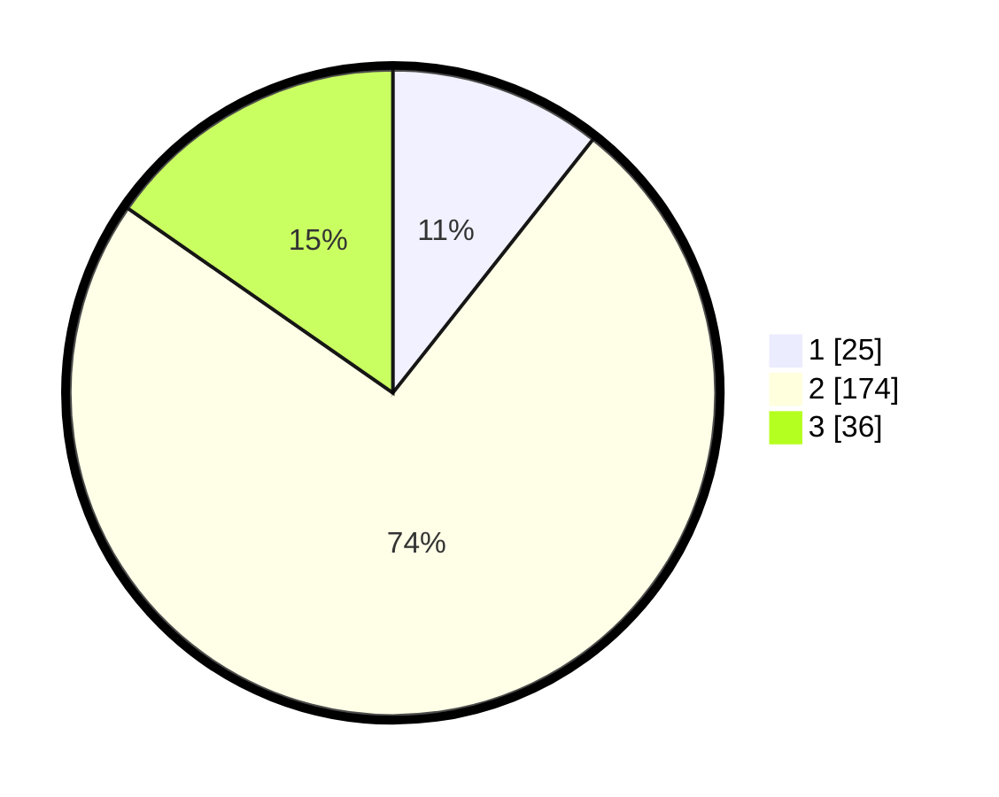

# Hasil

## Grafik

## Tabel

| No. | Nama Paslon    | Suara | Suara (raw) | Persentase |
|:--- |:-------------- | -----:| -----------:| ----------:|
| 1   | ANIES MUHAIMIN | 25    | [25][p-1]   | 10,64      |
| 2   | PRABOWO GIBRAN | 174   | [174][p-2]  | 74,04      |
| 3   | GANJAR MAHFUD  | 36    | [36][p-3]   | 15,32      |

[p-1]: https://github.com/gigit-pemilu/pemilu-2024/blob/main/pilpres/hitung-suara/sub/35-jawa-timur/sub/06-kediri/sub/15-purwoasri/sub/2016-muneng/sub/002-tps/sub/paslon-1.txt
[p-2]: https://github.com/gigit-pemilu/pemilu-2024/blob/main/pilpres/hitung-suara/sub/35-jawa-timur/sub/06-kediri/sub/15-purwoasri/sub/2016-muneng/sub/002-tps/sub/paslon-2.txt
[p-3]: https://github.com/gigit-pemilu/pemilu-2024/blob/main/pilpres/hitung-suara/sub/35-jawa-timur/sub/06-kediri/sub/15-purwoasri/sub/2016-muneng/sub/002-tps/sub/paslon-3.txt

## Foto C Plano

https://sirekap-obj-formc.kpu.go.id/db9e/pemilu/ppwp/35/06/15/20/16/3506152016002-20240214-233221--246205ad-45fa-401f-a7c2-3be6a2c1d7fd.jpg

https://sirekap-obj-formc.kpu.go.id/db9e/pemilu/ppwp/35/06/15/20/16/3506152016002-20240214-233723--6ff9446d-0a9b-4754-b90e-97515b3a2deb.jpg

https://sirekap-obj-formc.kpu.go.id/db9e/pemilu/ppwp/35/06/15/20/16/3506152016002-20240214-233857--3fbb229b-5761-4ac2-b6ff-db9865f1b218.jpg

## Metadata

| Key        | Value               |
| ---------- | ------------------- |
| Time Stamp | 2024-02-16 22:30:00 |

