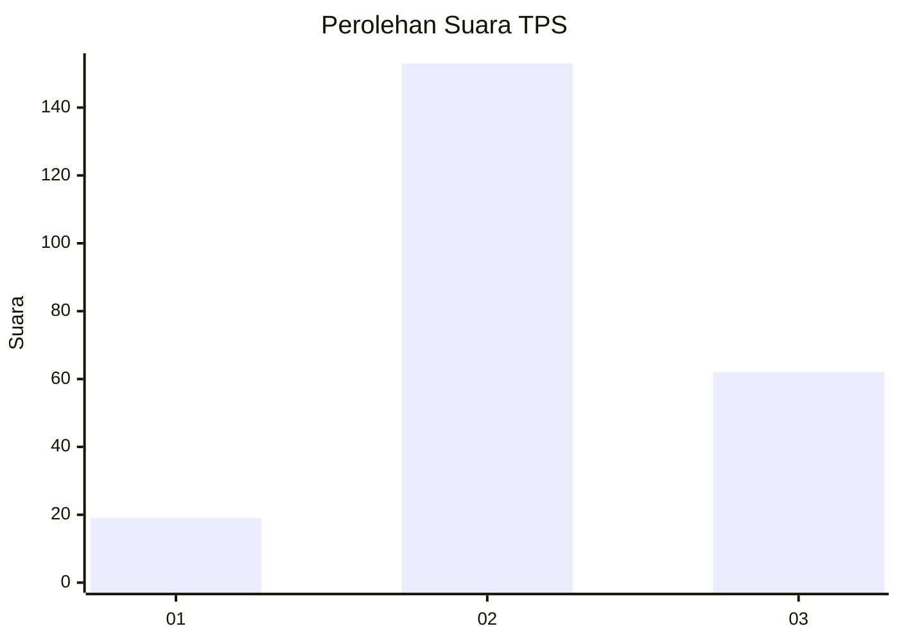

# Hasil

## Grafik

## Tabel

| No. | Nama Paslon    | Suara | Suara (raw) | Persentase |
|:--- |:-------------- | -----:| -----------:| ----------:|
| 1   | ANIES MUHAIMIN | 19    | [19][p-1]   | 8,12       |
| 2   | PRABOWO GIBRAN | 153   | [153][p-2]  | 65,38      |
| 3   | GANJAR MAHFUD  | 62    | [62][p-3]   | 26,50      |

[p-1]: https://github.com/gigit-pemilu/pemilu-2024/blob/main/pilpres/hitung-suara/sub/35-jawa-timur/sub/06-kediri/sub/15-purwoasri/sub/2016-muneng/sub/003-tps/sub/paslon-1.txt
[p-2]: https://github.com/gigit-pemilu/pemilu-2024/blob/main/pilpres/hitung-suara/sub/35-jawa-timur/sub/06-kediri/sub/15-purwoasri/sub/2016-muneng/sub/003-tps/sub/paslon-2.txt
[p-3]: https://github.com/gigit-pemilu/pemilu-2024/blob/main/pilpres/hitung-suara/sub/35-jawa-timur/sub/06-kediri/sub/15-purwoasri/sub/2016-muneng/sub/003-tps/sub/paslon-3.txt

## Foto C Plano

https://sirekap-obj-formc.kpu.go.id/4fe4/pemilu/ppwp/35/06/15/20/16/3506152016003-20240215-005203--2bd4a2c0-7e80-41f0-89cf-e7a6086c6152.jpg

https://sirekap-obj-formc.kpu.go.id/4fe4/pemilu/ppwp/35/06/15/20/16/3506152016003-20240214-213741--55bd00f8-7996-493d-8a6e-6dc6e958d05b.jpg

https://sirekap-obj-formc.kpu.go.id/4fe4/pemilu/ppwp/35/06/15/20/16/3506152016003-20240214-230215--1f5036d4-3206-4f51-86ea-4e9b796f9ffa.jpg

## Metadata

| Key        | Value               |
| ---------- | ------------------- |
| Time Stamp | 2024-02-16 22:30:00 |

