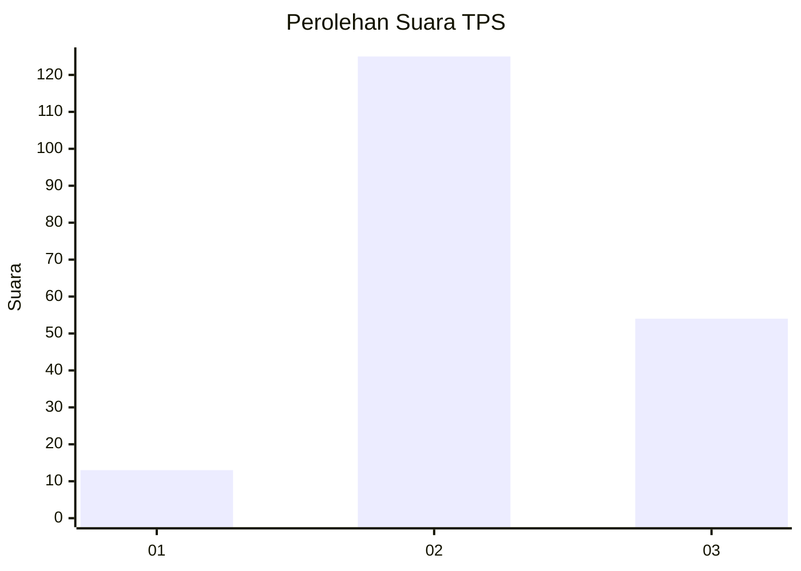
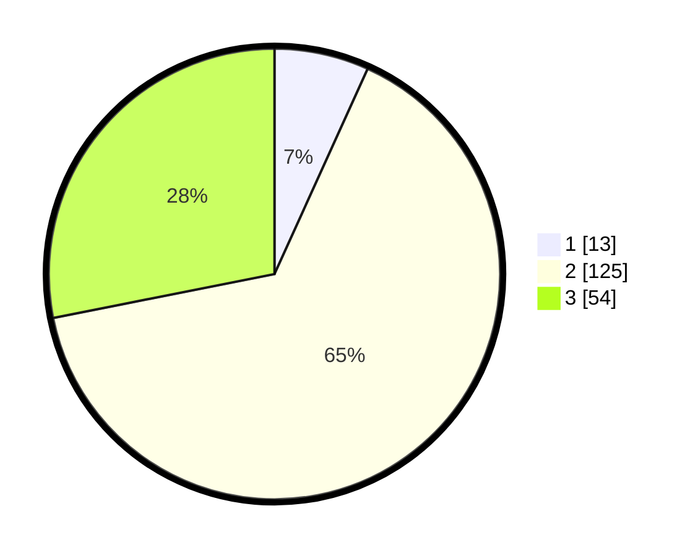

# Hasil

## Grafik

## Tabel

| No. | Nama Paslon    | Suara | Suara (raw) | Persentase |
|:--- |:-------------- | -----:| -----------:| ----------:|
| 1   | ANIES MUHAIMIN | 13    | [13][p-1]   | 6,77       |
| 2   | PRABOWO GIBRAN | 125   | [125][p-2]  | 65,10      |
| 3   | GANJAR MAHFUD  | 54    | [54][p-3]   | 28,13      |

[p-1]: https://github.com/gigit-pemilu/pemilu-2024-35-jawa-timur/blob/main/pilpres/hitung-suara/sub/35-jawa-timur/sub/06-kediri/sub/15-purwoasri/sub/2017-merjoyo/sub/004-tps/sub/paslon-1.txt
[p-2]: https://github.com/gigit-pemilu/pemilu-2024-35-jawa-timur/blob/main/pilpres/hitung-suara/sub/35-jawa-timur/sub/06-kediri/sub/15-purwoasri/sub/2017-merjoyo/sub/004-tps/sub/paslon-2.txt
[p-3]: https://github.com/gigit-pemilu/pemilu-2024-35-jawa-timur/blob/main/pilpres/hitung-suara/sub/35-jawa-timur/sub/06-kediri/sub/15-purwoasri/sub/2017-merjoyo/sub/004-tps/sub/paslon-3.txt

## Foto C Plano

https://sirekap-obj-formc.kpu.go.id/cce6/pemilu/ppwp/35/06/15/20/17/3506152017004-20240215-110441--226b6ab7-3254-468a-af54-e00184618c41.jpg

https://sirekap-obj-formc.kpu.go.id/cce6/pemilu/ppwp/35/06/15/20/17/3506152017004-20240215-103833--4e5184f2-0063-4158-86b1-88b2e63d045b.jpg

https://sirekap-obj-formc.kpu.go.id/cce6/pemilu/ppwp/35/06/15/20/17/3506152017004-20240214-234954--98494f07-5c25-476b-b956-2b067f17bb68.jpg

## Metadata

| Key        | Value               |
| ---------- | ------------------- |
| Time Stamp | 2024-02-17 11:30:03 |

