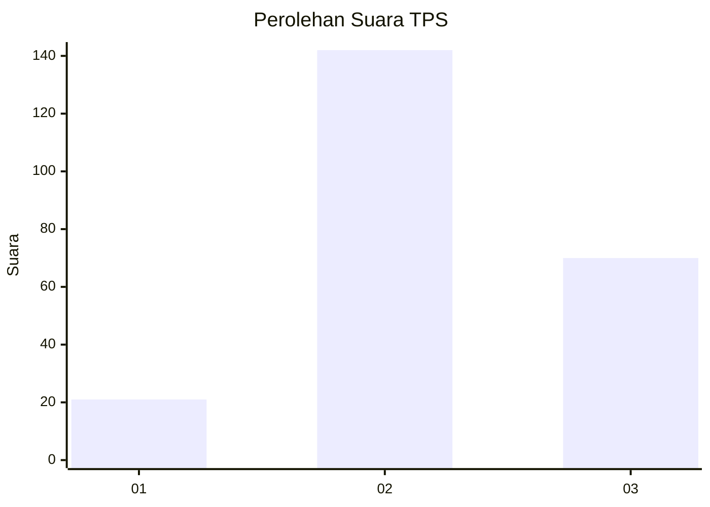
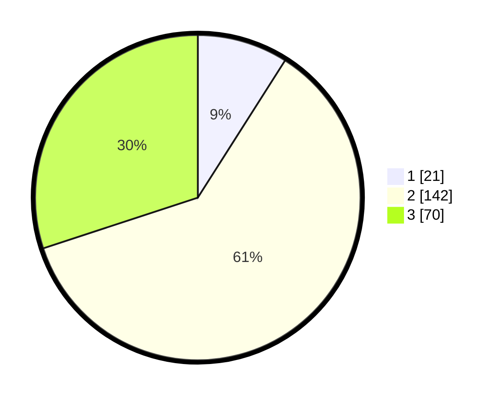

# Hasil

## Grafik

## Tabel

| No. | Nama Paslon    | Suara | Suara (raw) | Persentase |
|:--- |:-------------- | -----:| -----------:| ----------:|
| 1   | ANIES MUHAIMIN | 21    | [21][p-1]   | 9,01       |
| 2   | PRABOWO GIBRAN | 142   | [142][p-2]  | 60,94      |
| 3   | GANJAR MAHFUD  | 70    | [70][p-3]   | 30,04      |

[p-1]: https://github.com/gigit-pemilu/pemilu-2024/blob/main/pilpres/hitung-suara/sub/35-jawa-timur/sub/06-kediri/sub/15-purwoasri/sub/2018-mekikis/sub/005-tps/sub/paslon-1.txt
[p-2]: https://github.com/gigit-pemilu/pemilu-2024/blob/main/pilpres/hitung-suara/sub/35-jawa-timur/sub/06-kediri/sub/15-purwoasri/sub/2018-mekikis/sub/005-tps/sub/paslon-2.txt
[p-3]: https://github.com/gigit-pemilu/pemilu-2024/blob/main/pilpres/hitung-suara/sub/35-jawa-timur/sub/06-kediri/sub/15-purwoasri/sub/2018-mekikis/sub/005-tps/sub/paslon-3.txt

## Foto C Plano

https://sirekap-obj-formc.kpu.go.id/f60f/pemilu/ppwp/35/06/15/20/18/3506152018005-20240215-095936--23c65d6c-0fa5-413c-bdd4-62ae4bfc7c25.jpg

https://sirekap-obj-formc.kpu.go.id/f60f/pemilu/ppwp/35/06/15/20/18/3506152018005-20240215-100108--1a26616f-2960-46c7-84df-a6b901d0c1e8.jpg

https://sirekap-obj-formc.kpu.go.id/f60f/pemilu/ppwp/35/06/15/20/18/3506152018005-20240215-100153--9f30c5d3-0ebe-4a85-aeee-9a3632487c14.jpg

## Metadata

| Key        | Value               |
| ---------- | ------------------- |
| Time Stamp | 2024-02-20 17:00:00 |

