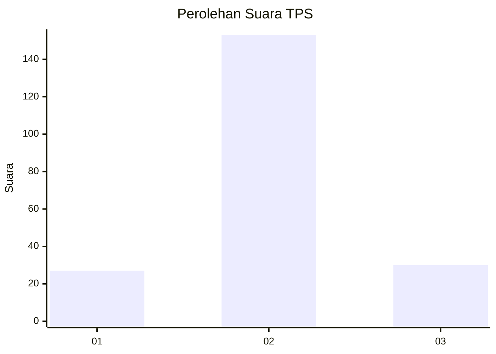
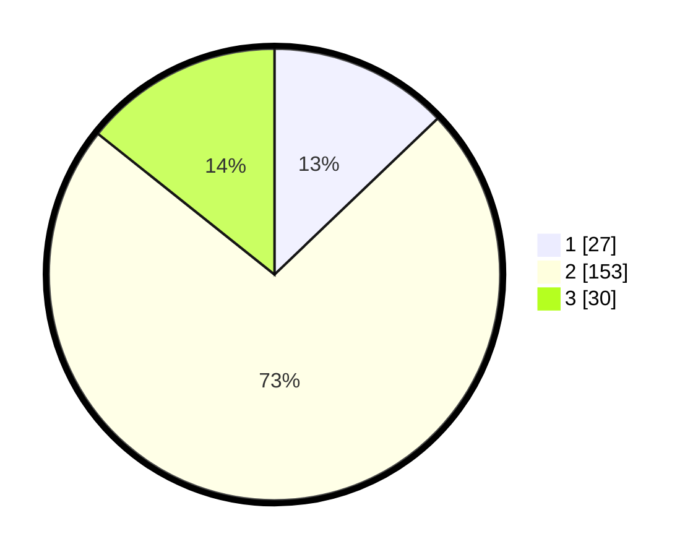

# Hasil

## Grafik

## Tabel

| No. | Nama Paslon    | Suara | Suara (raw) | Persentase |
|:--- |:-------------- | -----:| -----------:| ----------:|
| 1   | ANIES MUHAIMIN | 27    | [27][p-1]   | 12,86      |
| 2   | PRABOWO GIBRAN | 153   | [153][p-2]  | 72,86      |
| 3   | GANJAR MAHFUD  | 30    | [30][p-3]   | 14,29      |

[p-1]: https://github.com/gigit-pemilu/pemilu-2024-35-jawa-timur/blob/main/pilpres/hitung-suara/sub/35-jawa-timur/sub/06-kediri/sub/15-purwoasri/sub/2020-dayu/sub/003-tps/sub/paslon-1.txt
[p-2]: https://github.com/gigit-pemilu/pemilu-2024-35-jawa-timur/blob/main/pilpres/hitung-suara/sub/35-jawa-timur/sub/06-kediri/sub/15-purwoasri/sub/2020-dayu/sub/003-tps/sub/paslon-2.txt
[p-3]: https://github.com/gigit-pemilu/pemilu-2024-35-jawa-timur/blob/main/pilpres/hitung-suara/sub/35-jawa-timur/sub/06-kediri/sub/15-purwoasri/sub/2020-dayu/sub/003-tps/sub/paslon-3.txt

## Foto C Plano

https://sirekap-obj-formc.kpu.go.id/15a6/pemilu/ppwp/35/06/15/20/20/3506152020003-20240214-220445--7fe2db8c-7a50-4102-b11a-3ff9fc7bbe35.jpg

https://sirekap-obj-formc.kpu.go.id/15a6/pemilu/ppwp/35/06/15/20/20/3506152020003-20240214-221217--06855bcc-2683-4703-a30e-4ad9cafb470f.jpg

https://sirekap-obj-formc.kpu.go.id/15a6/pemilu/ppwp/35/06/15/20/20/3506152020003-20240214-221311--818ae006-e5a5-4daf-a6e4-6dad59ab8dfc.jpg

## Metadata

| Key        | Value               |
| ---------- | ------------------- |
| Time Stamp | 2024-02-17 13:37:34 |

