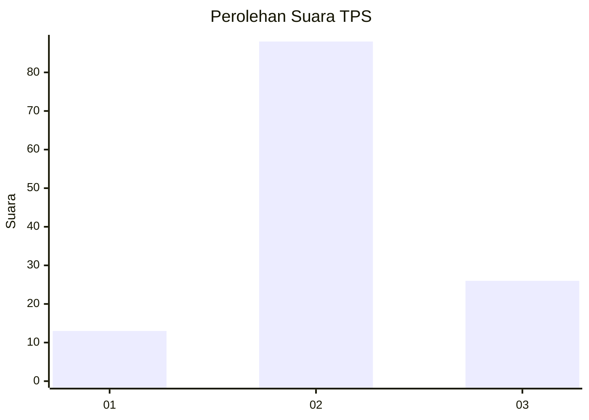
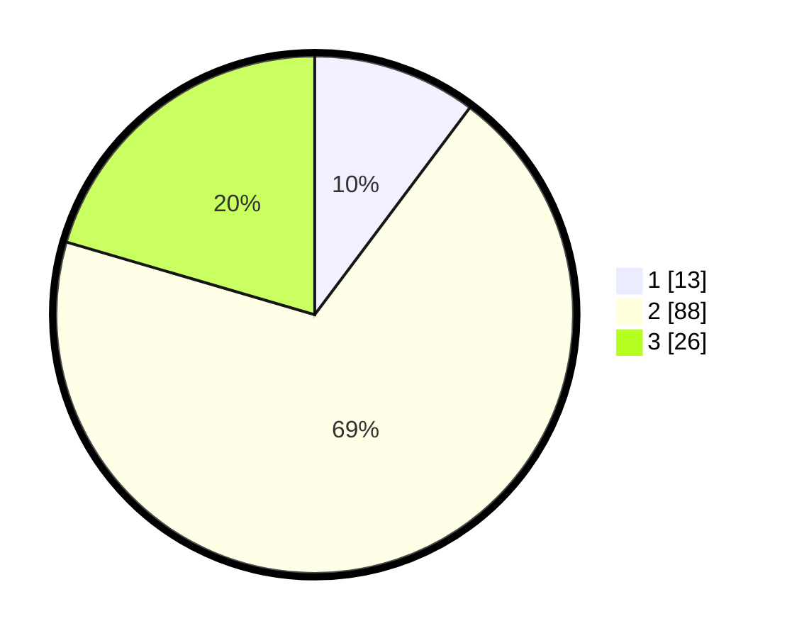

# Hasil

## Grafik

## Tabel

| No. | Nama Paslon    | Suara | Suara (raw) | Persentase |
|:--- |:-------------- | -----:| -----------:| ----------:|
| 1   | ANIES MUHAIMIN | 13    | [13][p-1]   | 10,24      |
| 2   | PRABOWO GIBRAN | 88    | [88][p-2]   | 69,29      |
| 3   | GANJAR MAHFUD  | 26    | [26][p-3]   | 20,47      |

[p-1]: https://github.com/gigit-pemilu/pemilu-2024-35-jawa-timur/blob/main/pilpres/hitung-suara/sub/35-jawa-timur/sub/06-kediri/sub/15-purwoasri/sub/2023-sumberjo/sub/003-tps/sub/paslon-1.txt
[p-2]: https://github.com/gigit-pemilu/pemilu-2024-35-jawa-timur/blob/main/pilpres/hitung-suara/sub/35-jawa-timur/sub/06-kediri/sub/15-purwoasri/sub/2023-sumberjo/sub/003-tps/sub/paslon-2.txt
[p-3]: https://github.com/gigit-pemilu/pemilu-2024-35-jawa-timur/blob/main/pilpres/hitung-suara/sub/35-jawa-timur/sub/06-kediri/sub/15-purwoasri/sub/2023-sumberjo/sub/003-tps/sub/paslon-3.txt

## Foto C Plano

https://sirekap-obj-formc.kpu.go.id/8782/pemilu/ppwp/35/06/15/20/23/3506152023003-20240214-221349--d2ddb5e8-832f-4b36-8d8f-8952d465b231.jpg

https://sirekap-obj-formc.kpu.go.id/8782/pemilu/ppwp/35/06/15/20/23/3506152023003-20240214-192738--77c504f9-be37-4c98-bd6b-9091b28777f0.jpg

https://sirekap-obj-formc.kpu.go.id/8782/pemilu/ppwp/35/06/15/20/23/3506152023003-20240214-204944--ed621c08-7c9c-418a-8a4e-6753d19f461e.jpg

## Metadata

| Key        | Value               |
| ---------- | ------------------- |
| Time Stamp | 2024-02-20 18:00:00 |

