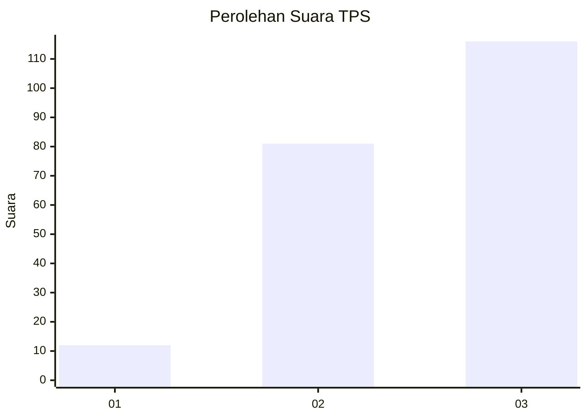
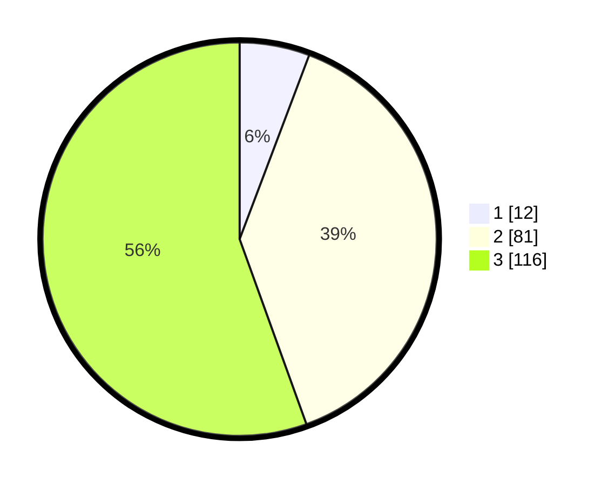

# Hasil

## Grafik

## Tabel

| No. | Nama Paslon    | Suara | Suara (raw) | Persentase |
|:--- |:-------------- | -----:| -----------:| ----------:|
| 1   | ANIES MUHAIMIN | 12    | [12][p-1]   | 5,74       |
| 2   | PRABOWO GIBRAN | 81    | [81][p-2]   | 38,76      |
| 3   | GANJAR MAHFUD  | 116   | [116][p-3]  | 55,50      |

[p-1]: https://github.com/gigit-pemilu/pemilu-2024-35-jawa-timur/blob/main/pilpres/hitung-suara/sub/35-jawa-timur/sub/06-kediri/sub/17-pare/sub/1009-pare/sub/030-tps/sub/paslon-1.txt
[p-2]: https://github.com/gigit-pemilu/pemilu-2024-35-jawa-timur/blob/main/pilpres/hitung-suara/sub/35-jawa-timur/sub/06-kediri/sub/17-pare/sub/1009-pare/sub/030-tps/sub/paslon-2.txt
[p-3]: https://github.com/gigit-pemilu/pemilu-2024-35-jawa-timur/blob/main/pilpres/hitung-suara/sub/35-jawa-timur/sub/06-kediri/sub/17-pare/sub/1009-pare/sub/030-tps/sub/paslon-3.txt

## Foto C Plano

https://sirekap-obj-formc.kpu.go.id/47aa/pemilu/ppwp/35/06/17/10/09/3506171009030-20240217-211425--9eef775a-935f-4397-a338-220c80b91093.jpg

https://sirekap-obj-formc.kpu.go.id/47aa/pemilu/ppwp/35/06/17/10/09/3506171009030-20240215-001628--bc7d2eba-5f49-4d01-8034-e6ea986747aa.jpg

https://sirekap-obj-formc.kpu.go.id/47aa/pemilu/ppwp/35/06/17/10/09/3506171009030-20240215-001643--bb22d000-6ad3-4352-9951-d416249f65f6.jpg

## Metadata

| Key        | Value               |
| ---------- | ------------------- |
| Time Stamp | 2024-02-19 06:16:00 |

