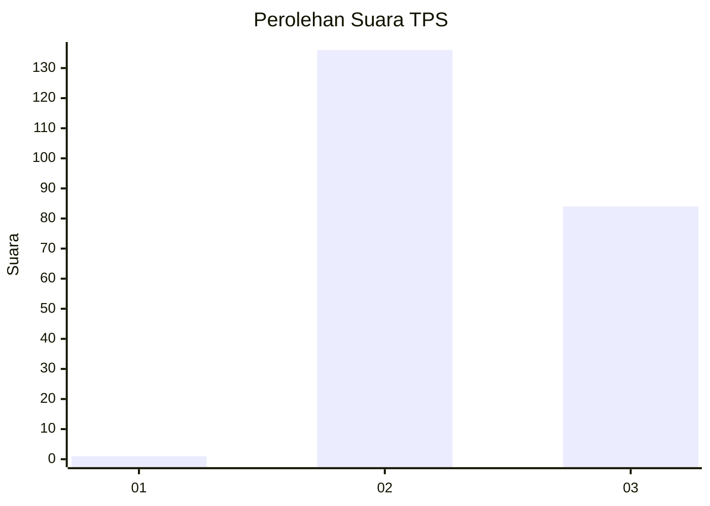
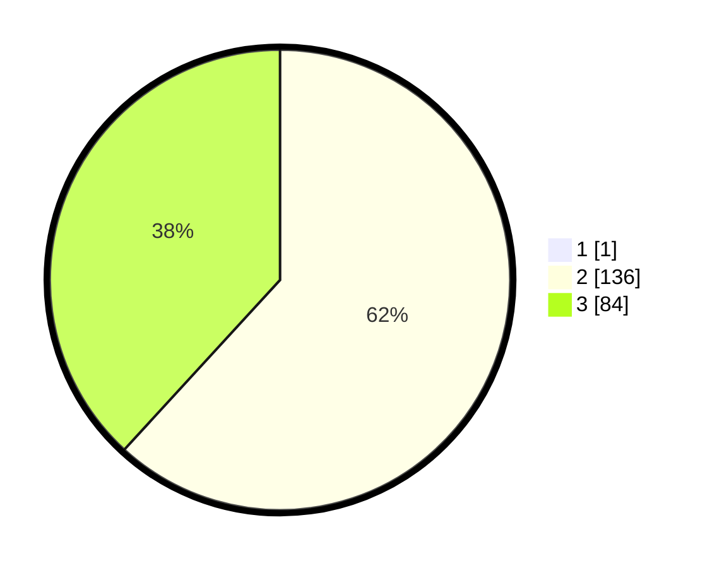

# Hasil

## Grafik

## Tabel

| No. | Nama Paslon    | Suara | Suara (raw) | Persentase |
|:--- |:-------------- | -----:| -----------:| ----------:|
| 1   | ANIES MUHAIMIN | 1     | [1][p-1]    | 0,45       |
| 2   | PRABOWO GIBRAN | 136   | [136][p-2]  | 61,54      |
| 3   | GANJAR MAHFUD  | 84    | [84][p-3]   | 38,01      |

[p-1]: https://github.com/gigit-pemilu/pemilu-2024/blob/main/pilpres/hitung-suara/sub/35-jawa-timur/sub/06-kediri/sub/17-pare/sub/2001-sidorejo/sub/003-tps/sub/paslon-1.txt
[p-2]: https://github.com/gigit-pemilu/pemilu-2024/blob/main/pilpres/hitung-suara/sub/35-jawa-timur/sub/06-kediri/sub/17-pare/sub/2001-sidorejo/sub/003-tps/sub/paslon-2.txt
[p-3]: https://github.com/gigit-pemilu/pemilu-2024/blob/main/pilpres/hitung-suara/sub/35-jawa-timur/sub/06-kediri/sub/17-pare/sub/2001-sidorejo/sub/003-tps/sub/paslon-3.txt

## Foto C Plano

https://sirekap-obj-formc.kpu.go.id/0ed7/pemilu/ppwp/35/06/17/20/01/3506172001003-20240214-204235--ceeb2ad4-4641-4b50-9f40-c4a3ac8953a2.jpg

https://sirekap-obj-formc.kpu.go.id/0ed7/pemilu/ppwp/35/06/17/20/01/3506172001003-20240214-204422--f7ac5204-1969-4abb-9d30-5e6fb51279ff.jpg

https://sirekap-obj-formc.kpu.go.id/0ed7/pemilu/ppwp/35/06/17/20/01/3506172001003-20240214-204517--b328f1e1-a6c7-4284-83a5-2ee6b0a42f24.jpg

## Metadata

| Key        | Value               |
| ---------- | ------------------- |
| Time Stamp | 2024-02-16 21:01:00 |

