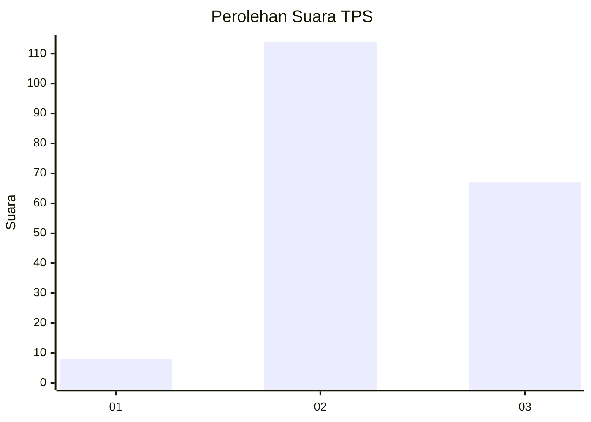
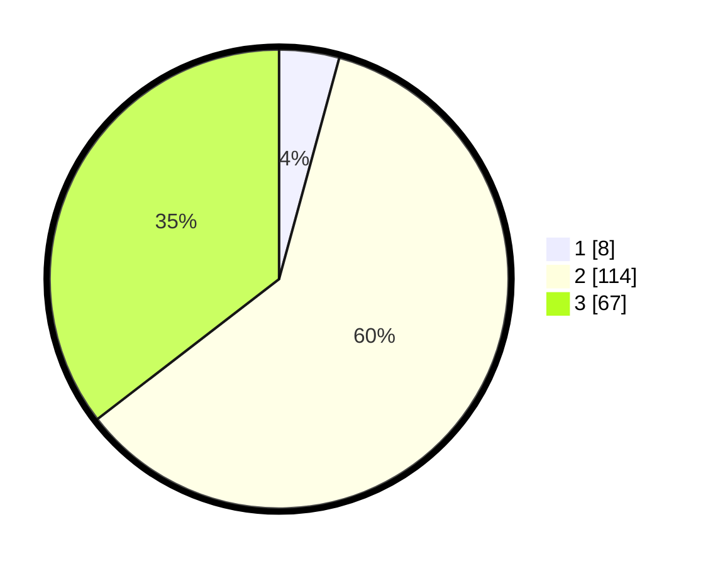

# Hasil

## Grafik

## Tabel

| No. | Nama Paslon    | Suara | Suara (raw) | Persentase |
|:--- |:-------------- | -----:| -----------:| ----------:|
| 1   | ANIES MUHAIMIN | 8     | [8][p-1]    | 4,23       |
| 2   | PRABOWO GIBRAN | 114   | [114][p-2]  | 60,32      |
| 3   | GANJAR MAHFUD  | 67    | [67][p-3]   | 35,45      |

[p-1]: https://github.com/gigit-pemilu/pemilu-2024/blob/main/pilpres/hitung-suara/sub/35-jawa-timur/sub/06-kediri/sub/17-pare/sub/2003-gedangsewu/sub/002-tps/sub/paslon-1.txt
[p-2]: https://github.com/gigit-pemilu/pemilu-2024/blob/main/pilpres/hitung-suara/sub/35-jawa-timur/sub/06-kediri/sub/17-pare/sub/2003-gedangsewu/sub/002-tps/sub/paslon-2.txt
[p-3]: https://github.com/gigit-pemilu/pemilu-2024/blob/main/pilpres/hitung-suara/sub/35-jawa-timur/sub/06-kediri/sub/17-pare/sub/2003-gedangsewu/sub/002-tps/sub/paslon-3.txt

## Foto C Plano

https://sirekap-obj-formc.kpu.go.id/a2b1/pemilu/ppwp/35/06/17/20/03/3506172003002-20240218-194334--23ef09fa-f232-41a8-b144-7d0de7fbd337.jpg

https://sirekap-obj-formc.kpu.go.id/a2b1/pemilu/ppwp/35/06/17/20/03/3506172003002-20240218-194228--a50f73e2-6722-4e98-9c70-561b0bae2c88.jpg

https://sirekap-obj-formc.kpu.go.id/a2b1/pemilu/ppwp/35/06/17/20/03/3506172003002-20240214-235238--7221daa5-2da0-47e5-8300-3437f3dacad3.jpg

## Metadata

| Key        | Value               |
| ---------- | ------------------- |
| Time Stamp | 2024-02-20 17:00:00 |

