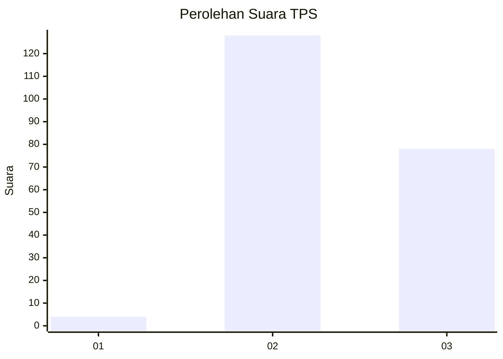
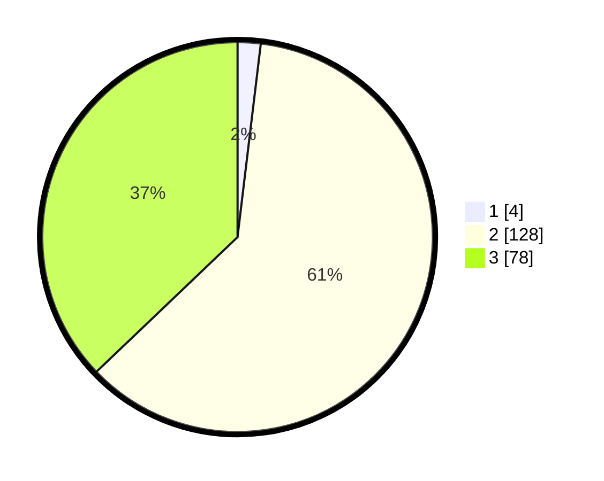

# Hasil

## Grafik

## Tabel

| No. | Nama Paslon    | Suara | Suara (raw) | Persentase |
|:--- |:-------------- | -----:| -----------:| ----------:|
| 1   | ANIES MUHAIMIN | 4     | [4][p-1]    | 1,90       |
| 2   | PRABOWO GIBRAN | 128   | [128][p-2]  | 60,95      |
| 3   | GANJAR MAHFUD  | 78    | [78][p-3]   | 37,14      |

[p-1]: https://github.com/gigit-pemilu/pemilu-2024-35-jawa-timur/blob/main/pilpres/hitung-suara/sub/35-jawa-timur/sub/06-kediri/sub/17-pare/sub/2003-gedangsewu/sub/005-tps/sub/paslon-1.txt
[p-2]: https://github.com/gigit-pemilu/pemilu-2024-35-jawa-timur/blob/main/pilpres/hitung-suara/sub/35-jawa-timur/sub/06-kediri/sub/17-pare/sub/2003-gedangsewu/sub/005-tps/sub/paslon-2.txt
[p-3]: https://github.com/gigit-pemilu/pemilu-2024-35-jawa-timur/blob/main/pilpres/hitung-suara/sub/35-jawa-timur/sub/06-kediri/sub/17-pare/sub/2003-gedangsewu/sub/005-tps/sub/paslon-3.txt

## Foto C Plano

https://sirekap-obj-formc.kpu.go.id/91a5/pemilu/ppwp/35/06/17/20/03/3506172003005-20240218-011520--581057d4-eccb-42db-a1c8-157d24826809.jpg

https://sirekap-obj-formc.kpu.go.id/91a5/pemilu/ppwp/35/06/17/20/03/3506172003005-20240218-010936--752c7841-8a1f-4cff-8a4e-a873d25953bd.jpg

https://sirekap-obj-formc.kpu.go.id/91a5/pemilu/ppwp/35/06/17/20/03/3506172003005-20240218-005858--51d575ee-076b-4073-9bfd-3aed0af1c863.jpg

## Metadata

| Key        | Value               |
| ---------- | ------------------- |
| Time Stamp | 2024-02-19 06:16:00 |

