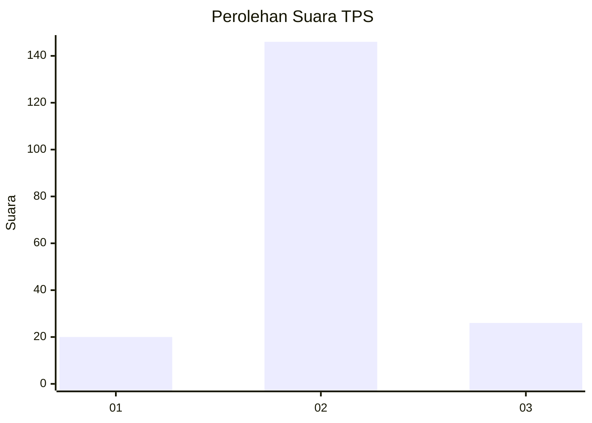
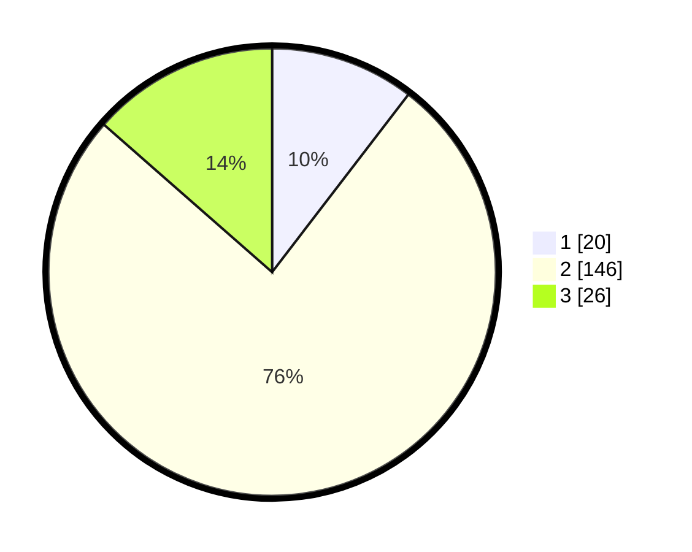

# Hasil

## Grafik

## Tabel

| No. | Nama Paslon    | Suara | Suara (raw) | Persentase |
|:--- |:-------------- | -----:| -----------:| ----------:|
| 1   | ANIES MUHAIMIN | 20    | [20][p-1]   | 10,42      |
| 2   | PRABOWO GIBRAN | 146   | [146][p-2]  | 76,04      |
| 3   | GANJAR MAHFUD  | 26    | [26][p-3]   | 13,54      |

[p-1]: https://github.com/gigit-pemilu/pemilu-2024/blob/main/pilpres/hitung-suara/sub/35-jawa-timur/sub/06-kediri/sub/17-pare/sub/2003-gedangsewu/sub/014-tps/sub/paslon-1.txt
[p-2]: https://github.com/gigit-pemilu/pemilu-2024/blob/main/pilpres/hitung-suara/sub/35-jawa-timur/sub/06-kediri/sub/17-pare/sub/2003-gedangsewu/sub/014-tps/sub/paslon-2.txt
[p-3]: https://github.com/gigit-pemilu/pemilu-2024/blob/main/pilpres/hitung-suara/sub/35-jawa-timur/sub/06-kediri/sub/17-pare/sub/2003-gedangsewu/sub/014-tps/sub/paslon-3.txt

## Foto C Plano

https://sirekap-obj-formc.kpu.go.id/0dcb/pemilu/ppwp/35/06/17/20/03/3506172003014-20240221-131337--3bf500d1-a37c-44f3-b225-c1cb5e0aab2b.jpg

https://sirekap-obj-formc.kpu.go.id/0dcb/pemilu/ppwp/35/06/17/20/03/3506172003014-20240220-151742--39dfd3c3-befc-4ed6-a08a-252d1902efa9.jpg

https://sirekap-obj-formc.kpu.go.id/0dcb/pemilu/ppwp/35/06/17/20/03/3506172003014-20240220-135944--508772dd-4c49-45c3-aa69-bf69fb6b6cd7.jpg

## Metadata

| Key        | Value               |
| ---------- | ------------------- |
| Time Stamp | 2024-02-21 14:00:00 |

