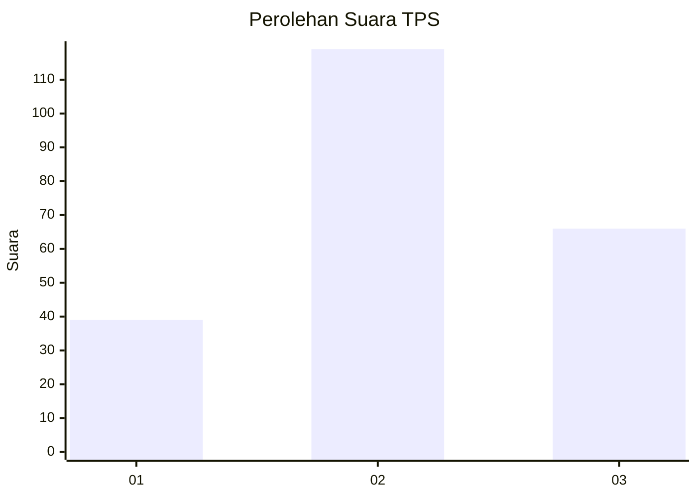
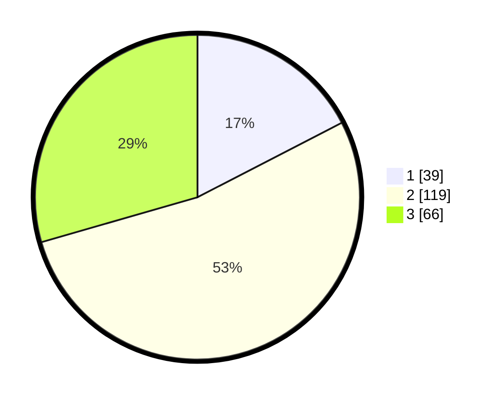

# Hasil

## Grafik

## Tabel

| No. | Nama Paslon    | Suara | Suara (raw) | Persentase |
|:--- |:-------------- | -----:| -----------:| ----------:|
| 1   | ANIES MUHAIMIN | 39    | [39][p-1]   | 17,41      |
| 2   | PRABOWO GIBRAN | 119   | [119][p-2]  | 53,13      |
| 3   | GANJAR MAHFUD  | 66    | [66][p-3]   | 29,46      |

[p-1]: https://github.com/gigit-pemilu/pemilu-2024/blob/main/pilpres/hitung-suara/sub/35-jawa-timur/sub/06-kediri/sub/17-pare/sub/2003-gedangsewu/sub/022-tps/sub/paslon-1.txt
[p-2]: https://github.com/gigit-pemilu/pemilu-2024/blob/main/pilpres/hitung-suara/sub/35-jawa-timur/sub/06-kediri/sub/17-pare/sub/2003-gedangsewu/sub/022-tps/sub/paslon-2.txt
[p-3]: https://github.com/gigit-pemilu/pemilu-2024/blob/main/pilpres/hitung-suara/sub/35-jawa-timur/sub/06-kediri/sub/17-pare/sub/2003-gedangsewu/sub/022-tps/sub/paslon-3.txt

## Foto C Plano

https://sirekap-obj-formc.kpu.go.id/18f6/pemilu/ppwp/35/06/17/20/03/3506172003022-20240216-145849--2f96c3be-3a24-44e2-ac7b-56275199fa74.jpg

https://sirekap-obj-formc.kpu.go.id/18f6/pemilu/ppwp/35/06/17/20/03/3506172003022-20240216-145904--49e4f7ab-4570-4c86-b599-eb8981d55ecb.jpg

https://sirekap-obj-formc.kpu.go.id/18f6/pemilu/ppwp/35/06/17/20/03/3506172003022-20240216-145908--d6f88745-a19e-46f6-9ab0-8489dd609550.jpg

## Metadata

| Key        | Value               |
| ---------- | ------------------- |
| Time Stamp | 2024-02-17 09:30:03 |

