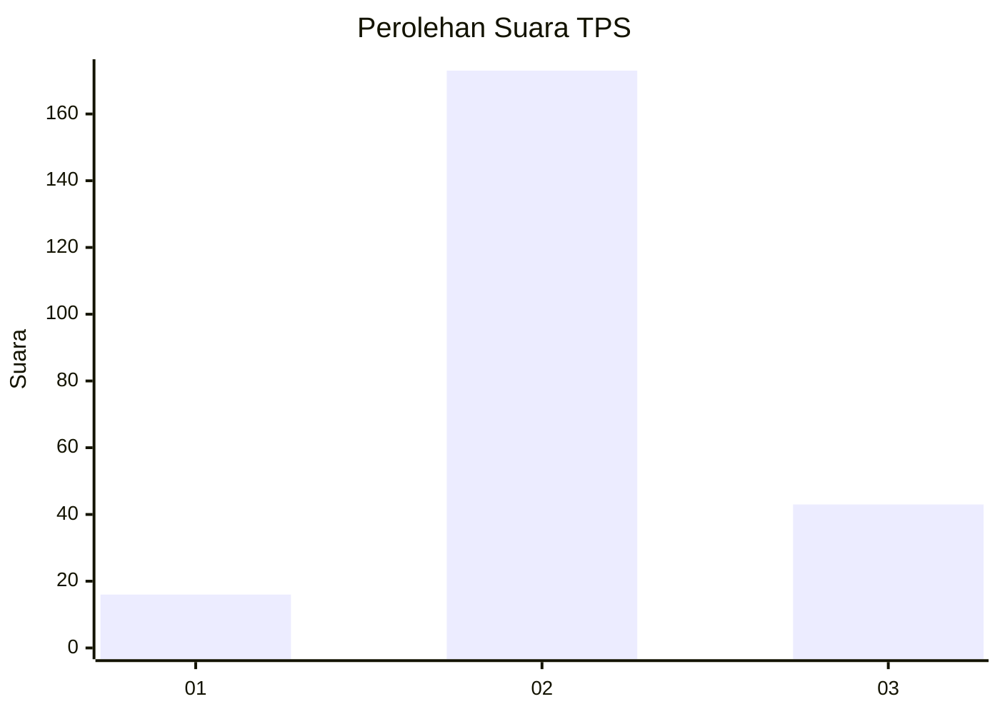
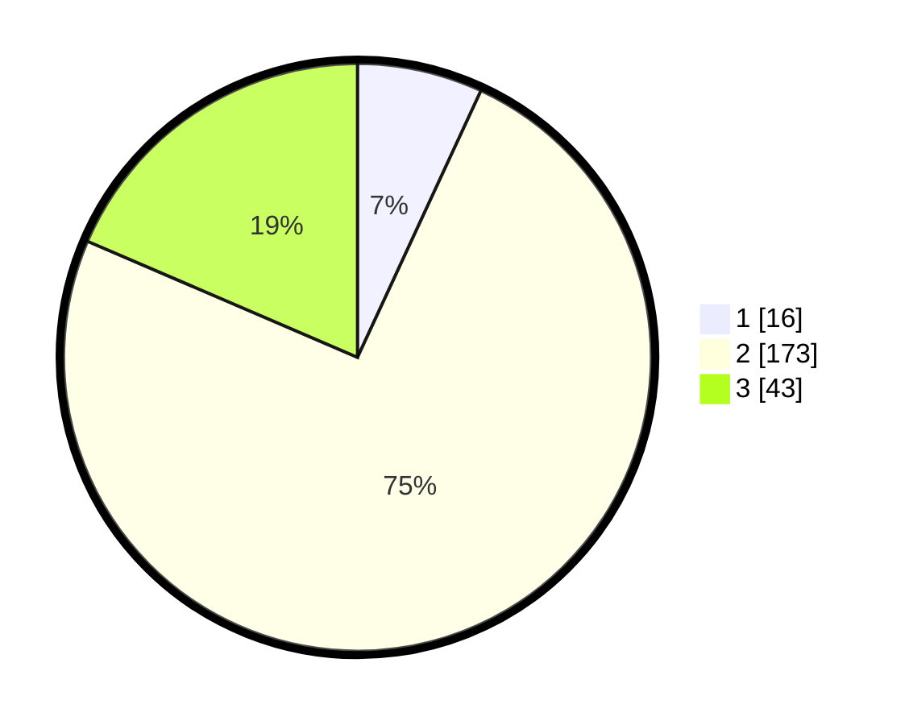

# Hasil

## Grafik

## Tabel

| No. | Nama Paslon    | Suara | Suara (raw) | Persentase |
|:--- |:-------------- | -----:| -----------:| ----------:|
| 1   | ANIES MUHAIMIN | 16    | [16][p-1]   | 6,90       |
| 2   | PRABOWO GIBRAN | 173   | [173][p-2]  | 74,57      |
| 3   | GANJAR MAHFUD  | 43    | [43][p-3]   | 18,53      |

[p-1]: https://github.com/gigit-pemilu/pemilu-2024/blob/main/pilpres/hitung-suara/sub/35-jawa-timur/sub/06-kediri/sub/17-pare/sub/2003-gedangsewu/sub/024-tps/sub/paslon-1.txt
[p-2]: https://github.com/gigit-pemilu/pemilu-2024/blob/main/pilpres/hitung-suara/sub/35-jawa-timur/sub/06-kediri/sub/17-pare/sub/2003-gedangsewu/sub/024-tps/sub/paslon-2.txt
[p-3]: https://github.com/gigit-pemilu/pemilu-2024/blob/main/pilpres/hitung-suara/sub/35-jawa-timur/sub/06-kediri/sub/17-pare/sub/2003-gedangsewu/sub/024-tps/sub/paslon-3.txt

## Foto C Plano

https://sirekap-obj-formc.kpu.go.id/7e89/pemilu/ppwp/35/06/17/20/03/3506172003024-20240216-110917--acaff0f2-d662-4230-a9a0-0e0a8ffacff7.jpg

https://sirekap-obj-formc.kpu.go.id/7e89/pemilu/ppwp/35/06/17/20/03/3506172003024-20240216-110927--18732f7c-0c86-4a79-af88-a09a26b0b780.jpg

https://sirekap-obj-formc.kpu.go.id/7e89/pemilu/ppwp/35/06/17/20/03/3506172003024-20240216-110933--ca6daddf-882e-4624-86be-7e905a2213a6.jpg

## Metadata

| Key        | Value               |
| ---------- | ------------------- |
| Time Stamp | 2024-02-17 10:00:02 |

