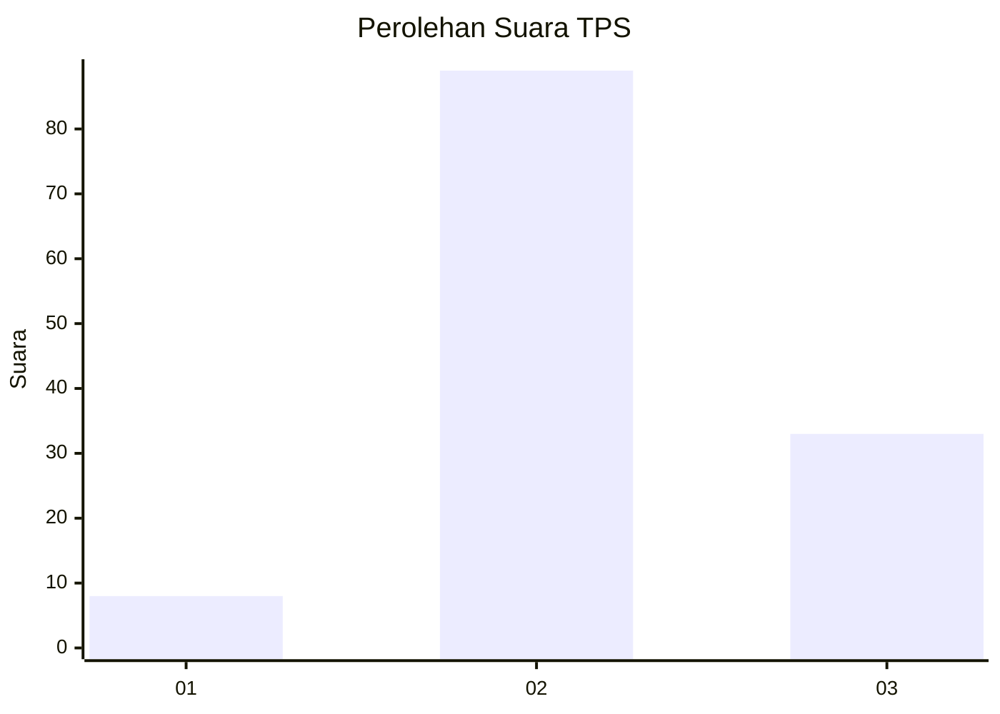
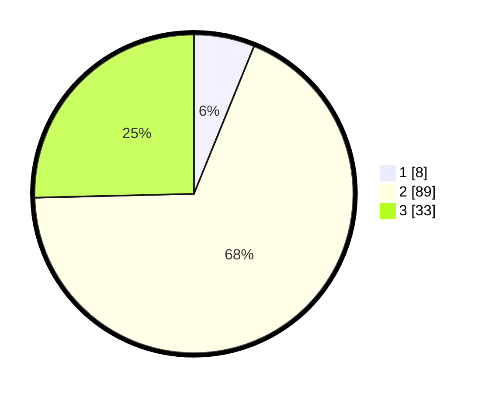

# Hasil

## Grafik

## Tabel

| No. | Nama Paslon    | Suara | Suara (raw) | Persentase |
|:--- |:-------------- | -----:| -----------:| ----------:|
| 1   | ANIES MUHAIMIN | 8     | [8][p-1]    | 6,15       |
| 2   | PRABOWO GIBRAN | 89    | [89][p-2]   | 68,46      |
| 3   | GANJAR MAHFUD  | 33    | [33][p-3]   | 25,38      |

[p-1]: https://github.com/gigit-pemilu/pemilu-2024-35-jawa-timur/blob/main/pilpres/hitung-suara/sub/35-jawa-timur/sub/06-kediri/sub/17-pare/sub/2003-gedangsewu/sub/038-tps/sub/paslon-1.txt
[p-2]: https://github.com/gigit-pemilu/pemilu-2024-35-jawa-timur/blob/main/pilpres/hitung-suara/sub/35-jawa-timur/sub/06-kediri/sub/17-pare/sub/2003-gedangsewu/sub/038-tps/sub/paslon-2.txt
[p-3]: https://github.com/gigit-pemilu/pemilu-2024-35-jawa-timur/blob/main/pilpres/hitung-suara/sub/35-jawa-timur/sub/06-kediri/sub/17-pare/sub/2003-gedangsewu/sub/038-tps/sub/paslon-3.txt

## Foto C Plano

https://sirekap-obj-formc.kpu.go.id/dc2e/pemilu/ppwp/35/06/17/20/03/3506172003038-20240217-111813--41192ec0-9f86-46a3-a89f-ecd753c730cc.jpg

https://sirekap-obj-formc.kpu.go.id/dc2e/pemilu/ppwp/35/06/17/20/03/3506172003038-20240214-141536--d676de98-1868-4fde-877c-23cabbcbc758.jpg

https://sirekap-obj-formc.kpu.go.id/dc2e/pemilu/ppwp/35/06/17/20/03/3506172003038-20240217-084445--b465bdd8-28de-45a6-b23b-b85278e460d9.jpg

## Metadata

| Key        | Value               |
| ---------- | ------------------- |
| Time Stamp | 2024-02-17 11:30:03 |

