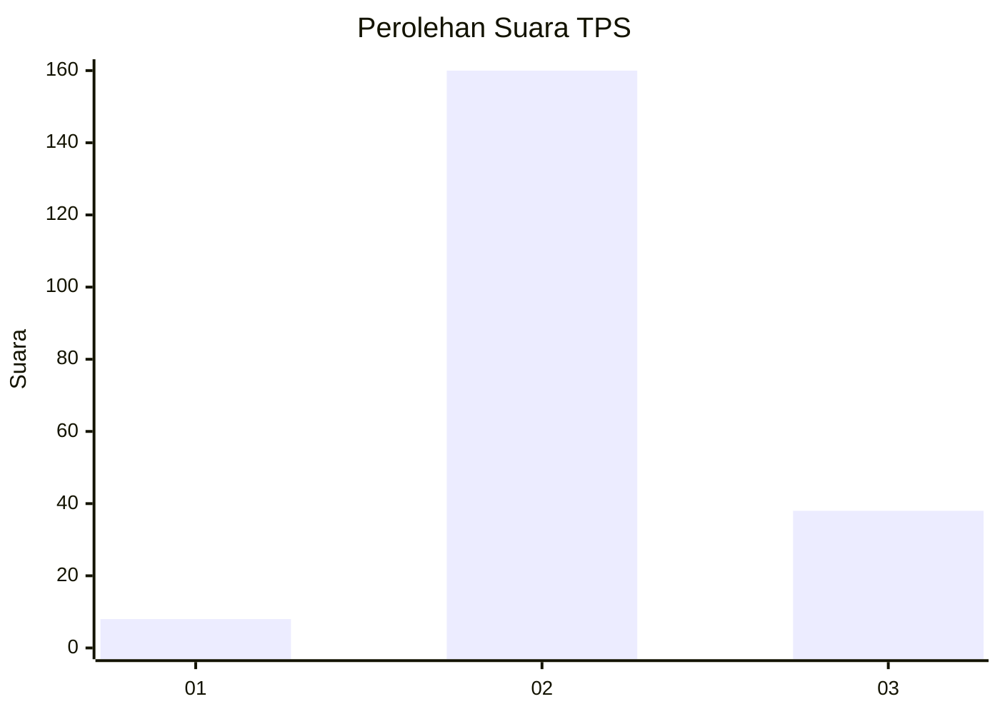

# Hasil

## Grafik

## Tabel

| No. | Nama Paslon    | Suara | Suara (raw) | Persentase |
|:--- |:-------------- | -----:| -----------:| ----------:|
| 1   | ANIES MUHAIMIN | 8     | [8][p-1]    | 3,88       |
| 2   | PRABOWO GIBRAN | 160   | [160][p-2]  | 77,67      |
| 3   | GANJAR MAHFUD  | 38    | [38][p-3]   | 18,45      |

[p-1]: https://github.com/gigit-pemilu/pemilu-2024-35-jawa-timur/blob/main/pilpres/hitung-suara/sub/35-jawa-timur/sub/06-kediri/sub/17-pare/sub/2003-gedangsewu/sub/045-tps/sub/paslon-1.txt
[p-2]: https://github.com/gigit-pemilu/pemilu-2024-35-jawa-timur/blob/main/pilpres/hitung-suara/sub/35-jawa-timur/sub/06-kediri/sub/17-pare/sub/2003-gedangsewu/sub/045-tps/sub/paslon-2.txt
[p-3]: https://github.com/gigit-pemilu/pemilu-2024-35-jawa-timur/blob/main/pilpres/hitung-suara/sub/35-jawa-timur/sub/06-kediri/sub/17-pare/sub/2003-gedangsewu/sub/045-tps/sub/paslon-3.txt

## Foto C Plano

https://sirekap-obj-formc.kpu.go.id/b47a/pemilu/ppwp/35/06/17/20/03/3506172003045-20240214-214252--c1524a37-9685-4b98-9271-ed832423b99b.jpg

https://sirekap-obj-formc.kpu.go.id/b47a/pemilu/ppwp/35/06/17/20/03/3506172003045-20240214-213919--7ef736d0-6c88-48e6-9cd3-31164c0e544c.jpg

https://sirekap-obj-formc.kpu.go.id/b47a/pemilu/ppwp/35/06/17/20/03/3506172003045-20240214-214621--8ee8c192-de32-458a-ae78-3224604fbb8f.jpg

## Metadata

| Key        | Value               |
| ---------- | ------------------- |
| Time Stamp | 2024-02-17 10:30:03 |

