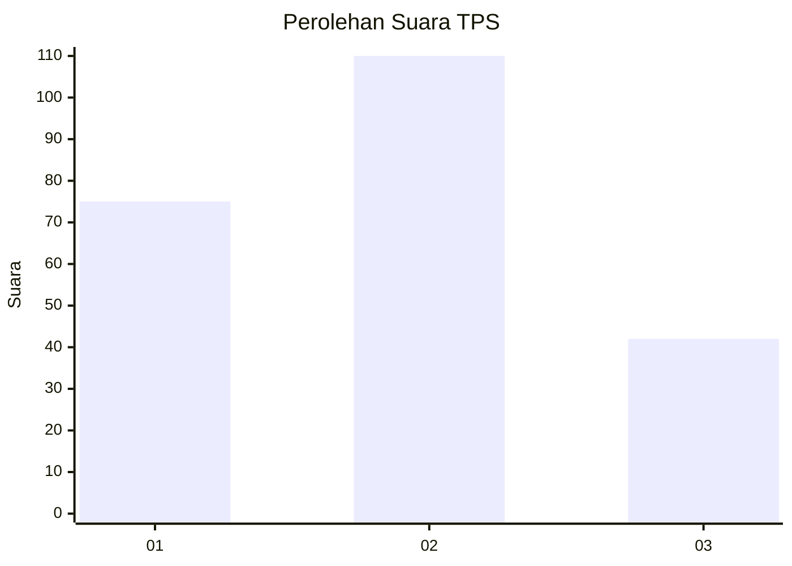
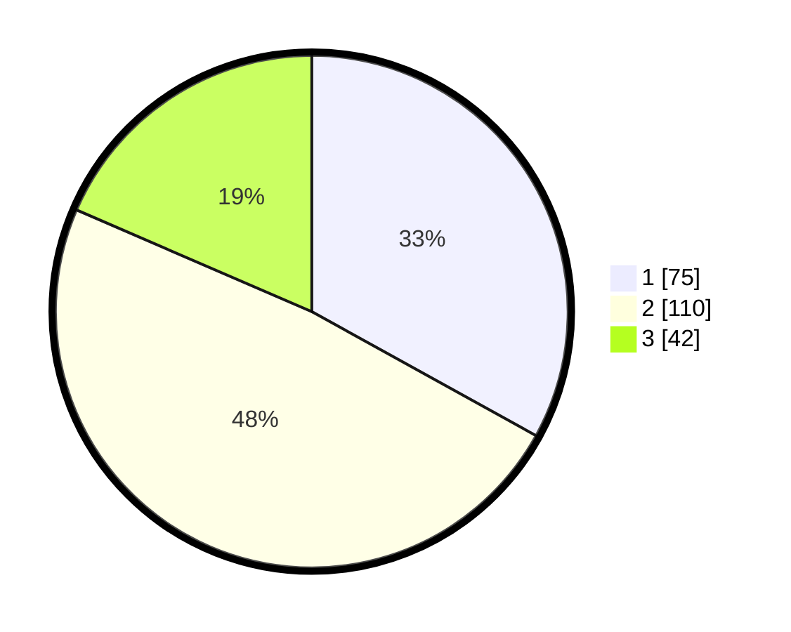

# Hasil

## Grafik

## Tabel

| No. | Nama Paslon    | Suara | Suara (raw) | Persentase |
|:--- |:-------------- | -----:| -----------:| ----------:|
| 1   | ANIES MUHAIMIN | 75    | [75][p-1]   | 33,04      |
| 2   | PRABOWO GIBRAN | 110   | [110][p-2]  | 48,46      |
| 3   | GANJAR MAHFUD  | 42    | [42][p-3]   | 18,50      |

[p-1]: https://github.com/gigit-pemilu/pemilu-2024/blob/main/pilpres/hitung-suara/sub/35-jawa-timur/sub/06-kediri/sub/17-pare/sub/2008-tulungrejo/sub/012-tps/sub/paslon-1.txt
[p-2]: https://github.com/gigit-pemilu/pemilu-2024/blob/main/pilpres/hitung-suara/sub/35-jawa-timur/sub/06-kediri/sub/17-pare/sub/2008-tulungrejo/sub/012-tps/sub/paslon-2.txt
[p-3]: https://github.com/gigit-pemilu/pemilu-2024/blob/main/pilpres/hitung-suara/sub/35-jawa-timur/sub/06-kediri/sub/17-pare/sub/2008-tulungrejo/sub/012-tps/sub/paslon-3.txt

## Foto C Plano

https://sirekap-obj-formc.kpu.go.id/baca/pemilu/ppwp/35/06/17/20/08/3506172008012-20240214-235628--f924c582-6b16-4119-8e28-6bc5ee1a4ace.jpg

https://sirekap-obj-formc.kpu.go.id/baca/pemilu/ppwp/35/06/17/20/08/3506172008012-20240214-235725--cb75d65b-8e5f-45fa-8897-ec42ac0cc38a.jpg

https://sirekap-obj-formc.kpu.go.id/baca/pemilu/ppwp/35/06/17/20/08/3506172008012-20240214-235801--8e1ead9d-6c13-4cb3-8a98-f8ed9642fab8.jpg

## Metadata

| Key        | Value               |
| ---------- | ------------------- |
| Time Stamp | 2024-02-17 10:30:03 |

