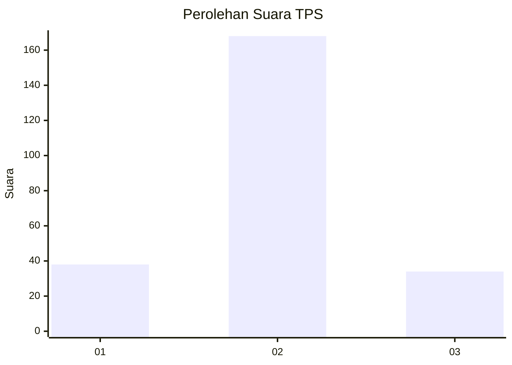

# Hasil

## Grafik

## Tabel

| No. | Nama Paslon    | Suara | Suara (raw) | Persentase |
|:--- |:-------------- | -----:| -----------:| ----------:|
| 1   | ANIES MUHAIMIN | 38    | [38][p-1]   | 15,83      |
| 2   | PRABOWO GIBRAN | 168   | [168][p-2]  | 70,00      |
| 3   | GANJAR MAHFUD  | 34    | [34][p-3]   | 14,17      |

[p-1]: https://github.com/gigit-pemilu/pemilu-2024/blob/main/pilpres/hitung-suara/sub/35-jawa-timur/sub/06-kediri/sub/17-pare/sub/2008-tulungrejo/sub/018-tps/sub/paslon-1.txt
[p-2]: https://github.com/gigit-pemilu/pemilu-2024/blob/main/pilpres/hitung-suara/sub/35-jawa-timur/sub/06-kediri/sub/17-pare/sub/2008-tulungrejo/sub/018-tps/sub/paslon-2.txt
[p-3]: https://github.com/gigit-pemilu/pemilu-2024/blob/main/pilpres/hitung-suara/sub/35-jawa-timur/sub/06-kediri/sub/17-pare/sub/2008-tulungrejo/sub/018-tps/sub/paslon-3.txt

## Foto C Plano

https://sirekap-obj-formc.kpu.go.id/9cdf/pemilu/ppwp/35/06/17/20/08/3506172008018-20240215-101432--fc9f8435-be3e-472f-8c72-f43aab83a3c4.jpg

https://sirekap-obj-formc.kpu.go.id/9cdf/pemilu/ppwp/35/06/17/20/08/3506172008018-20240215-002139--18d3ff60-2454-41ba-8afd-f63789bc7b7c.jpg

https://sirekap-obj-formc.kpu.go.id/9cdf/pemilu/ppwp/35/06/17/20/08/3506172008018-20240215-002239--03b842b7-cc1f-4425-abea-56f3a649356c.jpg

## Metadata

| Key        | Value               |
| ---------- | ------------------- |
| Time Stamp | 2024-02-15 15:00:29 |

