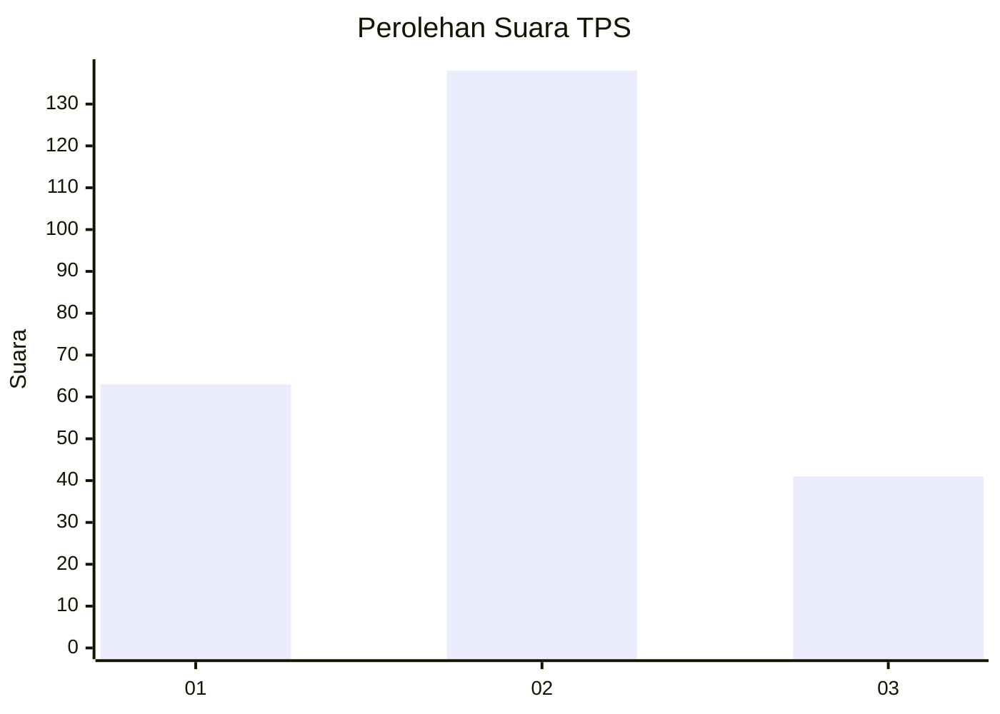
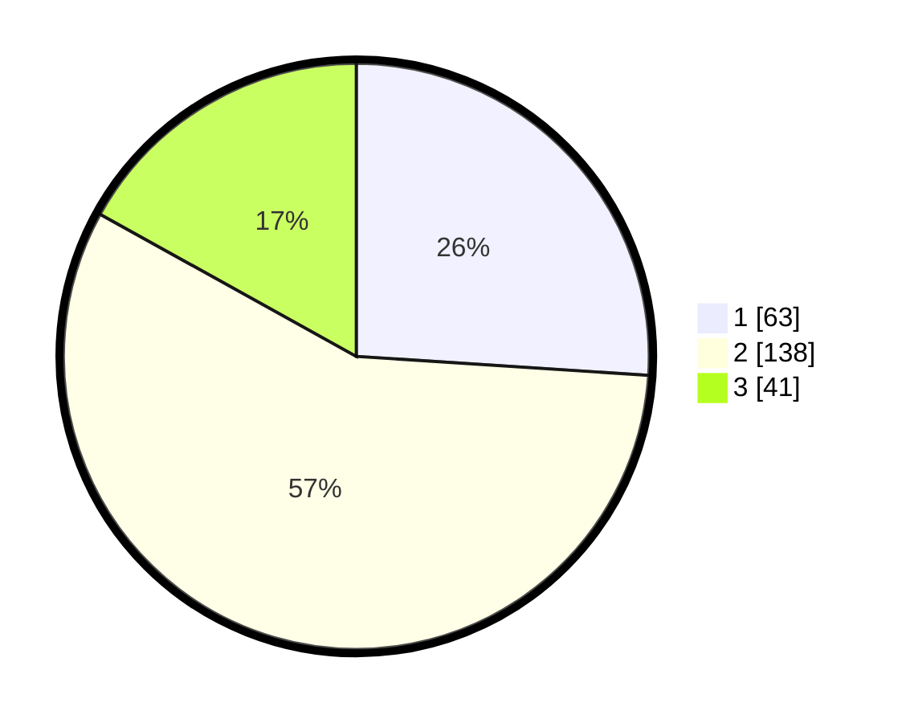

# Hasil

## Grafik

## Tabel

| No. | Nama Paslon    | Suara | Suara (raw) | Persentase |
|:--- |:-------------- | -----:| -----------:| ----------:|
| 1   | ANIES MUHAIMIN | 63    | [63][p-1]   | 26,03      |
| 2   | PRABOWO GIBRAN | 138   | [138][p-2]  | 57,02      |
| 3   | GANJAR MAHFUD  | 41    | [41][p-3]   | 16,94      |

[p-1]: https://github.com/gigit-pemilu/pemilu-2024/blob/main/pilpres/hitung-suara/sub/35-jawa-timur/sub/06-kediri/sub/17-pare/sub/2008-tulungrejo/sub/042-tps/sub/paslon-1.txt
[p-2]: https://github.com/gigit-pemilu/pemilu-2024/blob/main/pilpres/hitung-suara/sub/35-jawa-timur/sub/06-kediri/sub/17-pare/sub/2008-tulungrejo/sub/042-tps/sub/paslon-2.txt
[p-3]: https://github.com/gigit-pemilu/pemilu-2024/blob/main/pilpres/hitung-suara/sub/35-jawa-timur/sub/06-kediri/sub/17-pare/sub/2008-tulungrejo/sub/042-tps/sub/paslon-3.txt

## Foto C Plano

https://sirekap-obj-formc.kpu.go.id/3d00/pemilu/ppwp/35/06/17/20/08/3506172008042-20240215-004116--c32b84e5-c919-42e1-8587-e089bcf0f3ab.jpg

https://sirekap-obj-formc.kpu.go.id/3d00/pemilu/ppwp/35/06/17/20/08/3506172008042-20240215-005549--0278b5d6-e9e4-4f77-b1bd-3af9aab23dca.jpg

https://sirekap-obj-formc.kpu.go.id/3d00/pemilu/ppwp/35/06/17/20/08/3506172008042-20240215-004343--3665699c-41cc-41df-9b75-26d05f1235ef.jpg

## Metadata

| Key        | Value               |
| ---------- | ------------------- |
| Time Stamp | 2024-02-17 11:30:03 |

