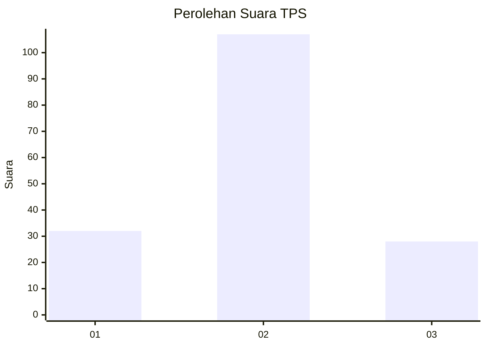
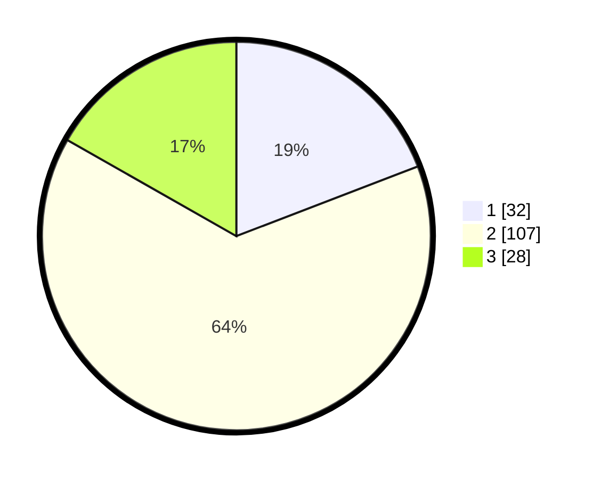

# Hasil

## Grafik

## Tabel

| No. | Nama Paslon    | Suara | Suara (raw) | Persentase |
|:--- |:-------------- | -----:| -----------:| ----------:|
| 1   | ANIES MUHAIMIN | 32    | [32][p-1]   | 19,16      |
| 2   | PRABOWO GIBRAN | 107   | [107][p-2]  | 64,07      |
| 3   | GANJAR MAHFUD  | 28    | [28][p-3]   | 16,77      |

[p-1]: https://github.com/gigit-pemilu/pemilu-2024-35-jawa-timur/blob/main/pilpres/hitung-suara/sub/35-jawa-timur/sub/06-kediri/sub/17-pare/sub/2008-tulungrejo/sub/050-tps/sub/paslon-1.txt
[p-2]: https://github.com/gigit-pemilu/pemilu-2024-35-jawa-timur/blob/main/pilpres/hitung-suara/sub/35-jawa-timur/sub/06-kediri/sub/17-pare/sub/2008-tulungrejo/sub/050-tps/sub/paslon-2.txt
[p-3]: https://github.com/gigit-pemilu/pemilu-2024-35-jawa-timur/blob/main/pilpres/hitung-suara/sub/35-jawa-timur/sub/06-kediri/sub/17-pare/sub/2008-tulungrejo/sub/050-tps/sub/paslon-3.txt

## Foto C Plano

https://sirekap-obj-formc.kpu.go.id/a670/pemilu/ppwp/35/06/17/20/08/3506172008050-20240215-041950--4c1de550-4e9d-40a3-bb38-82309105622b.jpg

https://sirekap-obj-formc.kpu.go.id/a670/pemilu/ppwp/35/06/17/20/08/3506172008050-20240215-042027--c757581a-9e48-473a-bab0-07cd33002011.jpg

https://sirekap-obj-formc.kpu.go.id/a670/pemilu/ppwp/35/06/17/20/08/3506172008050-20240215-042110--c18b95a6-000f-43a5-b494-55852406b674.jpg

## Metadata

| Key        | Value               |
| ---------- | ------------------- |
| Time Stamp | 2024-02-17 11:30:03 |

