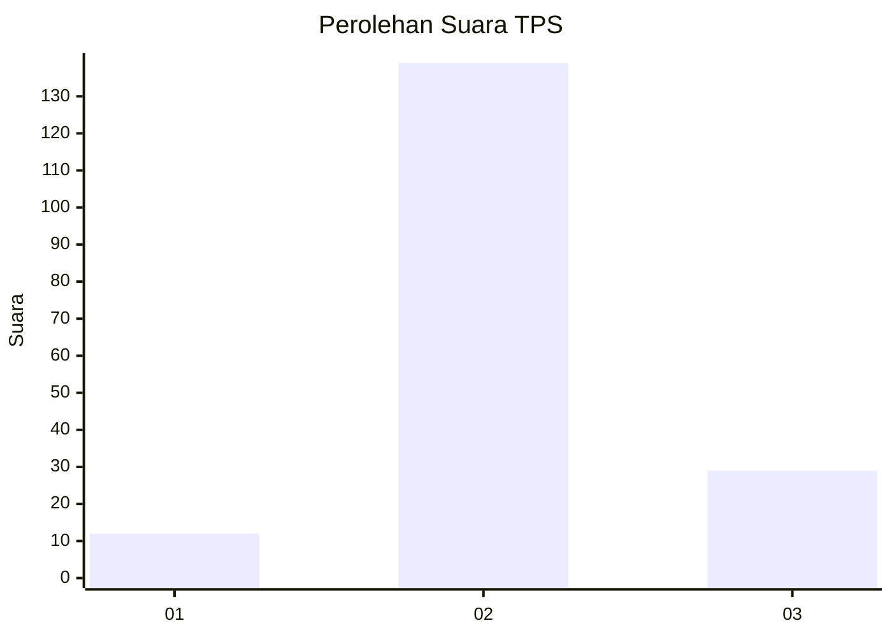
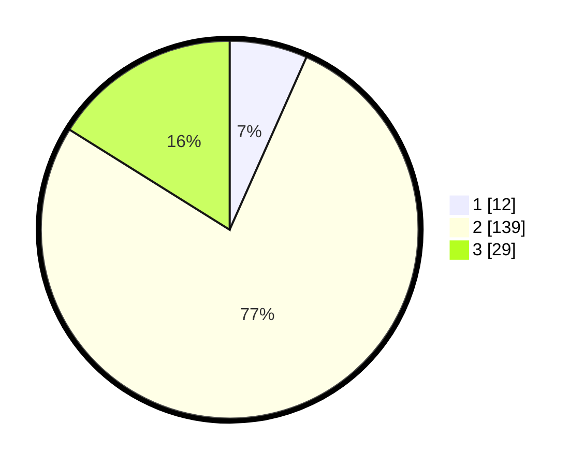

# Hasil

## Grafik

## Tabel

| No. | Nama Paslon    | Suara | Suara (raw) | Persentase |
|:--- |:-------------- | -----:| -----------:| ----------:|
| 1   | ANIES MUHAIMIN | 12    | [12][p-1]   | 6,67       |
| 2   | PRABOWO GIBRAN | 139   | [139][p-2]  | 77,22      |
| 3   | GANJAR MAHFUD  | 29    | [29][p-3]   | 16,11      |

[p-1]: https://github.com/gigit-pemilu/pemilu-2024/blob/main/pilpres/hitung-suara/sub/35-jawa-timur/sub/06-kediri/sub/18-kepung/sub/2006-kepung/sub/013-tps/sub/paslon-1.txt
[p-2]: https://github.com/gigit-pemilu/pemilu-2024/blob/main/pilpres/hitung-suara/sub/35-jawa-timur/sub/06-kediri/sub/18-kepung/sub/2006-kepung/sub/013-tps/sub/paslon-2.txt
[p-3]: https://github.com/gigit-pemilu/pemilu-2024/blob/main/pilpres/hitung-suara/sub/35-jawa-timur/sub/06-kediri/sub/18-kepung/sub/2006-kepung/sub/013-tps/sub/paslon-3.txt

## Foto C Plano

https://sirekap-obj-formc.kpu.go.id/ab77/pemilu/ppwp/35/06/18/20/06/3506182006013-20240214-191136--c726cacb-370d-4b3d-b35a-4fc00040e34d.jpg

https://sirekap-obj-formc.kpu.go.id/ab77/pemilu/ppwp/35/06/18/20/06/3506182006013-20240214-191155--ddc7aba2-1a20-4175-b110-a8018c5317de.jpg

https://sirekap-obj-formc.kpu.go.id/ab77/pemilu/ppwp/35/06/18/20/06/3506182006013-20240215-015056--56363be2-5fe8-48be-adf6-3b5ffb9b6b2a.jpg

## Metadata

| Key        | Value               |
| ---------- | ------------------- |
| Time Stamp | 2024-02-15 09:00:24 |

