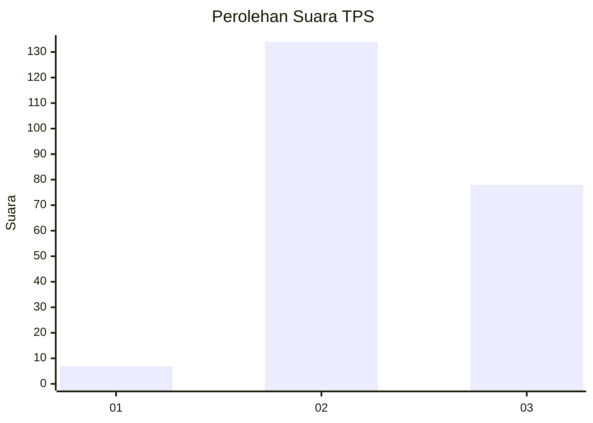
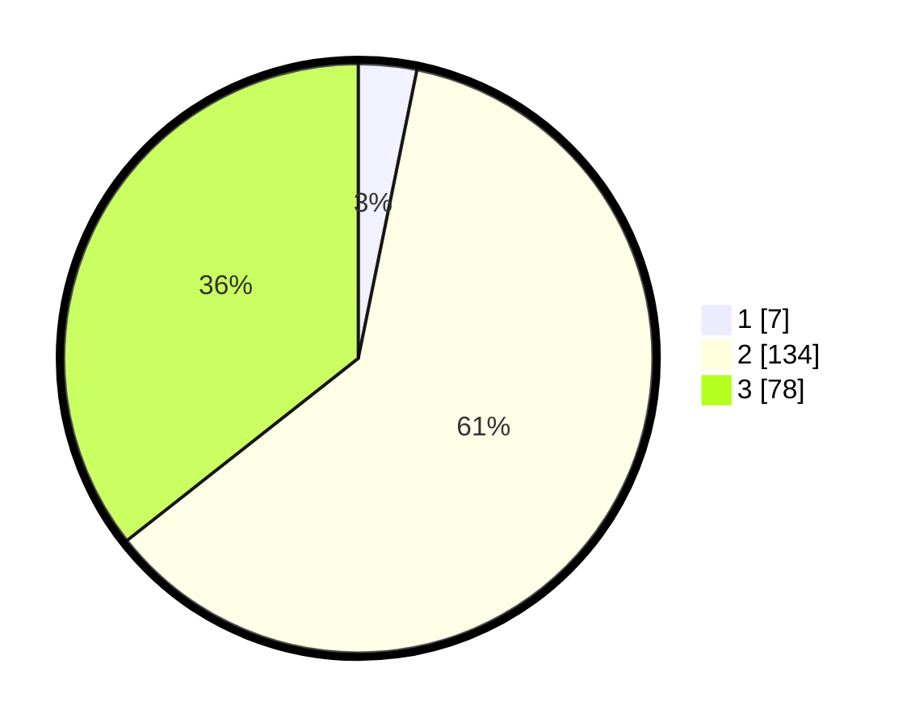

# Hasil

## Grafik

## Tabel

| No. | Nama Paslon    | Suara | Suara (raw) | Persentase |
|:--- |:-------------- | -----:| -----------:| ----------:|
| 1   | ANIES MUHAIMIN | 7     | [7][p-1]    | 3,20       |
| 2   | PRABOWO GIBRAN | 134   | [134][p-2]  | 61,19      |
| 3   | GANJAR MAHFUD  | 78    | [78][p-3]   | 35,62      |

[p-1]: https://github.com/gigit-pemilu/pemilu-2024-35-jawa-timur/blob/main/pilpres/hitung-suara/sub/35-jawa-timur/sub/06-kediri/sub/18-kepung/sub/2006-kepung/sub/039-tps/sub/paslon-1.txt
[p-2]: https://github.com/gigit-pemilu/pemilu-2024-35-jawa-timur/blob/main/pilpres/hitung-suara/sub/35-jawa-timur/sub/06-kediri/sub/18-kepung/sub/2006-kepung/sub/039-tps/sub/paslon-2.txt
[p-3]: https://github.com/gigit-pemilu/pemilu-2024-35-jawa-timur/blob/main/pilpres/hitung-suara/sub/35-jawa-timur/sub/06-kediri/sub/18-kepung/sub/2006-kepung/sub/039-tps/sub/paslon-3.txt

## Foto C Plano

https://sirekap-obj-formc.kpu.go.id/1dd9/pemilu/ppwp/35/06/18/20/06/3506182006039-20240219-230911--558522fb-05a2-408c-8376-b4914a0a5507.jpg

https://sirekap-obj-formc.kpu.go.id/1dd9/pemilu/ppwp/35/06/18/20/06/3506182006039-20240219-230941--676fffd8-12fd-4574-b35f-75a2ab3ee862.jpg

https://sirekap-obj-formc.kpu.go.id/1dd9/pemilu/ppwp/35/06/18/20/06/3506182006039-20240219-231010--6db75735-d7aa-4e23-9a41-4c994e2d9eb8.jpg

## Metadata

| Key        | Value               |
| ---------- | ------------------- |
| Time Stamp | 2024-02-20 00:00:00 |

## DATA PEMILIH TETAP

Jumlah pemilih dalam DPT: **293**.
 * L: **147**.
 * P: **146**.

## DATA PENGGUNA HAK PILIH

Jumlah pengguna hak pilih dalam DPT: **224**.
 * L: **442**.
 * P: **445**.

Jumlah pengguna hak pilih dalam DPTb: **0**.
 * L: **808**.
 * P: **88**.

Jumlah pengguna hak pilih dalam DPK: **885**.
 * L: **4**.
 * P: **4**.

Jumlah pengguna hak pilih: **229**.
 * L: **109**.
 * P: **129**.

## JUMLAH SUARA SAH DAN TIDAK SAH

JUMLAH SELURUH SUARA SAH: **219**.

JUMLAH SUARA TIDAK SAH: **10**.

JUMLAH SELURUH SUARA SAH DAN SUARA TIDAK SAH: **229**.

