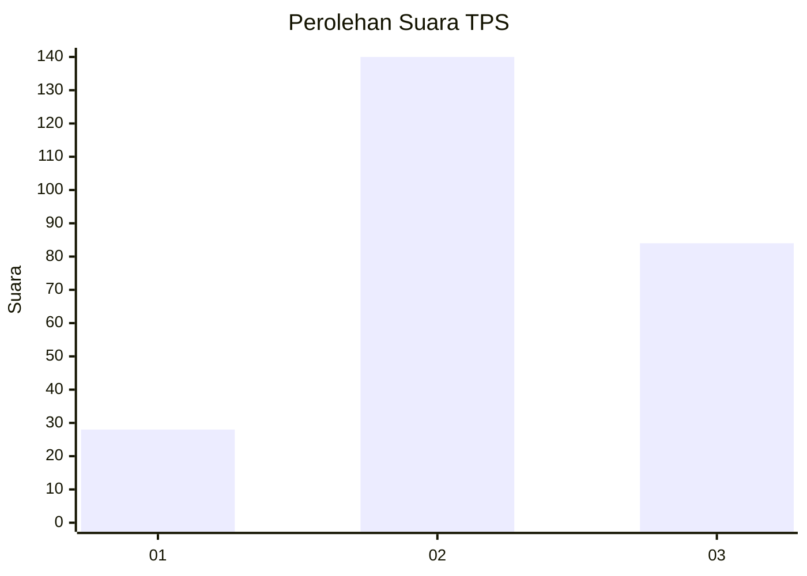
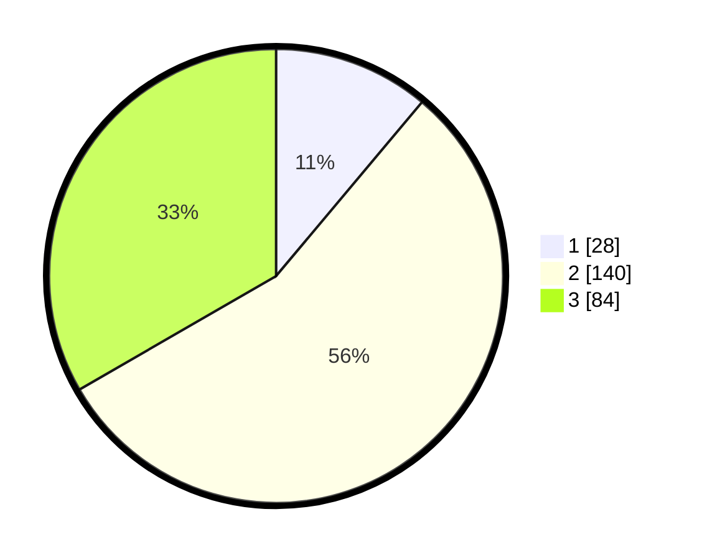

# Hasil

## Grafik

## Tabel

| No. | Nama Paslon    | Suara | Suara (raw) | Persentase |
|:--- |:-------------- | -----:| -----------:| ----------:|
| 1   | ANIES MUHAIMIN | 28    | [28][p-1]   | 11,11      |
| 2   | PRABOWO GIBRAN | 140   | [140][p-2]  | 55,56      |
| 3   | GANJAR MAHFUD  | 84    | [84][p-3]   | 33,33      |

[p-1]: https://github.com/gigit-pemilu/pemilu-2024/blob/main/pilpres/hitung-suara/sub/35-jawa-timur/sub/06-kediri/sub/19-kandangan/sub/2001-kemiri/sub/002-tps/sub/paslon-1.txt
[p-2]: https://github.com/gigit-pemilu/pemilu-2024/blob/main/pilpres/hitung-suara/sub/35-jawa-timur/sub/06-kediri/sub/19-kandangan/sub/2001-kemiri/sub/002-tps/sub/paslon-2.txt
[p-3]: https://github.com/gigit-pemilu/pemilu-2024/blob/main/pilpres/hitung-suara/sub/35-jawa-timur/sub/06-kediri/sub/19-kandangan/sub/2001-kemiri/sub/002-tps/sub/paslon-3.txt

## Foto C Plano

https://sirekap-obj-formc.kpu.go.id/f78e/pemilu/ppwp/35/06/19/20/01/3506192001002-20240215-020448--437faa1e-af8b-41bc-9096-1a978610f1ea.jpg

https://sirekap-obj-formc.kpu.go.id/f78e/pemilu/ppwp/35/06/19/20/01/3506192001002-20240215-020452--f66cff10-3d03-45a3-98fb-dbd0abdfe182.jpg

https://sirekap-obj-formc.kpu.go.id/f78e/pemilu/ppwp/35/06/19/20/01/3506192001002-20240215-020455--bec9cbaa-d16a-4364-90be-7d9532754cc0.jpg

## Metadata

| Key        | Value               |
| ---------- | ------------------- |
| Time Stamp | 2024-02-19 06:16:00 |

## DATA PEMILIH TETAP

Jumlah pemilih dalam DPT: **299**.
 * L: **160**.
 * P: **139**.

## DATA PENGGUNA HAK PILIH

Jumlah pengguna hak pilih dalam DPT: **243**.
 * L: **133**.
 * P: **110**.

Jumlah pengguna hak pilih dalam DPTb: **16**.
 * L: **3**.
 * P: **13**.

Jumlah pengguna hak pilih dalam DPK: **1**.
 * L: **1**.
 * P: **0**.

Jumlah pengguna hak pilih: **260**.
 * L: **137**.
 * P: **123**.

## JUMLAH SUARA SAH DAN TIDAK SAH

JUMLAH SELURUH SUARA SAH: **252**.

JUMLAH SUARA TIDAK SAH: **8**.

JUMLAH SELURUH SUARA SAH DAN SUARA TIDAK SAH: **260**.

