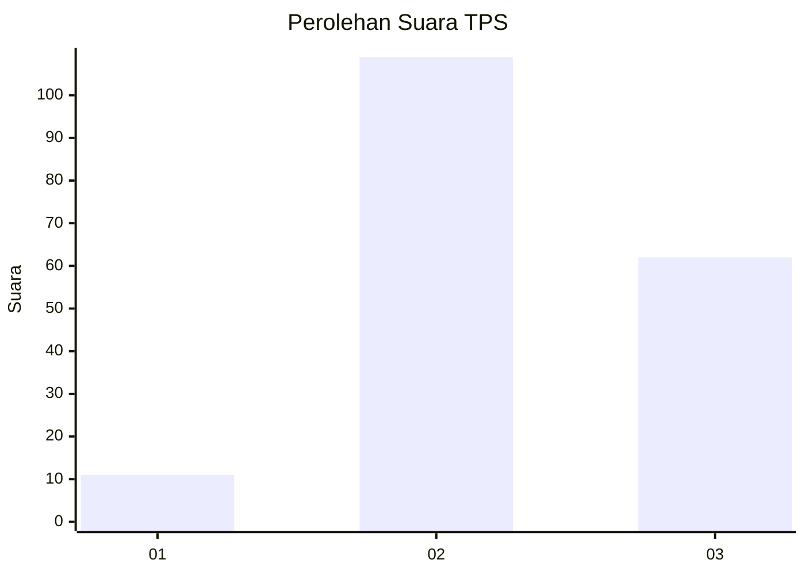
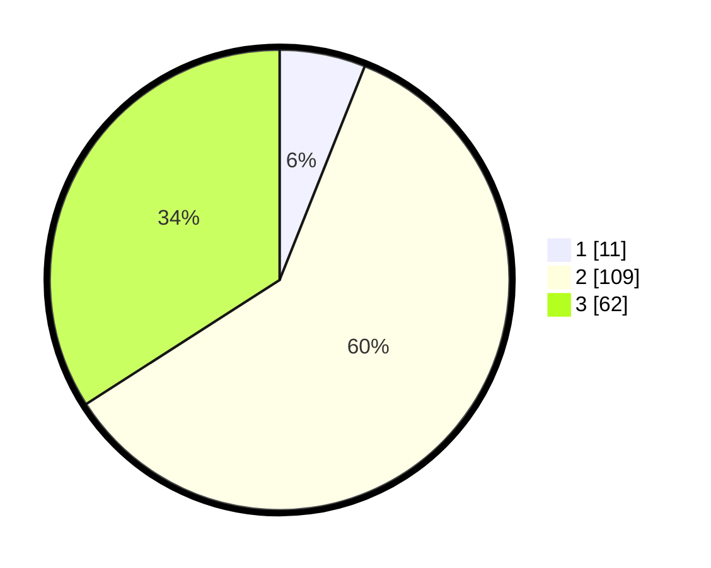

# Hasil

## Grafik

## Tabel

| No. | Nama Paslon    | Suara | Suara (raw) | Persentase |
|:--- |:-------------- | -----:| -----------:| ----------:|
| 1   | ANIES MUHAIMIN | 11    | [11][p-1]   | 6,04       |
| 2   | PRABOWO GIBRAN | 109   | [109][p-2]  | 59,89      |
| 3   | GANJAR MAHFUD  | 62    | [62][p-3]   | 34,07      |

[p-1]: https://github.com/gigit-pemilu/pemilu-2024/blob/main/pilpres/hitung-suara/sub/35-jawa-timur/sub/06-kediri/sub/19-kandangan/sub/2005-jerukwangi/sub/005-tps/sub/paslon-1.txt
[p-2]: https://github.com/gigit-pemilu/pemilu-2024/blob/main/pilpres/hitung-suara/sub/35-jawa-timur/sub/06-kediri/sub/19-kandangan/sub/2005-jerukwangi/sub/005-tps/sub/paslon-2.txt
[p-3]: https://github.com/gigit-pemilu/pemilu-2024/blob/main/pilpres/hitung-suara/sub/35-jawa-timur/sub/06-kediri/sub/19-kandangan/sub/2005-jerukwangi/sub/005-tps/sub/paslon-3.txt

## Foto C Plano

https://sirekap-obj-formc.kpu.go.id/3ab0/pemilu/ppwp/35/06/19/20/05/3506192005005-20240214-235313--5ff1586a-beb6-43d9-8cb7-f28ed2aa13a2.jpg

https://sirekap-obj-formc.kpu.go.id/3ab0/pemilu/ppwp/35/06/19/20/05/3506192005005-20240215-230120--c073dad8-2ae3-4087-b140-35e3f8cf3851.jpg

https://sirekap-obj-formc.kpu.go.id/3ab0/pemilu/ppwp/35/06/19/20/05/3506192005005-20240215-230235--8c41fa3e-15e3-4d4c-a4bb-65c8813910fd.jpg

## Metadata

| Key        | Value               |
| ---------- | ------------------- |
| Time Stamp | 2024-02-16 22:01:00 |

## DATA PEMILIH TETAP

Jumlah pemilih dalam DPT: **225**.
 * L: **355**.
 * P: **776**.

## DATA PENGGUNA HAK PILIH

Jumlah pengguna hak pilih dalam DPT: **355**.
 * L: **53**.
 * P: **33**.

Jumlah pengguna hak pilih dalam DPTb: **302**.
 * L: **805**.
 * P: **65**.

Jumlah pengguna hak pilih dalam DPK: **333**.
 * L: **0**.
 * P: **3**.

Jumlah pengguna hak pilih: **358**.
 * L: **35**.
 * P: **295**.

## JUMLAH SUARA SAH DAN TIDAK SAH

JUMLAH SELURUH SUARA SAH: **182**.

JUMLAH SUARA TIDAK SAH: **6**.

JUMLAH SELURUH SUARA SAH DAN SUARA TIDAK SAH: **188**.

