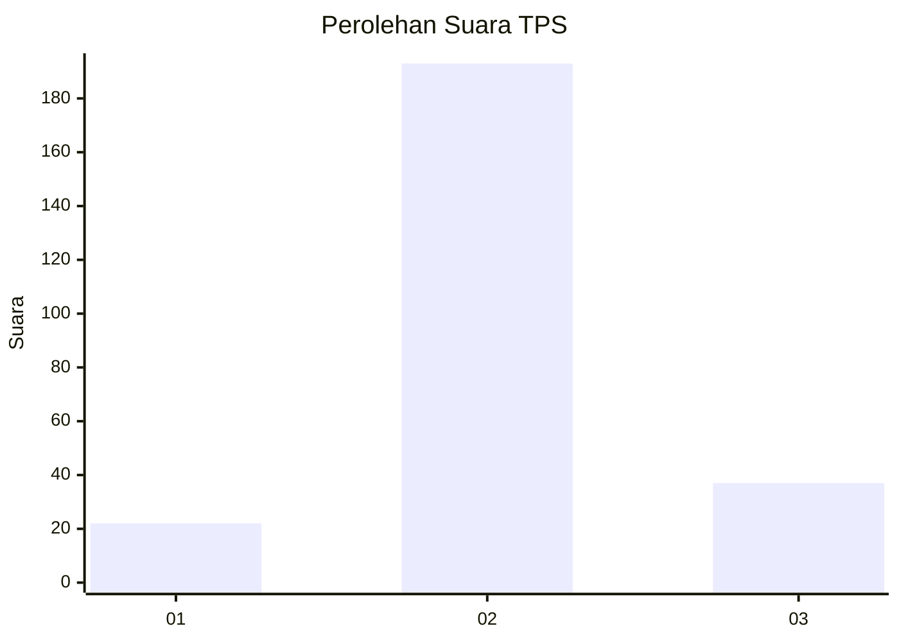

# Hasil

## Grafik

## Tabel

| No. | Nama Paslon    | Suara | Suara (raw) | Persentase |
|:--- |:-------------- | -----:| -----------:| ----------:|
| 1   | ANIES MUHAIMIN | 22    | [22][p-1]   | 8,73       |
| 2   | PRABOWO GIBRAN | 193   | [193][p-2]  | 76,59      |
| 3   | GANJAR MAHFUD  | 37    | [37][p-3]   | 14,68      |

[p-1]: https://github.com/gigit-pemilu/pemilu-2024/blob/main/pilpres/hitung-suara/sub/35-jawa-timur/sub/06-kediri/sub/21-kunjang/sub/2003-kapas/sub/001-tps/sub/paslon-1.txt
[p-2]: https://github.com/gigit-pemilu/pemilu-2024/blob/main/pilpres/hitung-suara/sub/35-jawa-timur/sub/06-kediri/sub/21-kunjang/sub/2003-kapas/sub/001-tps/sub/paslon-2.txt
[p-3]: https://github.com/gigit-pemilu/pemilu-2024/blob/main/pilpres/hitung-suara/sub/35-jawa-timur/sub/06-kediri/sub/21-kunjang/sub/2003-kapas/sub/001-tps/sub/paslon-3.txt

## Foto C Plano

https://sirekap-obj-formc.kpu.go.id/9dc6/pemilu/ppwp/35/06/21/20/03/3506212003001-20240214-193348--20302ccd-1ccc-4e98-97e2-95637ad8081b.jpg

https://sirekap-obj-formc.kpu.go.id/9dc6/pemilu/ppwp/35/06/21/20/03/3506212003001-20240214-193521--af8ec4fb-b9e7-44d9-aadf-8d2d6174794e.jpg

https://sirekap-obj-formc.kpu.go.id/9dc6/pemilu/ppwp/35/06/21/20/03/3506212003001-20240214-193704--a2c45413-7ea9-4211-b8aa-7fa47ee0b7ba.jpg

## Metadata

| Key        | Value               |
| ---------- | ------------------- |
| Time Stamp | 2024-02-16 21:01:00 |

## DATA PEMILIH TETAP

Jumlah pemilih dalam DPT: **267**.
 * L: **137**.
 * P: **130**.

## DATA PENGGUNA HAK PILIH

Jumlah pengguna hak pilih dalam DPT: **244**.
 * L: **123**.
 * P: **121**.

Jumlah pengguna hak pilih dalam DPTb: **1**.
 * L: **0**.
 * P: **1**.

Jumlah pengguna hak pilih dalam DPK: **13**.
 * L: **8**.
 * P: **5**.

Jumlah pengguna hak pilih: **258**.
 * L: **131**.
 * P: **127**.

## JUMLAH SUARA SAH DAN TIDAK SAH

JUMLAH SELURUH SUARA SAH: **252**.

JUMLAH SUARA TIDAK SAH: **6**.

JUMLAH SELURUH SUARA SAH DAN SUARA TIDAK SAH: **258**.

