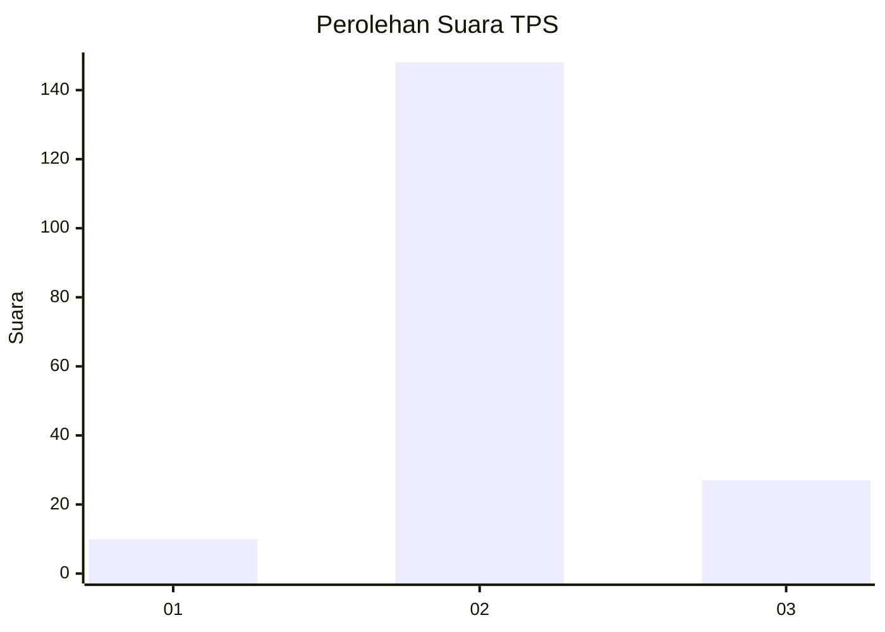

# Hasil

## Grafik

## Tabel

| No. | Nama Paslon    | Suara | Suara (raw) | Persentase |
|:--- |:-------------- | -----:| -----------:| ----------:|
| 1   | ANIES MUHAIMIN | 10    | [10][p-1]   | 5,41       |
| 2   | PRABOWO GIBRAN | 148   | [148][p-2]  | 80,00      |
| 3   | GANJAR MAHFUD  | 27    | [27][p-3]   | 14,59      |

[p-1]: https://github.com/gigit-pemilu/pemilu-2024/blob/main/pilpres/hitung-suara/sub/35-jawa-timur/sub/06-kediri/sub/21-kunjang/sub/2009-dungus/sub/010-tps/sub/paslon-1.txt
[p-2]: https://github.com/gigit-pemilu/pemilu-2024/blob/main/pilpres/hitung-suara/sub/35-jawa-timur/sub/06-kediri/sub/21-kunjang/sub/2009-dungus/sub/010-tps/sub/paslon-2.txt
[p-3]: https://github.com/gigit-pemilu/pemilu-2024/blob/main/pilpres/hitung-suara/sub/35-jawa-timur/sub/06-kediri/sub/21-kunjang/sub/2009-dungus/sub/010-tps/sub/paslon-3.txt

## Foto C Plano

https://sirekap-obj-formc.kpu.go.id/b27e/pemilu/ppwp/35/06/21/20/09/3506212009010-20240214-214754--c8a44304-2e07-427b-b337-44837f373ad6.jpg

https://sirekap-obj-formc.kpu.go.id/b27e/pemilu/ppwp/35/06/21/20/09/3506212009010-20240214-214802--60ef300a-75a5-4f44-8663-5f6ce27e87e9.jpg

https://sirekap-obj-formc.kpu.go.id/b27e/pemilu/ppwp/35/06/21/20/09/3506212009010-20240214-214812--d494a5d8-88e5-4fdd-917b-3cf25e75a112.jpg

## Metadata

| Key        | Value               |
| ---------- | ------------------- |
| Time Stamp | 2024-02-15 15:00:29 |

