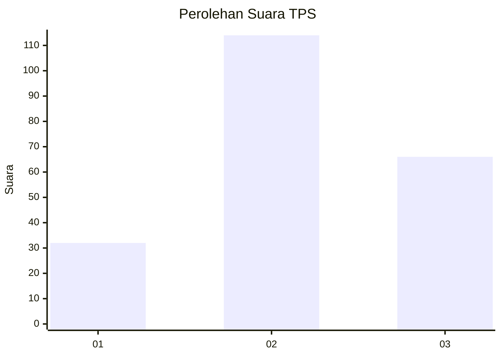
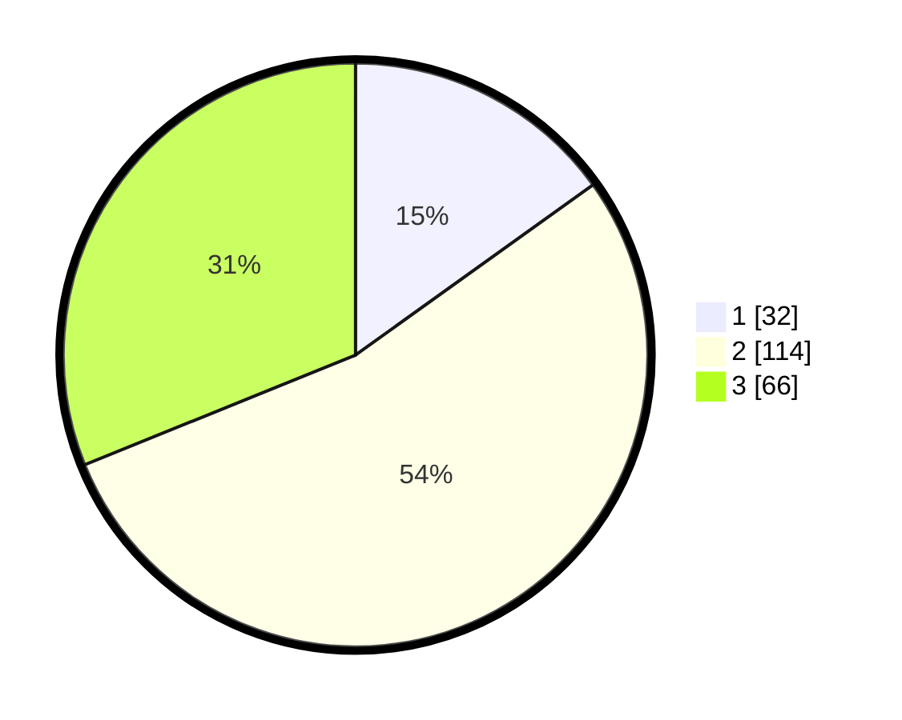

# Hasil

## Grafik

## Tabel

| No. | Nama Paslon    | Suara | Suara (raw) | Persentase |
|:--- |:-------------- | -----:| -----------:| ----------:|
| 1   | ANIES MUHAIMIN | 32    | [32][p-1]   | 15,09      |
| 2   | PRABOWO GIBRAN | 114   | [114][p-2]  | 53,77      |
| 3   | GANJAR MAHFUD  | 66    | [66][p-3]   | 31,13      |

[p-1]: https://github.com/gigit-pemilu/pemilu-2024-35-jawa-timur/blob/main/pilpres/hitung-suara/sub/35-jawa-timur/sub/06-kediri/sub/22-banyakan/sub/2004-tiron/sub/016-tps/sub/paslon-1.txt
[p-2]: https://github.com/gigit-pemilu/pemilu-2024-35-jawa-timur/blob/main/pilpres/hitung-suara/sub/35-jawa-timur/sub/06-kediri/sub/22-banyakan/sub/2004-tiron/sub/016-tps/sub/paslon-2.txt
[p-3]: https://github.com/gigit-pemilu/pemilu-2024-35-jawa-timur/blob/main/pilpres/hitung-suara/sub/35-jawa-timur/sub/06-kediri/sub/22-banyakan/sub/2004-tiron/sub/016-tps/sub/paslon-3.txt

## Foto C Plano

https://sirekap-obj-formc.kpu.go.id/0f11/pemilu/ppwp/35/06/22/20/04/3506222004016-20240217-205140--8ff7e7c0-6055-4fc8-9646-afb2040d83bc.jpg

https://sirekap-obj-formc.kpu.go.id/0f11/pemilu/ppwp/35/06/22/20/04/3506222004016-20240217-202740--4b9e3ca8-f757-4188-adb6-65de866447ed.jpg

https://sirekap-obj-formc.kpu.go.id/0f11/pemilu/ppwp/35/06/22/20/04/3506222004016-20240217-202807--c9236719-cb6b-4fd5-85d5-c328f26b1def.jpg

## Metadata

| Key        | Value               |
| ---------- | ------------------- |
| Time Stamp | 2024-02-21 21:00:04 |

## DATA PEMILIH TETAP

Jumlah pemilih dalam DPT: **370**.
 * L: **839**.
 * P: **438**.

## DATA PENGGUNA HAK PILIH

Jumlah pengguna hak pilih dalam DPT: **228**.
 * L: **850**.
 * P: **0**.

Jumlah pengguna hak pilih dalam DPTb: **888**.
 * L: **888**.
 * P: **80**.

Jumlah pengguna hak pilih dalam DPK: **87**.
 * L: **881**.
 * P: **83**.

Jumlah pengguna hak pilih: **202**.
 * L: **482**.
 * P: **603**.

## JUMLAH SUARA SAH DAN TIDAK SAH

JUMLAH SELURUH SUARA SAH: **0**.

JUMLAH SUARA TIDAK SAH: **0**.

JUMLAH SELURUH SUARA SAH DAN SUARA TIDAK SAH: **0**.

