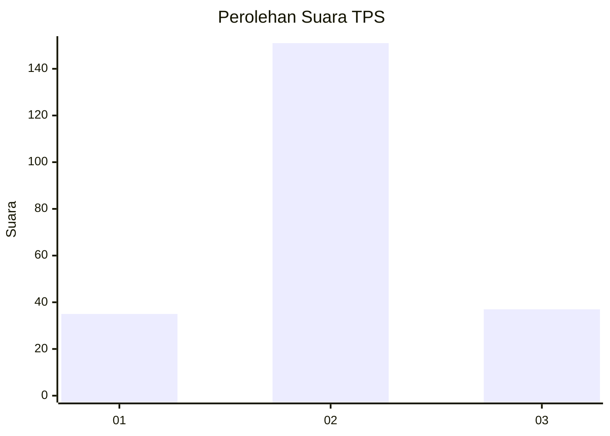
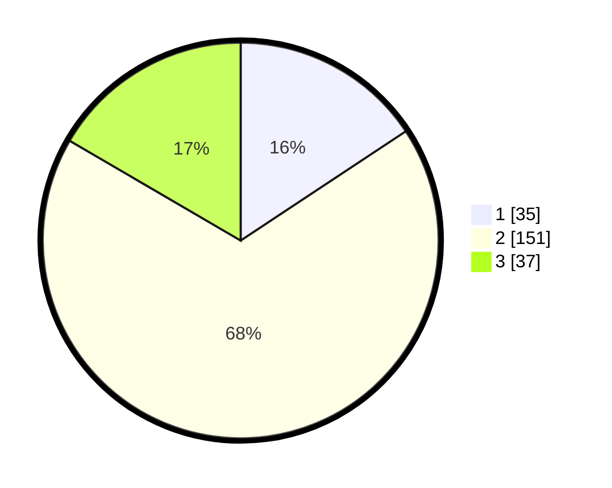

# Hasil

## Grafik

## Tabel

| No. | Nama Paslon    | Suara | Suara (raw) | Persentase |
|:--- |:-------------- | -----:| -----------:| ----------:|
| 1   | ANIES MUHAIMIN | 35    | [35][p-1]   | 15,70      |
| 2   | PRABOWO GIBRAN | 151   | [151][p-2]  | 67,71      |
| 3   | GANJAR MAHFUD  | 37    | [37][p-3]   | 16,59      |

[p-1]: https://github.com/gigit-pemilu/pemilu-2024-35-jawa-timur/blob/main/pilpres/hitung-suara/sub/35-jawa-timur/sub/06-kediri/sub/23-ringinrejo/sub/2010-srikaton/sub/007-tps/sub/paslon-1.txt
[p-2]: https://github.com/gigit-pemilu/pemilu-2024-35-jawa-timur/blob/main/pilpres/hitung-suara/sub/35-jawa-timur/sub/06-kediri/sub/23-ringinrejo/sub/2010-srikaton/sub/007-tps/sub/paslon-2.txt
[p-3]: https://github.com/gigit-pemilu/pemilu-2024-35-jawa-timur/blob/main/pilpres/hitung-suara/sub/35-jawa-timur/sub/06-kediri/sub/23-ringinrejo/sub/2010-srikaton/sub/007-tps/sub/paslon-3.txt

## Foto C Plano

https://sirekap-obj-formc.kpu.go.id/b12f/pemilu/ppwp/35/06/23/20/10/3506232010007-20240222-105338--9f506cbe-8dc7-4231-9439-6bb60946411f.jpg

https://sirekap-obj-formc.kpu.go.id/b12f/pemilu/ppwp/35/06/23/20/10/3506232010007-20240215-042822--6b3e97be-4b52-4c56-a5c7-2fc8acf7b744.jpg

https://sirekap-obj-formc.kpu.go.id/b12f/pemilu/ppwp/35/06/23/20/10/3506232010007-20240215-042936--3ba6b206-cdf9-4b45-a2b1-153395c1dbd2.jpg

## Metadata

| Key        | Value               |
| ---------- | ------------------- |
| Time Stamp | 2024-02-22 11:00:00 |

