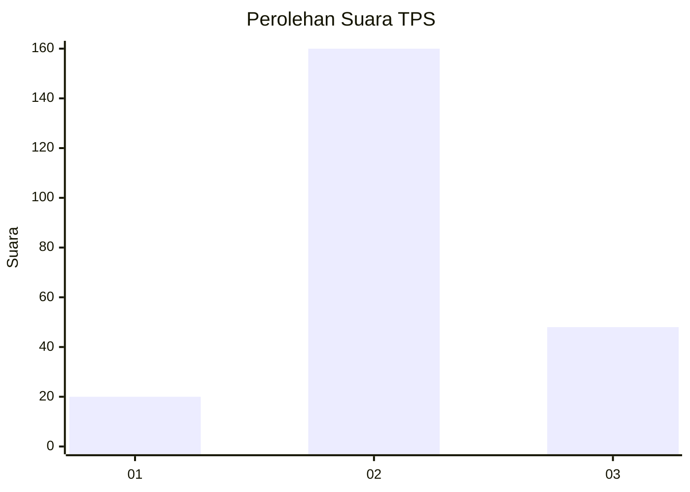
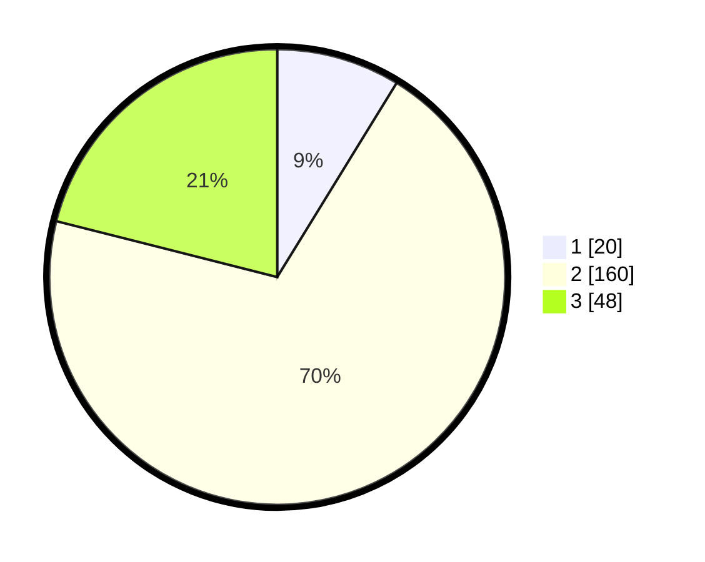

# Hasil

## Grafik

## Tabel

| No. | Nama Paslon    | Suara | Suara (raw) | Persentase |
|:--- |:-------------- | -----:| -----------:| ----------:|
| 1   | ANIES MUHAIMIN | 20    | [20][p-1]   | 8,77       |
| 2   | PRABOWO GIBRAN | 160   | [160][p-2]  | 70,18      |
| 3   | GANJAR MAHFUD  | 48    | [48][p-3]   | 21,05      |

[p-1]: https://github.com/gigit-pemilu/pemilu-2024/blob/main/pilpres/hitung-suara/sub/35-jawa-timur/sub/06-kediri/sub/26-badas/sub/2001-canggu/sub/009-tps/sub/paslon-1.txt
[p-2]: https://github.com/gigit-pemilu/pemilu-2024/blob/main/pilpres/hitung-suara/sub/35-jawa-timur/sub/06-kediri/sub/26-badas/sub/2001-canggu/sub/009-tps/sub/paslon-2.txt
[p-3]: https://github.com/gigit-pemilu/pemilu-2024/blob/main/pilpres/hitung-suara/sub/35-jawa-timur/sub/06-kediri/sub/26-badas/sub/2001-canggu/sub/009-tps/sub/paslon-3.txt

## Foto C Plano

https://sirekap-obj-formc.kpu.go.id/b081/pemilu/ppwp/35/06/26/20/01/3506262001009-20240301-191624--bd9d3634-d433-4941-ac2b-528e87690fc6.jpg

https://sirekap-obj-formc.kpu.go.id/b081/pemilu/ppwp/35/06/26/20/01/3506262001009-20240301-191710--ea647573-afab-49f4-822c-f287eb127e21.jpg

https://sirekap-obj-formc.kpu.go.id/b081/pemilu/ppwp/35/06/26/20/01/3506262001009-20240301-191722--6a41ede6-87e9-45cb-bdda-8b7bf9598239.jpg

## Metadata

| Key        | Value               |
| ---------- | ------------------- |
| Time Stamp | 2024-03-05 13:00:00 |

