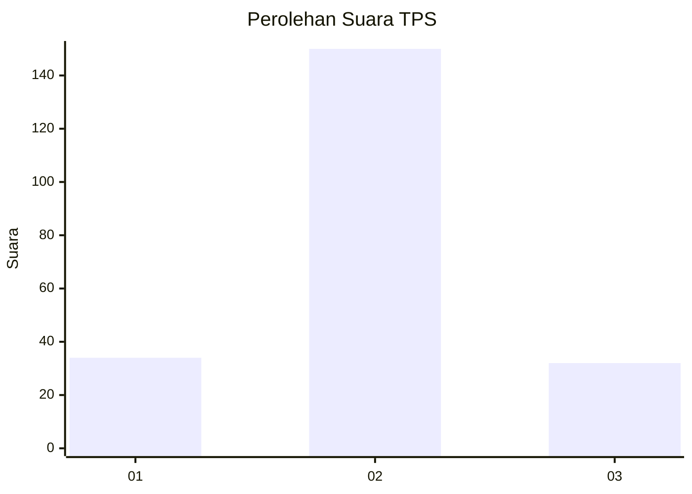

# Hasil

## Grafik

## Tabel

| No. | Nama Paslon    | Suara | Suara (raw) | Persentase |
|:--- |:-------------- | -----:| -----------:| ----------:|
| 1   | ANIES MUHAIMIN | 34    | [34][p-1]   | 15,74      |
| 2   | PRABOWO GIBRAN | 150   | [150][p-2]  | 69,44      |
| 3   | GANJAR MAHFUD  | 32    | [32][p-3]   | 14,81      |

[p-1]: https://github.com/gigit-pemilu/pemilu-2024/blob/main/pilpres/hitung-suara/sub/35-jawa-timur/sub/06-kediri/sub/26-badas/sub/2002-lamong/sub/004-tps/sub/paslon-1.txt
[p-2]: https://github.com/gigit-pemilu/pemilu-2024/blob/main/pilpres/hitung-suara/sub/35-jawa-timur/sub/06-kediri/sub/26-badas/sub/2002-lamong/sub/004-tps/sub/paslon-2.txt
[p-3]: https://github.com/gigit-pemilu/pemilu-2024/blob/main/pilpres/hitung-suara/sub/35-jawa-timur/sub/06-kediri/sub/26-badas/sub/2002-lamong/sub/004-tps/sub/paslon-3.txt

## Foto C Plano

https://sirekap-obj-formc.kpu.go.id/1ebb/pemilu/ppwp/35/06/26/20/02/3506262002004-20240224-152631--d71dd7af-3ac2-4697-bbcc-9bf7c8ea9464.jpg

https://sirekap-obj-formc.kpu.go.id/1ebb/pemilu/ppwp/35/06/26/20/02/3506262002004-20240224-152741--ed18ebac-71cc-4c72-9e8e-911a9b2bc9a5.jpg

https://sirekap-obj-formc.kpu.go.id/1ebb/pemilu/ppwp/35/06/26/20/02/3506262002004-20240224-153026--f6728e3c-59a1-4a9e-a4e1-0108a434cf93.jpg

## Metadata

| Key        | Value               |
| ---------- | ------------------- |
| Time Stamp | 2024-02-28 19:00:00 |

