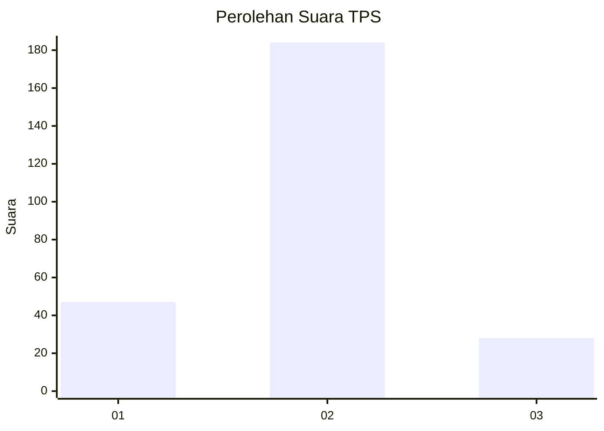
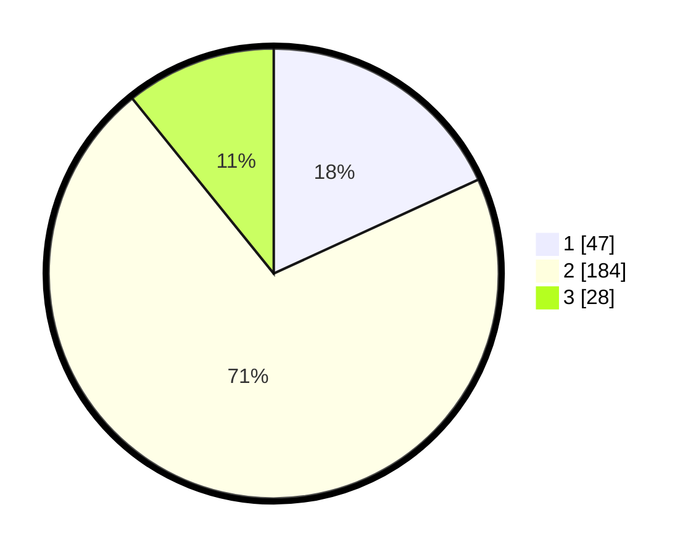

# Hasil

## Grafik

## Tabel

| No. | Nama Paslon    | Suara | Suara (raw) | Persentase |
|:--- |:-------------- | -----:| -----------:| ----------:|
| 1   | ANIES MUHAIMIN | 47    | [47][p-1]   | 18,15      |
| 2   | PRABOWO GIBRAN | 184   | [184][p-2]  | 71,04      |
| 3   | GANJAR MAHFUD  | 28    | [28][p-3]   | 10,81      |

[p-1]: https://github.com/gigit-pemilu/pemilu-2024-35-jawa-timur/blob/main/pilpres/hitung-suara/sub/35-jawa-timur/sub/06-kediri/sub/26-badas/sub/2002-lamong/sub/012-tps/sub/paslon-1.txt
[p-2]: https://github.com/gigit-pemilu/pemilu-2024-35-jawa-timur/blob/main/pilpres/hitung-suara/sub/35-jawa-timur/sub/06-kediri/sub/26-badas/sub/2002-lamong/sub/012-tps/sub/paslon-2.txt
[p-3]: https://github.com/gigit-pemilu/pemilu-2024-35-jawa-timur/blob/main/pilpres/hitung-suara/sub/35-jawa-timur/sub/06-kediri/sub/26-badas/sub/2002-lamong/sub/012-tps/sub/paslon-3.txt

## Foto C Plano

https://sirekap-obj-formc.kpu.go.id/e6f4/pemilu/ppwp/35/06/26/20/02/3506262002012-20240301-181131--6b536c37-169a-424b-8489-5fa6fb321aae.jpg

https://sirekap-obj-formc.kpu.go.id/e6f4/pemilu/ppwp/35/06/26/20/02/3506262002012-20240215-204747--0d12bc57-7f3e-4b15-859b-c09519c7d20f.jpg

https://sirekap-obj-formc.kpu.go.id/e6f4/pemilu/ppwp/35/06/26/20/02/3506262002012-20240221-183622--6628942f-c3d0-499d-8d11-2dadbb867725.jpg

## Metadata

| Key        | Value               |
| ---------- | ------------------- |
| Time Stamp | 2024-03-01 19:00:00 |

