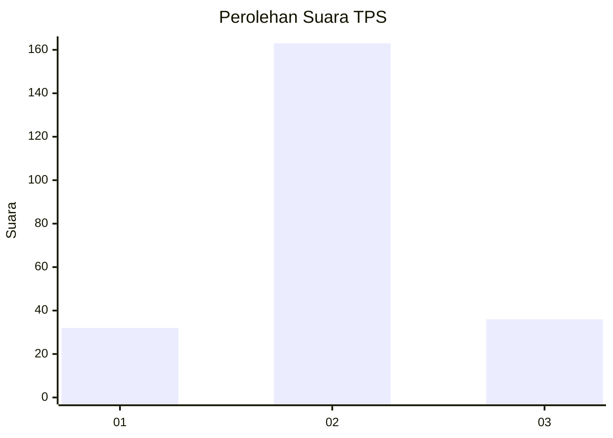

# Hasil

## Grafik

## Tabel

| No. | Nama Paslon    | Suara | Suara (raw) | Persentase |
|:--- |:-------------- | -----:| -----------:| ----------:|
| 1   | ANIES MUHAIMIN | 32    | [32][p-1]   | 13,85      |
| 2   | PRABOWO GIBRAN | 163   | [163][p-2]  | 70,56      |
| 3   | GANJAR MAHFUD  | 36    | [36][p-3]   | 15,58      |

[p-1]: https://github.com/gigit-pemilu/pemilu-2024/blob/main/pilpres/hitung-suara/sub/35-jawa-timur/sub/06-kediri/sub/26-badas/sub/2002-lamong/sub/013-tps/sub/paslon-1.txt
[p-2]: https://github.com/gigit-pemilu/pemilu-2024/blob/main/pilpres/hitung-suara/sub/35-jawa-timur/sub/06-kediri/sub/26-badas/sub/2002-lamong/sub/013-tps/sub/paslon-2.txt
[p-3]: https://github.com/gigit-pemilu/pemilu-2024/blob/main/pilpres/hitung-suara/sub/35-jawa-timur/sub/06-kediri/sub/26-badas/sub/2002-lamong/sub/013-tps/sub/paslon-3.txt

## Foto C Plano

https://sirekap-obj-formc.kpu.go.id/fce2/pemilu/ppwp/35/06/26/20/02/3506262002013-20240225-010543--ce8f3591-295f-4f12-b510-9e5a50bfc021.jpg

https://sirekap-obj-formc.kpu.go.id/fce2/pemilu/ppwp/35/06/26/20/02/3506262002013-20240217-181132--e17f9581-4deb-41c8-8788-3f80c220a1c9.jpg

https://sirekap-obj-formc.kpu.go.id/fce2/pemilu/ppwp/35/06/26/20/02/3506262002013-20240217-182913--0e61002a-25bc-401a-8b4b-beac31bd5081.jpg

## Metadata

| Key        | Value               |
| ---------- | ------------------- |
| Time Stamp | 2024-02-25 02:00:00 |

