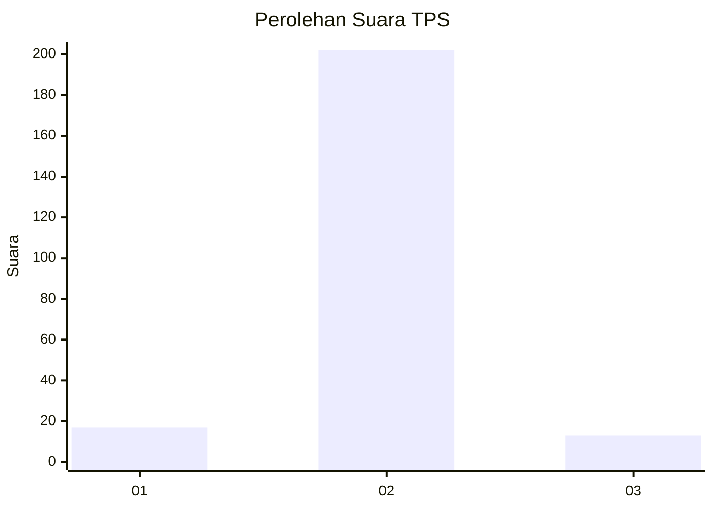
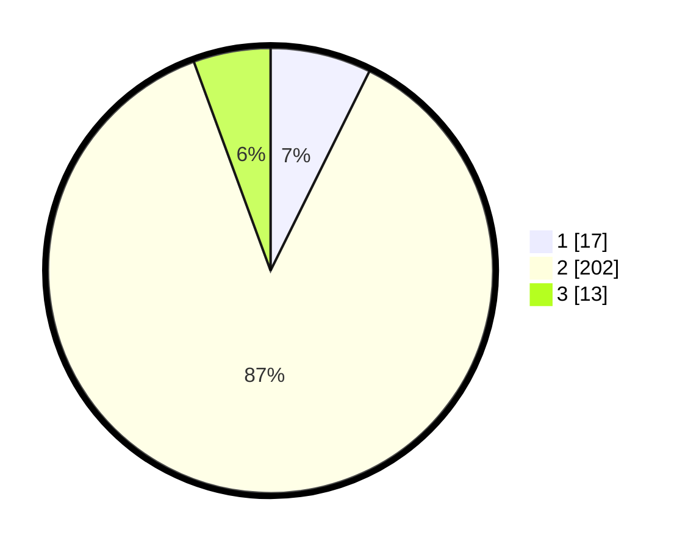

# Hasil

## Grafik

## Tabel

| No. | Nama Paslon    | Suara | Suara (raw) | Persentase |
|:--- |:-------------- | -----:| -----------:| ----------:|
| 1   | ANIES MUHAIMIN | 17    | [17][p-1]   | 7,33       |
| 2   | PRABOWO GIBRAN | 202   | [202][p-2]  | 87,07      |
| 3   | GANJAR MAHFUD  | 13    | [13][p-3]   | 5,60       |

[p-1]: https://github.com/gigit-pemilu/pemilu-2024/blob/main/pilpres/hitung-suara/sub/35-jawa-timur/sub/06-kediri/sub/26-badas/sub/2003-bringin/sub/005-tps/sub/paslon-1.txt
[p-2]: https://github.com/gigit-pemilu/pemilu-2024/blob/main/pilpres/hitung-suara/sub/35-jawa-timur/sub/06-kediri/sub/26-badas/sub/2003-bringin/sub/005-tps/sub/paslon-2.txt
[p-3]: https://github.com/gigit-pemilu/pemilu-2024/blob/main/pilpres/hitung-suara/sub/35-jawa-timur/sub/06-kediri/sub/26-badas/sub/2003-bringin/sub/005-tps/sub/paslon-3.txt

## Foto C Plano

https://sirekap-obj-formc.kpu.go.id/4ff6/pemilu/ppwp/35/06/26/20/03/3506262003005-20240214-141344--a1a99a9e-61f0-43e3-9230-df531022b0b9.jpg

https://sirekap-obj-formc.kpu.go.id/4ff6/pemilu/ppwp/35/06/26/20/03/3506262003005-20240214-141519--9351d2cb-e931-4c3f-b151-da6f6e7f94ed.jpg

https://sirekap-obj-formc.kpu.go.id/4ff6/pemilu/ppwp/35/06/26/20/03/3506262003005-20240214-212516--4299cba3-8b8a-4603-b3f8-e1c7cd450041.jpg

## Metadata

| Key        | Value               |
| ---------- | ------------------- |
| Time Stamp | 2024-02-15 12:00:28 |

