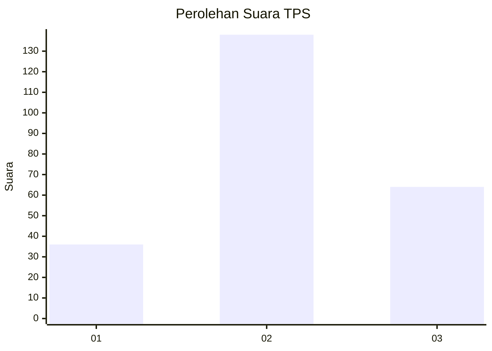
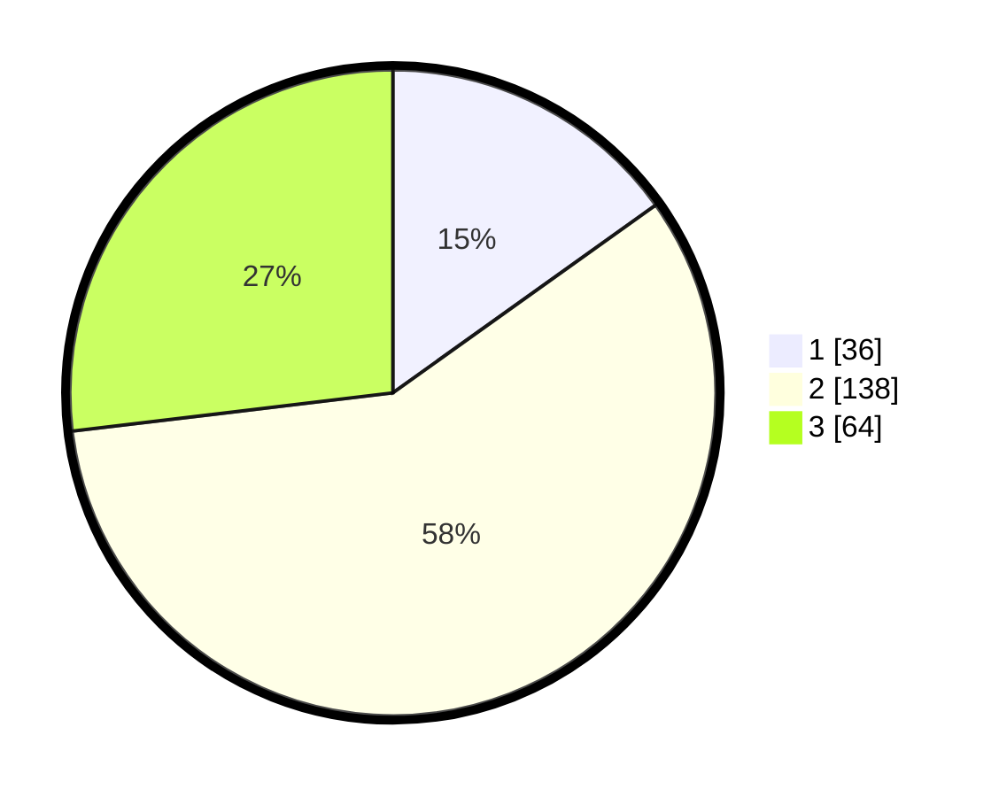

# Hasil

## Grafik

## Tabel

| No. | Nama Paslon    | Suara | Suara (raw) | Persentase |
|:--- |:-------------- | -----:| -----------:| ----------:|
| 1   | ANIES MUHAIMIN | 36    | [36][p-1]   | 15,13      |
| 2   | PRABOWO GIBRAN | 138   | [138][p-2]  | 57,98      |
| 3   | GANJAR MAHFUD  | 64    | [64][p-3]   | 26,89      |

[p-1]: https://github.com/gigit-pemilu/pemilu-2024-35-jawa-timur/blob/main/pilpres/hitung-suara/sub/35-jawa-timur/sub/06-kediri/sub/26-badas/sub/2005-tunglur/sub/014-tps/sub/paslon-1.txt
[p-2]: https://github.com/gigit-pemilu/pemilu-2024-35-jawa-timur/blob/main/pilpres/hitung-suara/sub/35-jawa-timur/sub/06-kediri/sub/26-badas/sub/2005-tunglur/sub/014-tps/sub/paslon-2.txt
[p-3]: https://github.com/gigit-pemilu/pemilu-2024-35-jawa-timur/blob/main/pilpres/hitung-suara/sub/35-jawa-timur/sub/06-kediri/sub/26-badas/sub/2005-tunglur/sub/014-tps/sub/paslon-3.txt

## Foto C Plano

https://sirekap-obj-formc.kpu.go.id/8483/pemilu/ppwp/35/06/26/20/05/3506262005014-20240214-203319--6a60054c-e087-4d15-a141-3d615feb96e7.jpg

https://sirekap-obj-formc.kpu.go.id/8483/pemilu/ppwp/35/06/26/20/05/3506262005014-20240215-043422--7a80c0c0-f2c2-4398-8b6c-d0ca7b2f1023.jpg

https://sirekap-obj-formc.kpu.go.id/8483/pemilu/ppwp/35/06/26/20/05/3506262005014-20240215-043544--5fc7d5ff-fa9a-4376-a332-275b634ebdb0.jpg

## Metadata

| Key        | Value               |
| ---------- | ------------------- |
| Time Stamp | 2024-02-17 16:00:02 |

