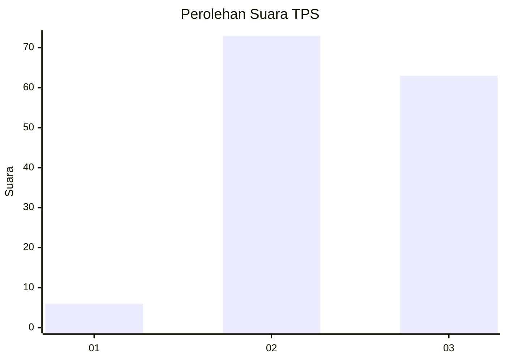
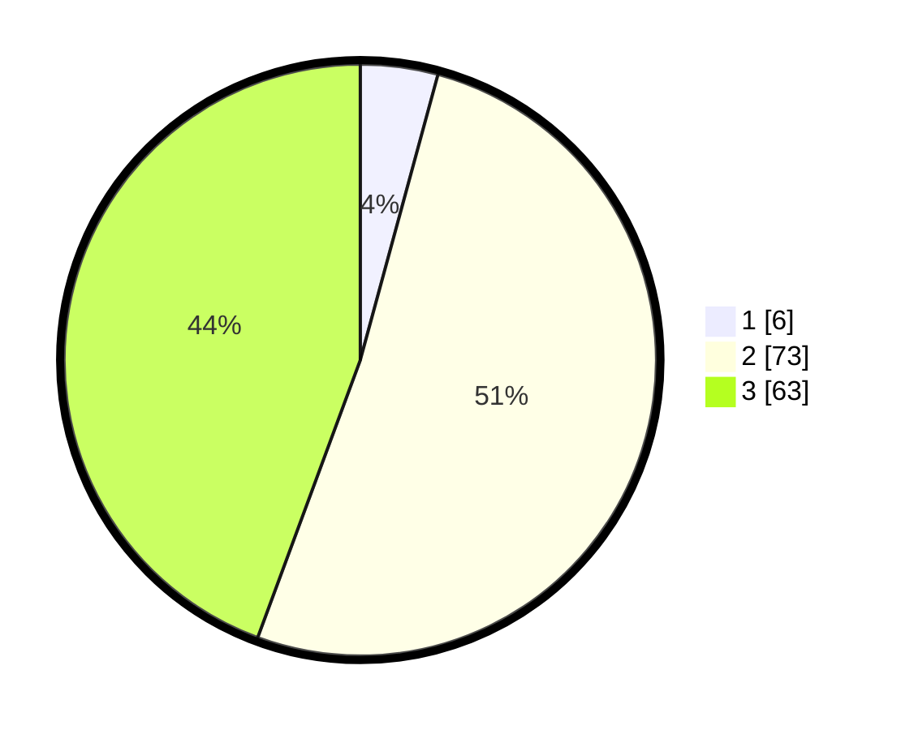

# Hasil

## Grafik

## Tabel

| No. | Nama Paslon    | Suara | Suara (raw) | Persentase |
|:--- |:-------------- | -----:| -----------:| ----------:|
| 1   | ANIES MUHAIMIN | 6     | [6][p-1]    | 4,23       |
| 2   | PRABOWO GIBRAN | 73    | [73][p-2]   | 51,41      |
| 3   | GANJAR MAHFUD  | 63    | [63][p-3]   | 44,37      |

[p-1]: https://github.com/gigit-pemilu/pemilu-2024/blob/main/pilpres/hitung-suara/sub/35-jawa-timur/sub/07-malang/sub/01-donomulyo/sub/2006-donomulyo/sub/028-tps/sub/paslon-1.txt
[p-2]: https://github.com/gigit-pemilu/pemilu-2024/blob/main/pilpres/hitung-suara/sub/35-jawa-timur/sub/07-malang/sub/01-donomulyo/sub/2006-donomulyo/sub/028-tps/sub/paslon-2.txt
[p-3]: https://github.com/gigit-pemilu/pemilu-2024/blob/main/pilpres/hitung-suara/sub/35-jawa-timur/sub/07-malang/sub/01-donomulyo/sub/2006-donomulyo/sub/028-tps/sub/paslon-3.txt

## Foto C Plano

https://sirekap-obj-formc.kpu.go.id/d6d6/pemilu/ppwp/35/07/01/20/06/3507012006028-20240215-022056--20376c51-c67f-4489-bedf-026ad8880ee9.jpg

https://sirekap-obj-formc.kpu.go.id/d6d6/pemilu/ppwp/35/07/01/20/06/3507012006028-20240215-022212--8c161f41-323e-4ba9-b860-ca33e717e617.jpg

https://sirekap-obj-formc.kpu.go.id/d6d6/pemilu/ppwp/35/07/01/20/06/3507012006028-20240219-070807--b8a9391e-8da4-4f08-9af1-9237b61fdece.jpg

## Metadata

| Key        | Value               |
| ---------- | ------------------- |
| Time Stamp | 2024-02-19 08:00:00 |

