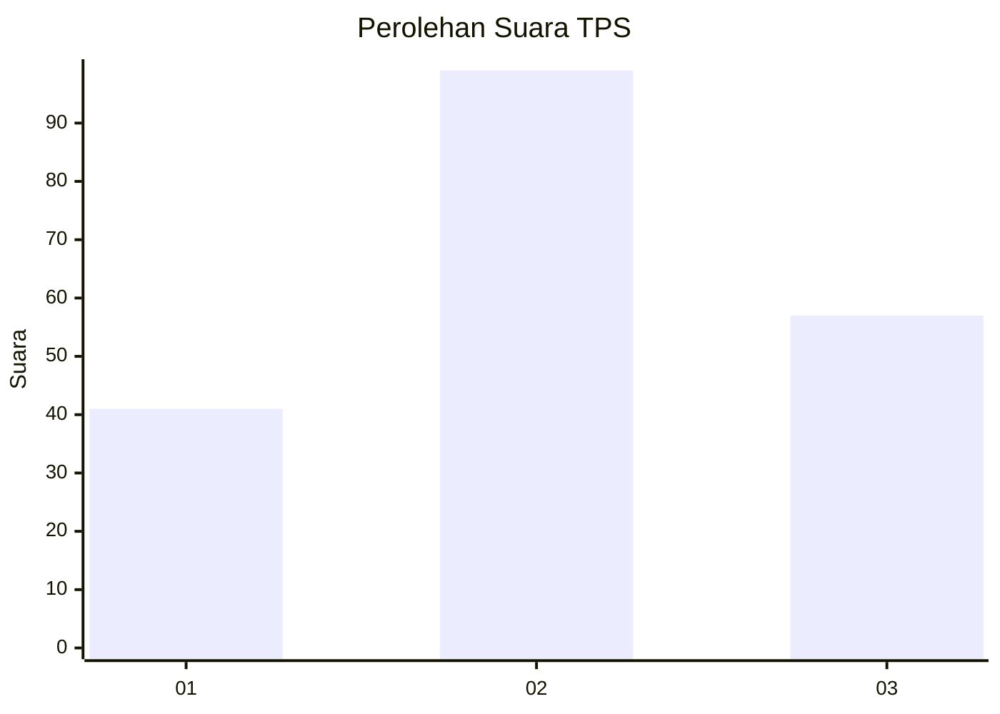
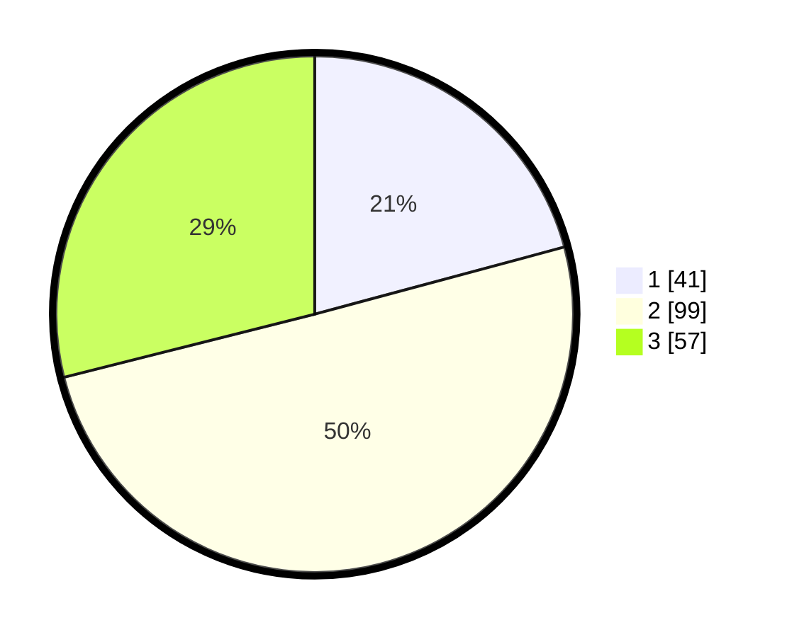

# Hasil

## Grafik

## Tabel

| No. | Nama Paslon    | Suara | Suara (raw) | Persentase |
|:--- |:-------------- | -----:| -----------:| ----------:|
| 1   | ANIES MUHAIMIN | 41    | [41][p-1]   | 20,81      |
| 2   | PRABOWO GIBRAN | 99    | [99][p-2]   | 50,25      |
| 3   | GANJAR MAHFUD  | 57    | [57][p-3]   | 28,93      |

[p-1]: https://github.com/gigit-pemilu/pemilu-2024/blob/main/pilpres/hitung-suara/sub/35-jawa-timur/sub/07-malang/sub/01-donomulyo/sub/2006-donomulyo/sub/031-tps/sub/paslon-1.txt
[p-2]: https://github.com/gigit-pemilu/pemilu-2024/blob/main/pilpres/hitung-suara/sub/35-jawa-timur/sub/07-malang/sub/01-donomulyo/sub/2006-donomulyo/sub/031-tps/sub/paslon-2.txt
[p-3]: https://github.com/gigit-pemilu/pemilu-2024/blob/main/pilpres/hitung-suara/sub/35-jawa-timur/sub/07-malang/sub/01-donomulyo/sub/2006-donomulyo/sub/031-tps/sub/paslon-3.txt

## Foto C Plano

https://sirekap-obj-formc.kpu.go.id/1c20/pemilu/ppwp/35/07/01/20/06/3507012006031-20240218-203337--0938105f-e46c-4978-8b95-ceedf752fb97.jpg

https://sirekap-obj-formc.kpu.go.id/1c20/pemilu/ppwp/35/07/01/20/06/3507012006031-20240218-193804--56a3893b-05d2-416a-bd7c-30970044d710.jpg

https://sirekap-obj-formc.kpu.go.id/1c20/pemilu/ppwp/35/07/01/20/06/3507012006031-20240218-194530--088c76f7-9aa3-40bf-a846-574bd3259a94.jpg

## Metadata

| Key        | Value               |
| ---------- | ------------------- |
| Time Stamp | 2024-02-24 22:31:28 |

