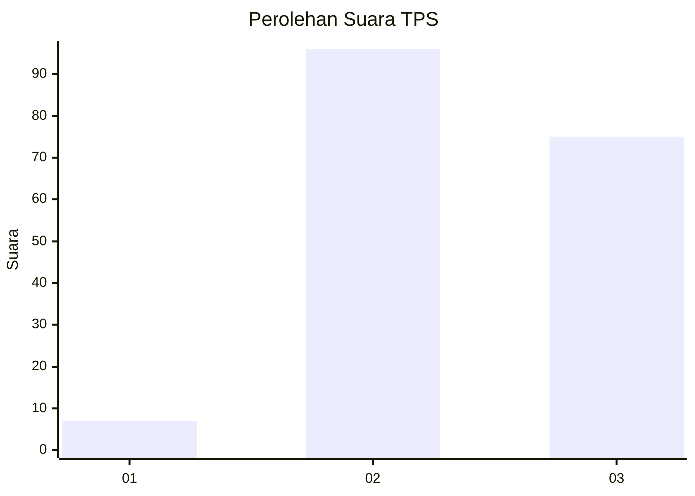
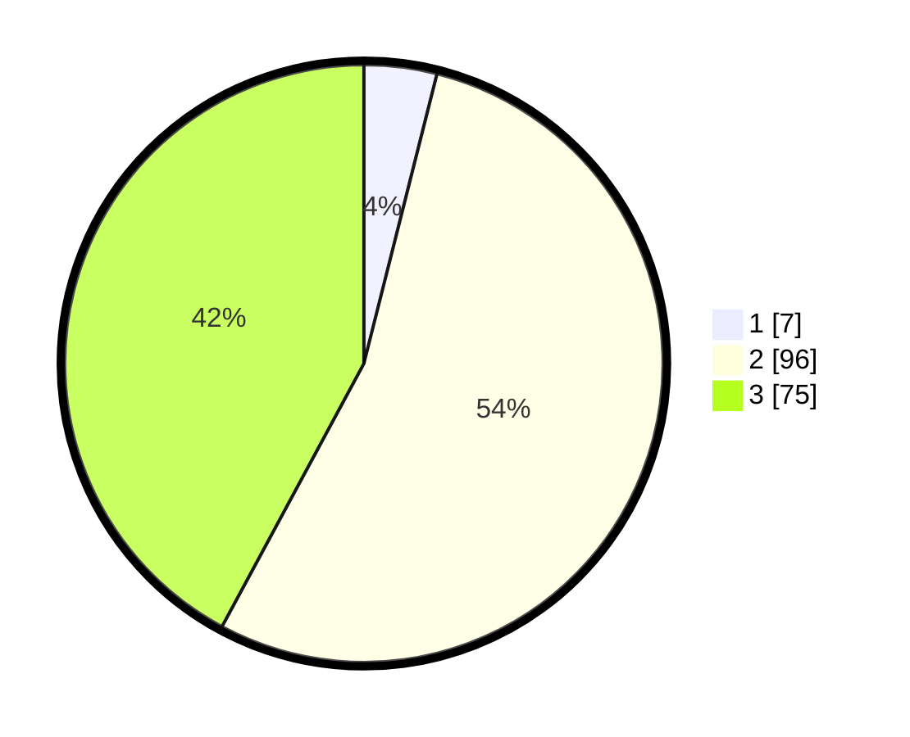

# Hasil

## Grafik

## Tabel

| No. | Nama Paslon    | Suara | Suara (raw) | Persentase |
|:--- |:-------------- | -----:| -----------:| ----------:|
| 1   | ANIES MUHAIMIN | 7     | [7][p-1]    | 3,93       |
| 2   | PRABOWO GIBRAN | 96    | [96][p-2]   | 53,93      |
| 3   | GANJAR MAHFUD  | 75    | [75][p-3]   | 42,13      |

[p-1]: https://github.com/gigit-pemilu/pemilu-2024-35-jawa-timur/blob/main/pilpres/hitung-suara/sub/35-jawa-timur/sub/07-malang/sub/01-donomulyo/sub/2006-donomulyo/sub/032-tps/sub/paslon-1.txt
[p-2]: https://github.com/gigit-pemilu/pemilu-2024-35-jawa-timur/blob/main/pilpres/hitung-suara/sub/35-jawa-timur/sub/07-malang/sub/01-donomulyo/sub/2006-donomulyo/sub/032-tps/sub/paslon-2.txt
[p-3]: https://github.com/gigit-pemilu/pemilu-2024-35-jawa-timur/blob/main/pilpres/hitung-suara/sub/35-jawa-timur/sub/07-malang/sub/01-donomulyo/sub/2006-donomulyo/sub/032-tps/sub/paslon-3.txt

## Foto C Plano

https://sirekap-obj-formc.kpu.go.id/aba8/pemilu/ppwp/35/07/01/20/06/3507012006032-20240215-020305--3dffd4ca-94b1-4a19-a658-d32be44fddab.jpg

https://sirekap-obj-formc.kpu.go.id/aba8/pemilu/ppwp/35/07/01/20/06/3507012006032-20240215-020357--13518e57-b360-4197-9a33-0077079af395.jpg

https://sirekap-obj-formc.kpu.go.id/aba8/pemilu/ppwp/35/07/01/20/06/3507012006032-20240219-112504--88de6720-24cd-40cd-90fe-d6f18cc71ef3.jpg

## Metadata

| Key        | Value               |
| ---------- | ------------------- |
| Time Stamp | 2024-02-19 12:00:00 |

