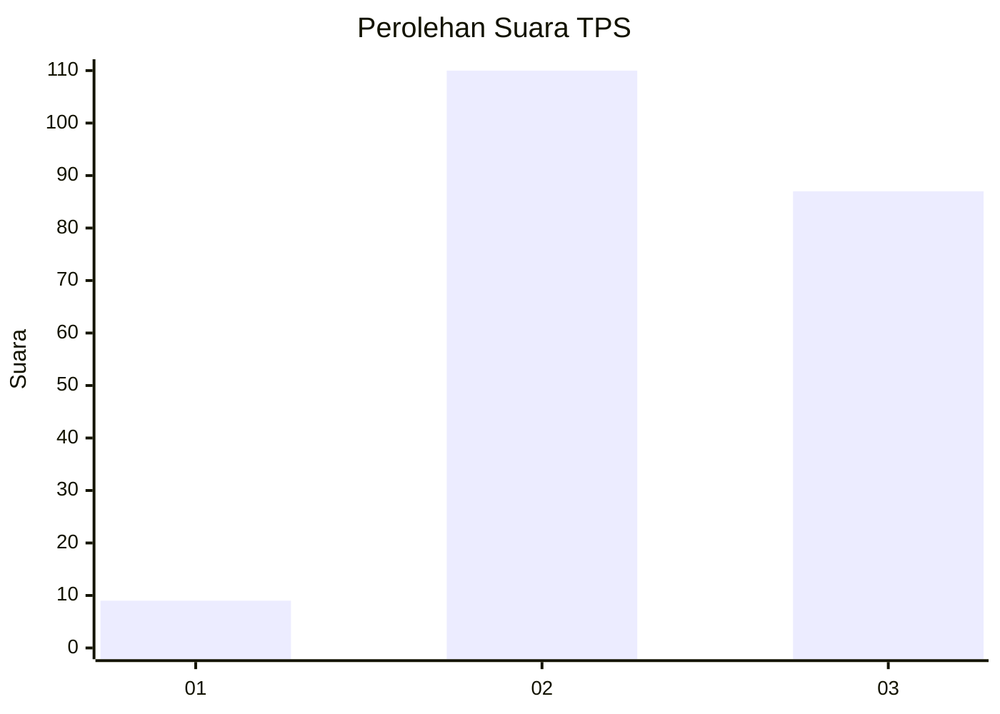
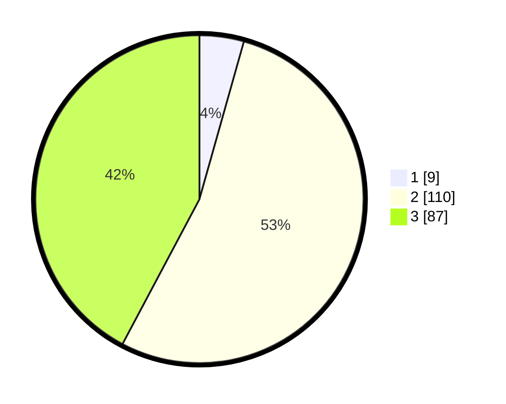

# Hasil

## Grafik

## Tabel

| No. | Nama Paslon    | Suara | Suara (raw) | Persentase |
|:--- |:-------------- | -----:| -----------:| ----------:|
| 1   | ANIES MUHAIMIN | 9     | [9][p-1]    | 4,37       |
| 2   | PRABOWO GIBRAN | 110   | [110][p-2]  | 53,40      |
| 3   | GANJAR MAHFUD  | 87    | [87][p-3]   | 42,23      |

[p-1]: https://github.com/gigit-pemilu/pemilu-2024-35-jawa-timur/blob/main/pilpres/hitung-suara/sub/35-jawa-timur/sub/07-malang/sub/01-donomulyo/sub/2007-purworejo/sub/023-tps/sub/paslon-1.txt
[p-2]: https://github.com/gigit-pemilu/pemilu-2024-35-jawa-timur/blob/main/pilpres/hitung-suara/sub/35-jawa-timur/sub/07-malang/sub/01-donomulyo/sub/2007-purworejo/sub/023-tps/sub/paslon-2.txt
[p-3]: https://github.com/gigit-pemilu/pemilu-2024-35-jawa-timur/blob/main/pilpres/hitung-suara/sub/35-jawa-timur/sub/07-malang/sub/01-donomulyo/sub/2007-purworejo/sub/023-tps/sub/paslon-3.txt

## Foto C Plano

https://sirekap-obj-formc.kpu.go.id/f803/pemilu/ppwp/35/07/01/20/07/3507012007023-20240214-155840--3b054d6c-9d91-4623-a74c-f75fce926884.jpg

https://sirekap-obj-formc.kpu.go.id/f803/pemilu/ppwp/35/07/01/20/07/3507012007023-20240214-160059--ca201469-3709-49cf-9314-e559e16a2167.jpg

https://sirekap-obj-formc.kpu.go.id/f803/pemilu/ppwp/35/07/01/20/07/3507012007023-20240214-160101--a4295c01-8c22-4340-99cd-699776490499.jpg

## Metadata

| Key        | Value               |
| ---------- | ------------------- |
| Time Stamp | 2024-02-15 16:30:25 |

