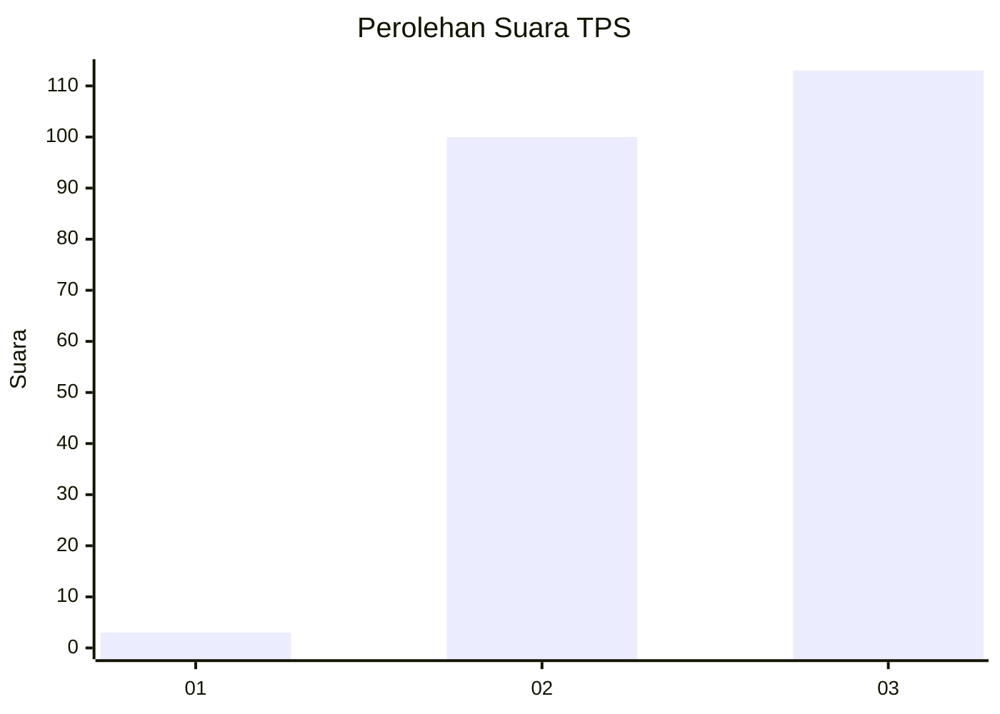
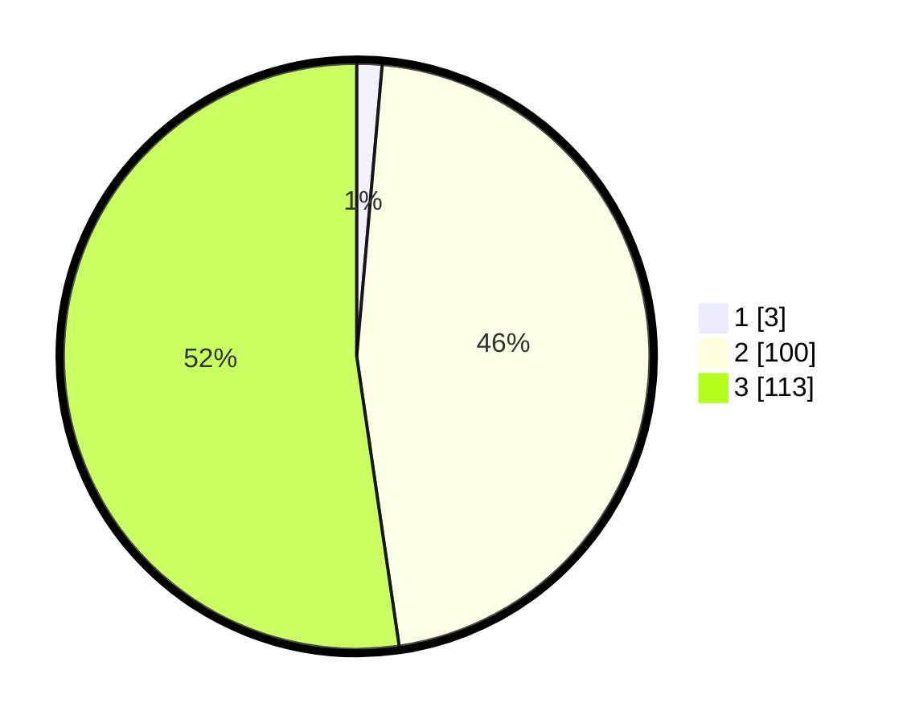

# Hasil

## Grafik

## Tabel

| No. | Nama Paslon    | Suara | Suara (raw) | Persentase |
|:--- |:-------------- | -----:| -----------:| ----------:|
| 1   | ANIES MUHAIMIN | 3     | [3][p-1]    | 1,39       |
| 2   | PRABOWO GIBRAN | 100   | [100][p-2]  | 46,30      |
| 3   | GANJAR MAHFUD  | 113   | [113][p-3]  | 52,31      |

[p-1]: https://github.com/gigit-pemilu/pemilu-2024/blob/main/pilpres/hitung-suara/sub/35-jawa-timur/sub/07-malang/sub/01-donomulyo/sub/2009-mentaraman/sub/013-tps/sub/paslon-1.txt
[p-2]: https://github.com/gigit-pemilu/pemilu-2024/blob/main/pilpres/hitung-suara/sub/35-jawa-timur/sub/07-malang/sub/01-donomulyo/sub/2009-mentaraman/sub/013-tps/sub/paslon-2.txt
[p-3]: https://github.com/gigit-pemilu/pemilu-2024/blob/main/pilpres/hitung-suara/sub/35-jawa-timur/sub/07-malang/sub/01-donomulyo/sub/2009-mentaraman/sub/013-tps/sub/paslon-3.txt

## Foto C Plano

https://sirekap-obj-formc.kpu.go.id/d054/pemilu/ppwp/35/07/01/20/09/3507012009013-20240227-175018--5d456c94-aabc-4706-9235-66b9ee5ab92e.jpg

https://sirekap-obj-formc.kpu.go.id/d054/pemilu/ppwp/35/07/01/20/09/3507012009013-20240215-035746--bf227828-6f80-4c11-a663-d062ce1d04ca.jpg

https://sirekap-obj-formc.kpu.go.id/d054/pemilu/ppwp/35/07/01/20/09/3507012009013-20240215-022531--40042513-75e5-4263-b8c1-9ca21332aeba.jpg

## Metadata

| Key        | Value               |
| ---------- | ------------------- |
| Time Stamp | 2024-02-27 18:00:00 |

