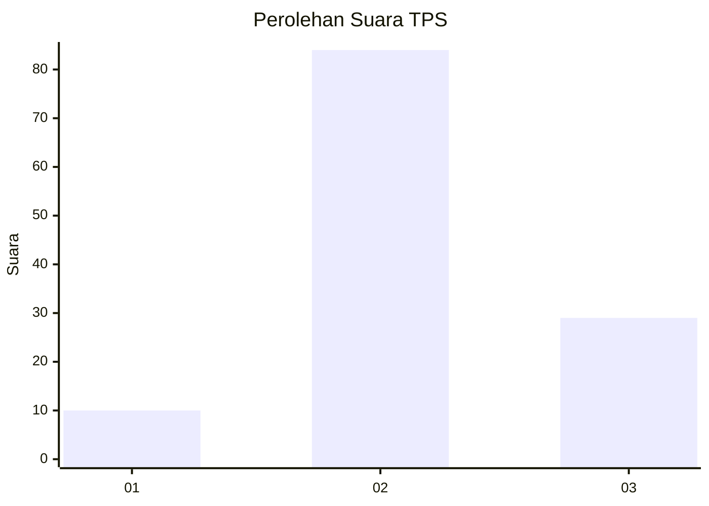
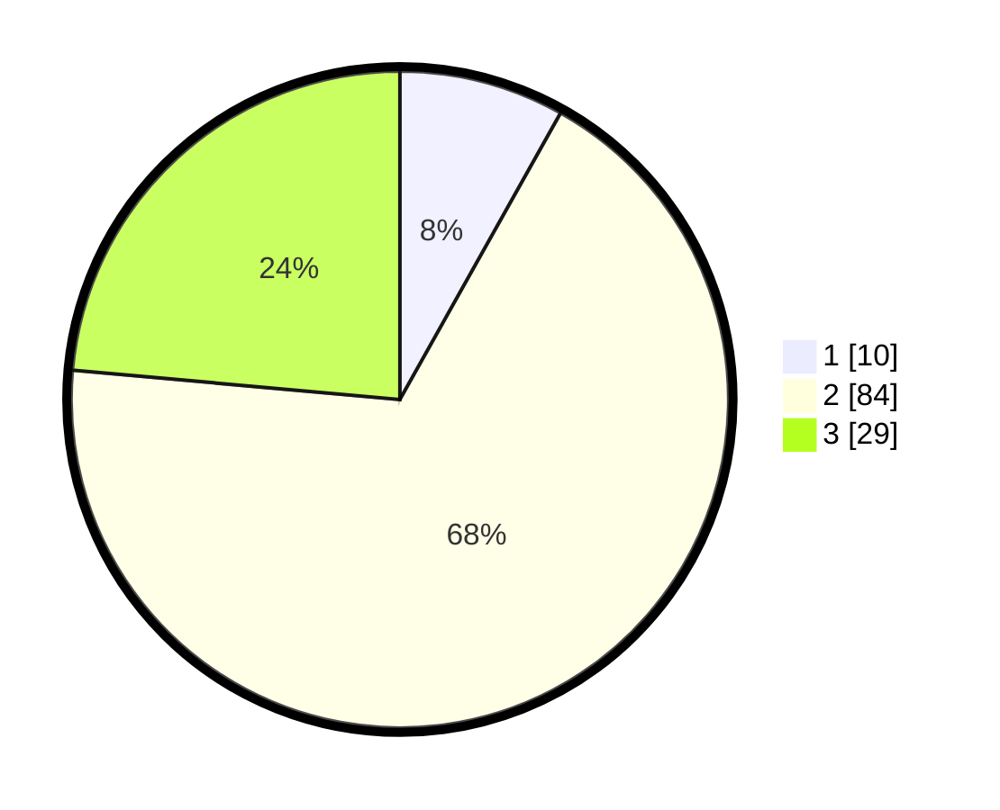

# Hasil

## Grafik

## Tabel

| No. | Nama Paslon    | Suara | Suara (raw) | Persentase |
|:--- |:-------------- | -----:| -----------:| ----------:|
| 1   | ANIES MUHAIMIN | 10    | [10][p-1]   | 8,13       |
| 2   | PRABOWO GIBRAN | 84    | [84][p-2]   | 68,29      |
| 3   | GANJAR MAHFUD  | 29    | [29][p-3]   | 23,58      |

[p-1]: https://github.com/gigit-pemilu/pemilu-2024-35-jawa-timur/blob/main/pilpres/hitung-suara/sub/35-jawa-timur/sub/07-malang/sub/02-pagak/sub/2001-sumbermanjingkulon/sub/026-tps/sub/paslon-1.txt
[p-2]: https://github.com/gigit-pemilu/pemilu-2024-35-jawa-timur/blob/main/pilpres/hitung-suara/sub/35-jawa-timur/sub/07-malang/sub/02-pagak/sub/2001-sumbermanjingkulon/sub/026-tps/sub/paslon-2.txt
[p-3]: https://github.com/gigit-pemilu/pemilu-2024-35-jawa-timur/blob/main/pilpres/hitung-suara/sub/35-jawa-timur/sub/07-malang/sub/02-pagak/sub/2001-sumbermanjingkulon/sub/026-tps/sub/paslon-3.txt

## Foto C Plano

https://sirekap-obj-formc.kpu.go.id/c1ac/pemilu/ppwp/35/07/02/20/01/3507022001026-20240218-184001--86488be1-8d99-4719-9600-dbaa2693a96d.jpg

https://sirekap-obj-formc.kpu.go.id/c1ac/pemilu/ppwp/35/07/02/20/01/3507022001026-20240218-184145--ab63731b-0faa-4bea-a7ab-073a6816b915.jpg

https://sirekap-obj-formc.kpu.go.id/c1ac/pemilu/ppwp/35/07/02/20/01/3507022001026-20240218-184343--3a7c943c-82e5-4f14-9ac4-5a0cfb994250.jpg

## Metadata

| Key        | Value               |
| ---------- | ------------------- |
| Time Stamp | 2024-02-25 11:00:00 |

