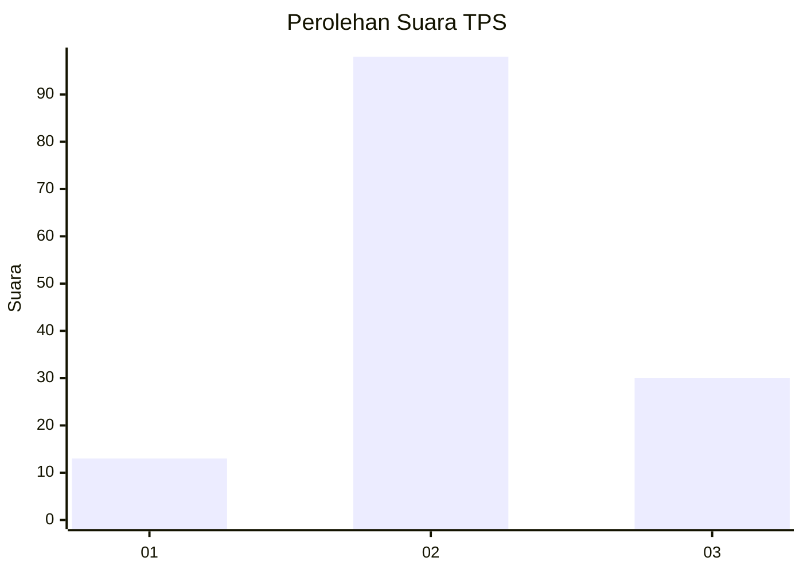
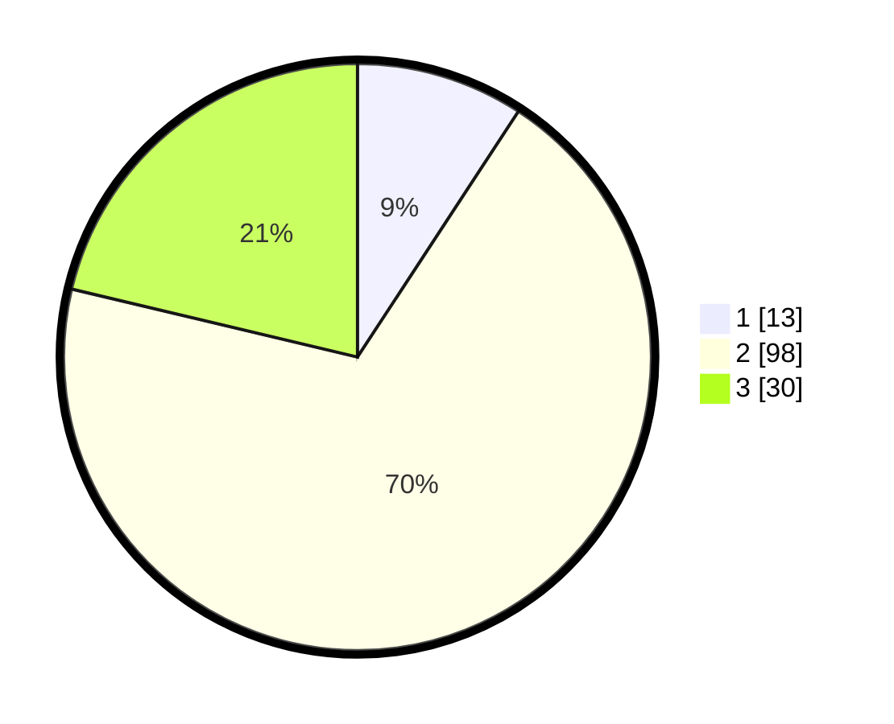

# Hasil

## Grafik

## Tabel

| No. | Nama Paslon    | Suara | Suara (raw) | Persentase |
|:--- |:-------------- | -----:| -----------:| ----------:|
| 1   | ANIES MUHAIMIN | 13    | [13][p-1]   | 9,22       |
| 2   | PRABOWO GIBRAN | 98    | [98][p-2]   | 69,50      |
| 3   | GANJAR MAHFUD  | 30    | [30][p-3]   | 21,28      |

[p-1]: https://github.com/gigit-pemilu/pemilu-2024/blob/main/pilpres/hitung-suara/sub/35-jawa-timur/sub/07-malang/sub/02-pagak/sub/2007-gampingan/sub/019-tps/sub/paslon-1.txt
[p-2]: https://github.com/gigit-pemilu/pemilu-2024/blob/main/pilpres/hitung-suara/sub/35-jawa-timur/sub/07-malang/sub/02-pagak/sub/2007-gampingan/sub/019-tps/sub/paslon-2.txt
[p-3]: https://github.com/gigit-pemilu/pemilu-2024/blob/main/pilpres/hitung-suara/sub/35-jawa-timur/sub/07-malang/sub/02-pagak/sub/2007-gampingan/sub/019-tps/sub/paslon-3.txt

## Foto C Plano

https://sirekap-obj-formc.kpu.go.id/58a3/pemilu/ppwp/35/07/02/20/07/3507022007019-20240219-211835--c12a6576-3cd2-4989-a37a-7e06641b1947.jpg

https://sirekap-obj-formc.kpu.go.id/58a3/pemilu/ppwp/35/07/02/20/07/3507022007019-20240214-230850--795eb4d6-140c-4914-9fd3-082ce9dd1a37.jpg

https://sirekap-obj-formc.kpu.go.id/58a3/pemilu/ppwp/35/07/02/20/07/3507022007019-20240217-185835--d2346213-46c7-47d6-a7ce-07098f3db5af.jpg

## Metadata

| Key        | Value               |
| ---------- | ------------------- |
| Time Stamp | 2024-02-19 22:00:00 |

