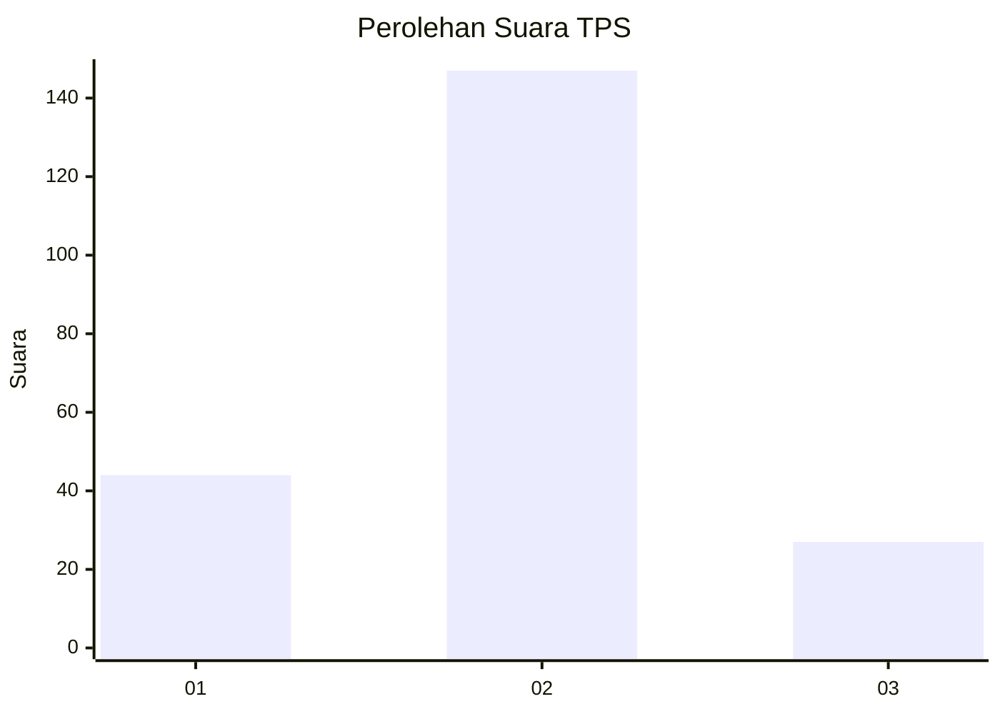
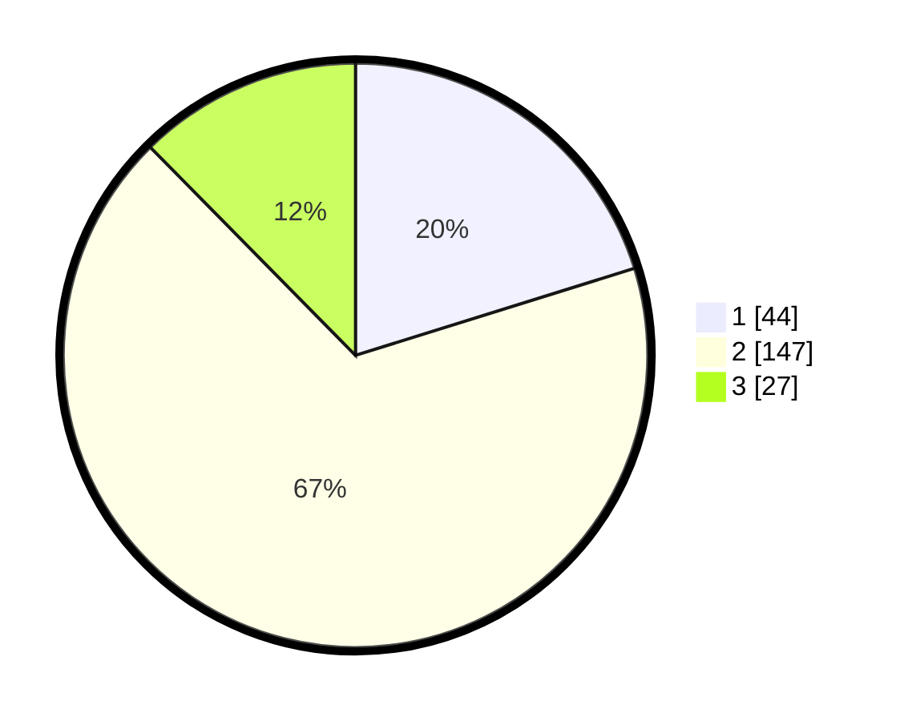

# Hasil

## Grafik

## Tabel

| No. | Nama Paslon    | Suara | Suara (raw) | Persentase |
|:--- |:-------------- | -----:| -----------:| ----------:|
| 1   | ANIES MUHAIMIN | 44    | [44][p-1]   | 20,18      |
| 2   | PRABOWO GIBRAN | 147   | [147][p-2]  | 67,43      |
| 3   | GANJAR MAHFUD  | 27    | [27][p-3]   | 12,39      |

[p-1]: https://github.com/gigit-pemilu/pemilu-2024/blob/main/pilpres/hitung-suara/sub/35-jawa-timur/sub/07-malang/sub/03-bantur/sub/2008-pringgodani/sub/003-tps/sub/paslon-1.txt
[p-2]: https://github.com/gigit-pemilu/pemilu-2024/blob/main/pilpres/hitung-suara/sub/35-jawa-timur/sub/07-malang/sub/03-bantur/sub/2008-pringgodani/sub/003-tps/sub/paslon-2.txt
[p-3]: https://github.com/gigit-pemilu/pemilu-2024/blob/main/pilpres/hitung-suara/sub/35-jawa-timur/sub/07-malang/sub/03-bantur/sub/2008-pringgodani/sub/003-tps/sub/paslon-3.txt

## Foto C Plano

https://sirekap-obj-formc.kpu.go.id/e6ee/pemilu/ppwp/35/07/03/20/08/3507032008003-20240218-081435--8e15bdf9-1f7e-4108-bbbf-a475c548a692.jpg

https://sirekap-obj-formc.kpu.go.id/e6ee/pemilu/ppwp/35/07/03/20/08/3507032008003-20240218-075831--e02371f8-e978-4fb5-8090-8da86929ca05.jpg

https://sirekap-obj-formc.kpu.go.id/e6ee/pemilu/ppwp/35/07/03/20/08/3507032008003-20240216-013048--a7577095-692f-4337-98cc-81878c345633.jpg

## Metadata

| Key        | Value               |
| ---------- | ------------------- |
| Time Stamp | 2024-02-19 06:16:00 |

