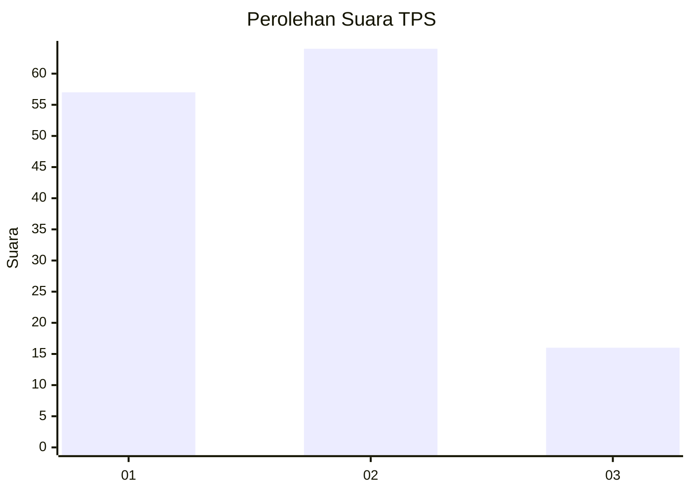
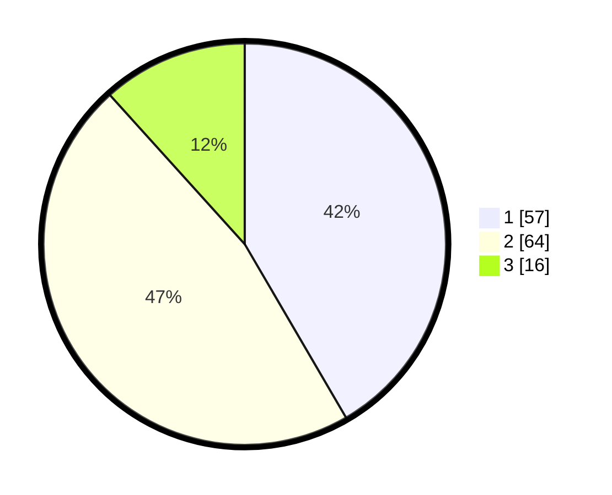

# Hasil

## Grafik

## Tabel

| No. | Nama Paslon    | Suara | Suara (raw) | Persentase |
|:--- |:-------------- | -----:| -----------:| ----------:|
| 1   | ANIES MUHAIMIN | 57    | [57][p-1]   | 41,61      |
| 2   | PRABOWO GIBRAN | 64    | [64][p-2]   | 46,72      |
| 3   | GANJAR MAHFUD  | 16    | [16][p-3]   | 11,68      |

[p-1]: https://github.com/gigit-pemilu/pemilu-2024/blob/main/pilpres/hitung-suara/sub/35-jawa-timur/sub/07-malang/sub/03-bantur/sub/2010-karangsari/sub/016-tps/sub/paslon-1.txt
[p-2]: https://github.com/gigit-pemilu/pemilu-2024/blob/main/pilpres/hitung-suara/sub/35-jawa-timur/sub/07-malang/sub/03-bantur/sub/2010-karangsari/sub/016-tps/sub/paslon-2.txt
[p-3]: https://github.com/gigit-pemilu/pemilu-2024/blob/main/pilpres/hitung-suara/sub/35-jawa-timur/sub/07-malang/sub/03-bantur/sub/2010-karangsari/sub/016-tps/sub/paslon-3.txt

## Foto C Plano

https://sirekap-obj-formc.kpu.go.id/732c/pemilu/ppwp/35/07/03/20/10/3507032010016-20240214-232810--4bbfc164-cb17-4d5a-93d5-175f6266a239.jpg

https://sirekap-obj-formc.kpu.go.id/732c/pemilu/ppwp/35/07/03/20/10/3507032010016-20240214-233140--312aefcf-9717-496a-9697-a10e0b794f55.jpg

https://sirekap-obj-formc.kpu.go.id/732c/pemilu/ppwp/35/07/03/20/10/3507032010016-20240214-233309--b2aac067-840b-4a1d-94b1-126cdd3d2bae.jpg

## Metadata

| Key        | Value               |
| ---------- | ------------------- |
| Time Stamp | 2024-02-17 18:00:00 |

## DATA PEMILIH TETAP

Jumlah pemilih dalam DPT: **638**.
 * L: **22**.
 * P: **866**.

## DATA PENGGUNA HAK PILIH

Jumlah pengguna hak pilih dalam DPT: **538**.
 * L: **72**.
 * P: **66**.

Jumlah pengguna hak pilih dalam DPTb: **888**.
 * L: **882**.
 * P: **8**.

Jumlah pengguna hak pilih dalam DPK: **5**.
 * L: **0**.
 * P: **807**.

Jumlah pengguna hak pilih: **540**.
 * L: **23**.
 * P: **53**.

## JUMLAH SUARA SAH DAN TIDAK SAH

JUMLAH SELURUH SUARA SAH: **137**.

JUMLAH SUARA TIDAK SAH: **3**.

JUMLAH SELURUH SUARA SAH DAN SUARA TIDAK SAH: **140**.

