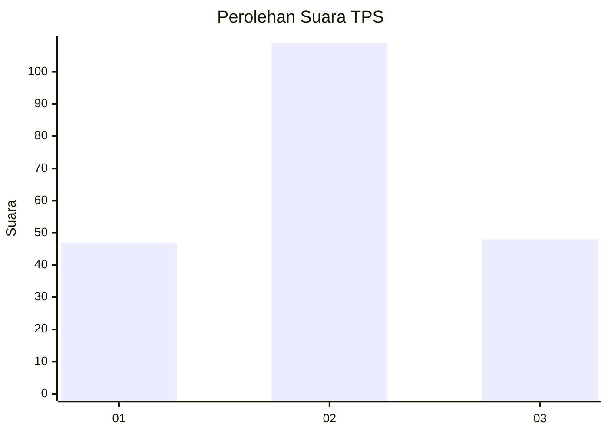
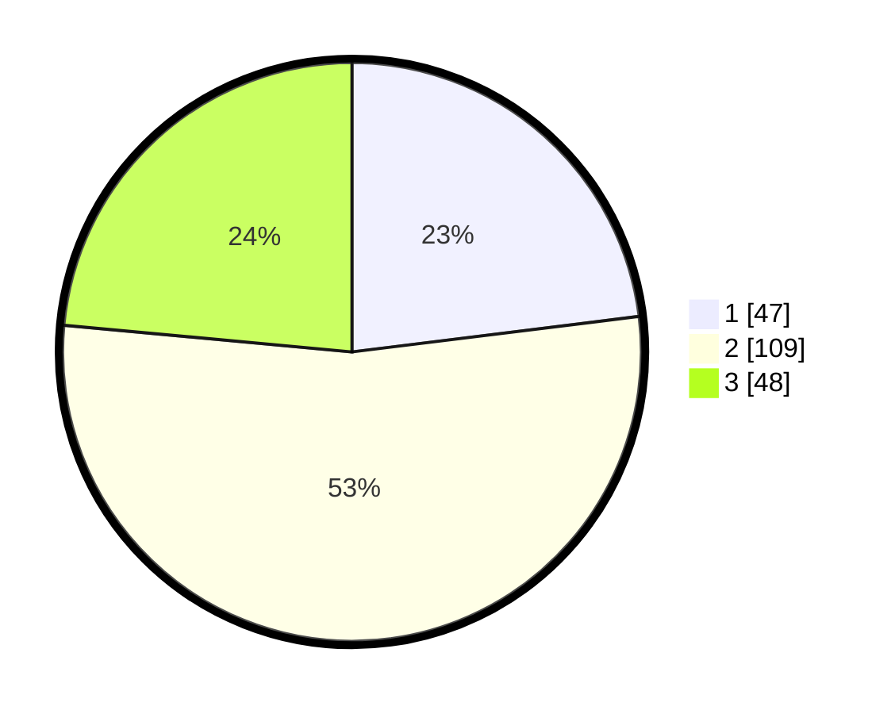

# Hasil

## Grafik

## Tabel

| No. | Nama Paslon    | Suara | Suara (raw) | Persentase |
|:--- |:-------------- | -----:| -----------:| ----------:|
| 1   | ANIES MUHAIMIN | 47    | [47][p-1]   | 23,04      |
| 2   | PRABOWO GIBRAN | 109   | [109][p-2]  | 53,43      |
| 3   | GANJAR MAHFUD  | 48    | [48][p-3]   | 23,53      |

[p-1]: https://github.com/gigit-pemilu/pemilu-2024/blob/main/pilpres/hitung-suara/sub/35-jawa-timur/sub/07-malang/sub/03-bantur/sub/2010-karangsari/sub/024-tps/sub/paslon-1.txt
[p-2]: https://github.com/gigit-pemilu/pemilu-2024/blob/main/pilpres/hitung-suara/sub/35-jawa-timur/sub/07-malang/sub/03-bantur/sub/2010-karangsari/sub/024-tps/sub/paslon-2.txt
[p-3]: https://github.com/gigit-pemilu/pemilu-2024/blob/main/pilpres/hitung-suara/sub/35-jawa-timur/sub/07-malang/sub/03-bantur/sub/2010-karangsari/sub/024-tps/sub/paslon-3.txt

## Foto C Plano

https://sirekap-obj-formc.kpu.go.id/7a41/pemilu/ppwp/35/07/03/20/10/3507032010024-20240227-163128--0e5c5450-76a5-463f-a5b4-a8e73eff5561.jpg

https://sirekap-obj-formc.kpu.go.id/7a41/pemilu/ppwp/35/07/03/20/10/3507032010024-20240227-163254--c3e16ffe-9517-4dbd-975f-c6758a75c388.jpg

https://sirekap-obj-formc.kpu.go.id/7a41/pemilu/ppwp/35/07/03/20/10/3507032010024-20240227-163536--b847b0d0-4269-4b16-b0f1-ea0a3b3547a2.jpg

## Metadata

| Key        | Value               |
| ---------- | ------------------- |
| Time Stamp | 2024-02-28 20:00:00 |

