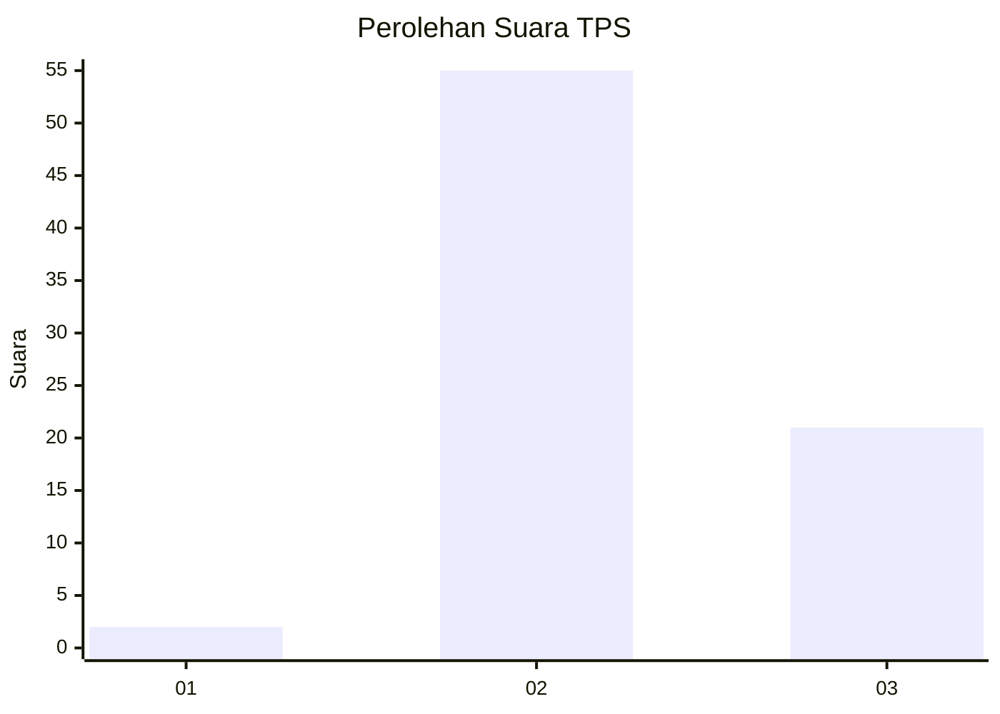
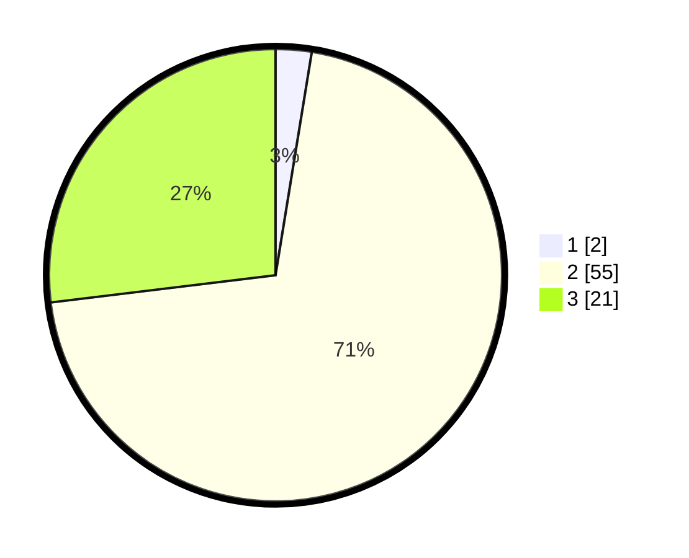

# Hasil

## Grafik

## Tabel

| No. | Nama Paslon    | Suara | Suara (raw) | Persentase |
|:--- |:-------------- | -----:| -----------:| ----------:|
| 1   | ANIES MUHAIMIN | 2     | [2][p-1]    | 2,56       |
| 2   | PRABOWO GIBRAN | 55    | [55][p-2]   | 70,51      |
| 3   | GANJAR MAHFUD  | 21    | [21][p-3]   | 26,92      |

[p-1]: https://github.com/gigit-pemilu/pemilu-2024-35-jawa-timur/blob/main/pilpres/hitung-suara/sub/35-jawa-timur/sub/07-malang/sub/04-sumbermanjing-wetan/sub/2002-tegalrejo/sub/009-tps/sub/paslon-1.txt
[p-2]: https://github.com/gigit-pemilu/pemilu-2024-35-jawa-timur/blob/main/pilpres/hitung-suara/sub/35-jawa-timur/sub/07-malang/sub/04-sumbermanjing-wetan/sub/2002-tegalrejo/sub/009-tps/sub/paslon-2.txt
[p-3]: https://github.com/gigit-pemilu/pemilu-2024-35-jawa-timur/blob/main/pilpres/hitung-suara/sub/35-jawa-timur/sub/07-malang/sub/04-sumbermanjing-wetan/sub/2002-tegalrejo/sub/009-tps/sub/paslon-3.txt

## Foto C Plano

https://sirekap-obj-formc.kpu.go.id/f32d/pemilu/ppwp/35/07/04/20/02/3507042002009-20240214-141135--1c76e8c2-5946-4d6f-9547-c7c19ff81b7c.jpg

https://sirekap-obj-formc.kpu.go.id/f32d/pemilu/ppwp/35/07/04/20/02/3507042002009-20240214-141236--82c62cb2-ca8b-4f78-b779-393387b274d7.jpg

https://sirekap-obj-formc.kpu.go.id/f32d/pemilu/ppwp/35/07/04/20/02/3507042002009-20240214-205056--e1212bc7-7229-4a14-a68b-afe1f40b4bd2.jpg

## Metadata

| Key        | Value               |
| ---------- | ------------------- |
| Time Stamp | 2024-02-14 21:46:01 |

## DATA PEMILIH TETAP

Jumlah pemilih dalam DPT: **85**.
 * L: **44**.
 * P: **41**.

## DATA PENGGUNA HAK PILIH

Jumlah pengguna hak pilih dalam DPT: **77**.
 * L: **41**.
 * P: **36**.

Jumlah pengguna hak pilih dalam DPTb: **1**.
 * L: **1**.
 * P: **0**.

Jumlah pengguna hak pilih dalam DPK: **0**.
 * L: **0**.
 * P: **0**.

Jumlah pengguna hak pilih: **78**.
 * L: **42**.
 * P: **36**.

## JUMLAH SUARA SAH DAN TIDAK SAH

JUMLAH SELURUH SUARA SAH: **78**.

JUMLAH SUARA TIDAK SAH: **0**.

JUMLAH SELURUH SUARA SAH DAN SUARA TIDAK SAH: **78**.

