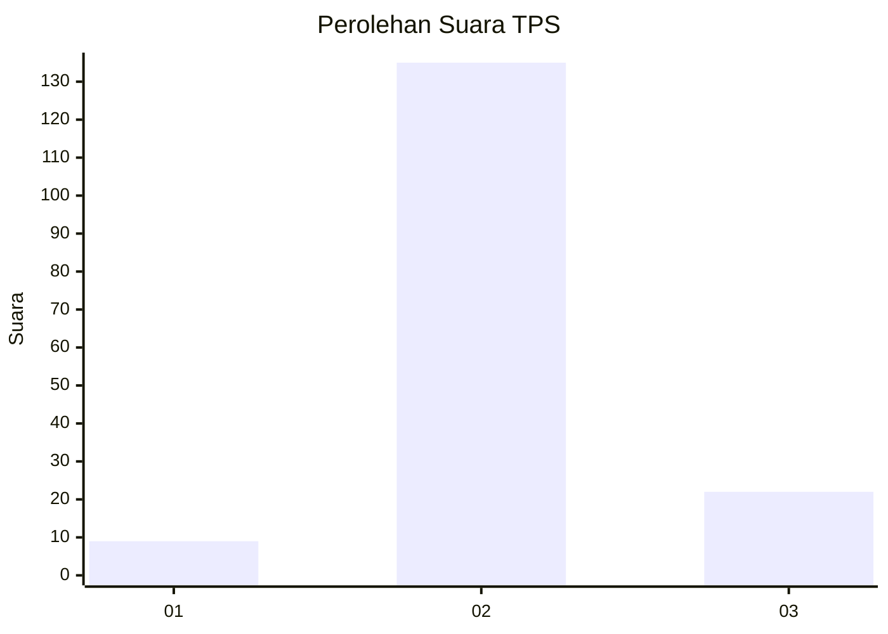
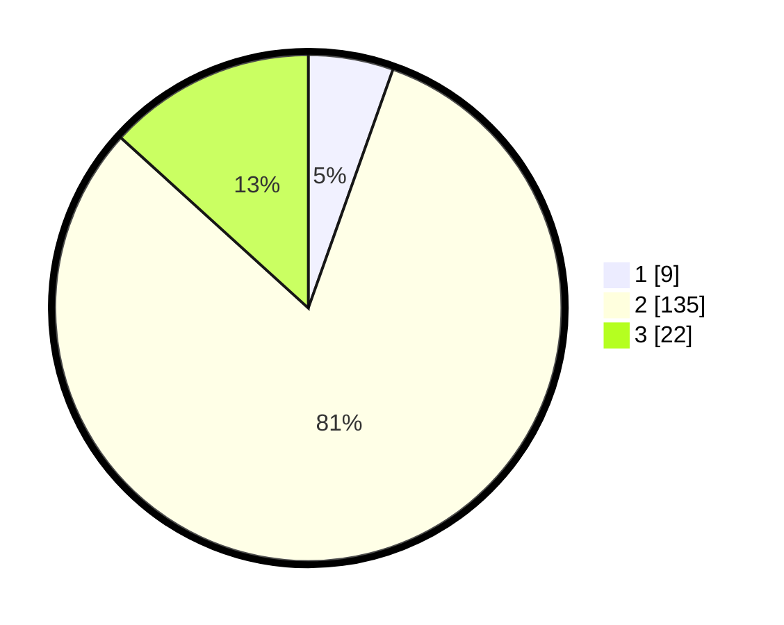

# Hasil

## Grafik

## Tabel

| No. | Nama Paslon    | Suara | Suara (raw) | Persentase |
|:--- |:-------------- | -----:| -----------:| ----------:|
| 1   | ANIES MUHAIMIN | 9     | [9][p-1]    | 5,42       |
| 2   | PRABOWO GIBRAN | 135   | [135][p-2]  | 81,33      |
| 3   | GANJAR MAHFUD  | 22    | [22][p-3]   | 13,25      |

[p-1]: https://github.com/gigit-pemilu/pemilu-2024-35-jawa-timur/blob/main/pilpres/hitung-suara/sub/35-jawa-timur/sub/07-malang/sub/04-sumbermanjing-wetan/sub/2003-sekarbanyu/sub/003-tps/sub/paslon-1.txt
[p-2]: https://github.com/gigit-pemilu/pemilu-2024-35-jawa-timur/blob/main/pilpres/hitung-suara/sub/35-jawa-timur/sub/07-malang/sub/04-sumbermanjing-wetan/sub/2003-sekarbanyu/sub/003-tps/sub/paslon-2.txt
[p-3]: https://github.com/gigit-pemilu/pemilu-2024-35-jawa-timur/blob/main/pilpres/hitung-suara/sub/35-jawa-timur/sub/07-malang/sub/04-sumbermanjing-wetan/sub/2003-sekarbanyu/sub/003-tps/sub/paslon-3.txt

## Foto C Plano

https://sirekap-obj-formc.kpu.go.id/ba67/pemilu/ppwp/35/07/04/20/03/3507042003003-20240219-161939--d9110b03-8b2b-4fe6-8bee-e490a752b1d4.jpg

https://sirekap-obj-formc.kpu.go.id/ba67/pemilu/ppwp/35/07/04/20/03/3507042003003-20240219-161951--29441859-6ff8-42e8-90c3-94c7993c7828.jpg

https://sirekap-obj-formc.kpu.go.id/ba67/pemilu/ppwp/35/07/04/20/03/3507042003003-20240219-162020--1923319d-7421-4df6-8443-2940187fb2f9.jpg

## Metadata

| Key        | Value               |
| ---------- | ------------------- |
| Time Stamp | 2024-02-19 19:00:00 |

