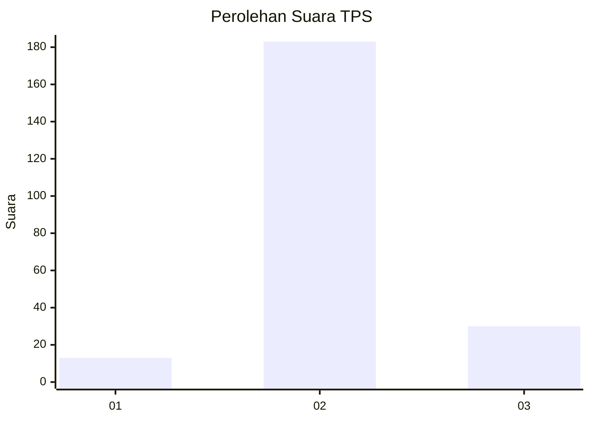
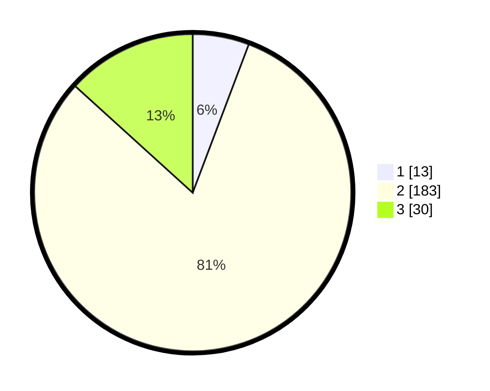

# Hasil

## Grafik

## Tabel

| No. | Nama Paslon    | Suara | Suara (raw) | Persentase |
|:--- |:-------------- | -----:| -----------:| ----------:|
| 1   | ANIES MUHAIMIN | 13    | [13][p-1]   | 5,75       |
| 2   | PRABOWO GIBRAN | 183   | [183][p-2]  | 80,97      |
| 3   | GANJAR MAHFUD  | 30    | [30][p-3]   | 13,27      |

[p-1]: https://github.com/gigit-pemilu/pemilu-2024/blob/main/pilpres/hitung-suara/sub/35-jawa-timur/sub/07-malang/sub/04-sumbermanjing-wetan/sub/2003-sekarbanyu/sub/004-tps/sub/paslon-1.txt
[p-2]: https://github.com/gigit-pemilu/pemilu-2024/blob/main/pilpres/hitung-suara/sub/35-jawa-timur/sub/07-malang/sub/04-sumbermanjing-wetan/sub/2003-sekarbanyu/sub/004-tps/sub/paslon-2.txt
[p-3]: https://github.com/gigit-pemilu/pemilu-2024/blob/main/pilpres/hitung-suara/sub/35-jawa-timur/sub/07-malang/sub/04-sumbermanjing-wetan/sub/2003-sekarbanyu/sub/004-tps/sub/paslon-3.txt

## Foto C Plano

https://sirekap-obj-formc.kpu.go.id/8204/pemilu/ppwp/35/07/04/20/03/3507042003004-20240219-173732--0b8fb2de-1854-4b5b-9921-fa408f5e6c89.jpg

https://sirekap-obj-formc.kpu.go.id/8204/pemilu/ppwp/35/07/04/20/03/3507042003004-20240215-005306--6d40ea63-ad60-4e55-86c9-5e4a80fe4688.jpg

https://sirekap-obj-formc.kpu.go.id/8204/pemilu/ppwp/35/07/04/20/03/3507042003004-20240215-005333--5e30e104-2f97-4a25-ba0b-7a19a6a44d6d.jpg

## Metadata

| Key        | Value               |
| ---------- | ------------------- |
| Time Stamp | 2024-02-19 18:00:00 |

