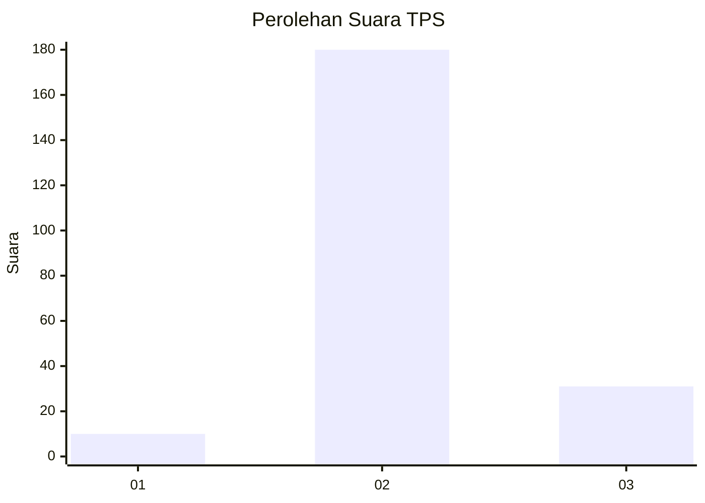
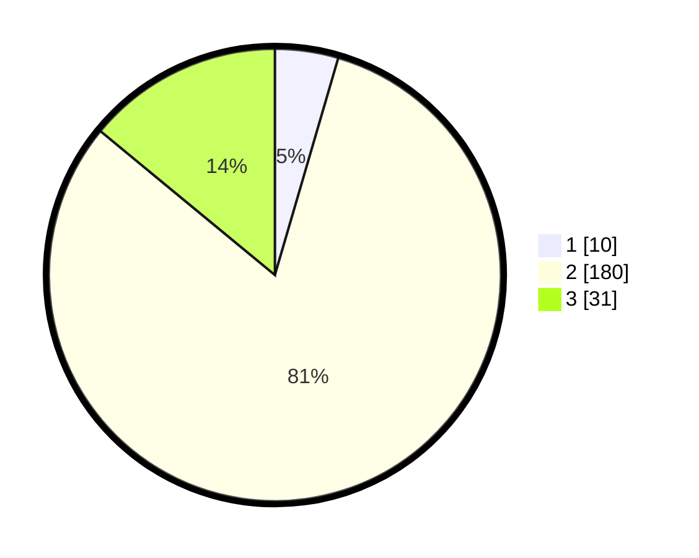

# Hasil

## Grafik

## Tabel

| No. | Nama Paslon    | Suara | Suara (raw) | Persentase |
|:--- |:-------------- | -----:| -----------:| ----------:|
| 1   | ANIES MUHAIMIN | 10    | [10][p-1]   | 4,52       |
| 2   | PRABOWO GIBRAN | 180   | [180][p-2]  | 81,45      |
| 3   | GANJAR MAHFUD  | 31    | [31][p-3]   | 14,03      |

[p-1]: https://github.com/gigit-pemilu/pemilu-2024/blob/main/pilpres/hitung-suara/sub/35-jawa-timur/sub/07-malang/sub/04-sumbermanjing-wetan/sub/2003-sekarbanyu/sub/005-tps/sub/paslon-1.txt
[p-2]: https://github.com/gigit-pemilu/pemilu-2024/blob/main/pilpres/hitung-suara/sub/35-jawa-timur/sub/07-malang/sub/04-sumbermanjing-wetan/sub/2003-sekarbanyu/sub/005-tps/sub/paslon-2.txt
[p-3]: https://github.com/gigit-pemilu/pemilu-2024/blob/main/pilpres/hitung-suara/sub/35-jawa-timur/sub/07-malang/sub/04-sumbermanjing-wetan/sub/2003-sekarbanyu/sub/005-tps/sub/paslon-3.txt

## Foto C Plano

https://sirekap-obj-formc.kpu.go.id/bb93/pemilu/ppwp/35/07/04/20/03/3507042003005-20240215-001702--e3c77ebe-37bd-49db-a37c-126aacc25de7.jpg

https://sirekap-obj-formc.kpu.go.id/bb93/pemilu/ppwp/35/07/04/20/03/3507042003005-20240215-001806--9dc7d7e9-4aeb-4ac4-a24e-d1c70536ac55.jpg

https://sirekap-obj-formc.kpu.go.id/bb93/pemilu/ppwp/35/07/04/20/03/3507042003005-20240214-233242--a067d385-41b0-4a95-9126-68e1ee174092.jpg

## Metadata

| Key        | Value               |
| ---------- | ------------------- |
| Time Stamp | 2024-02-19 06:16:00 |

