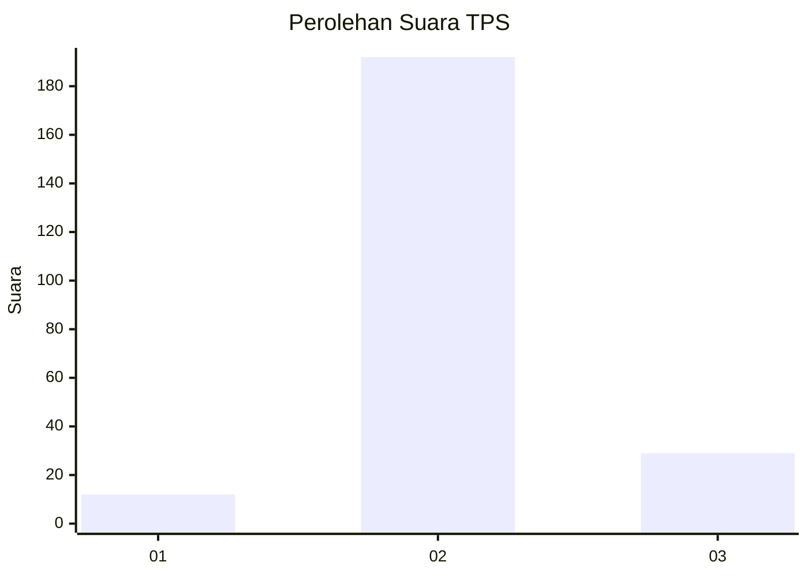
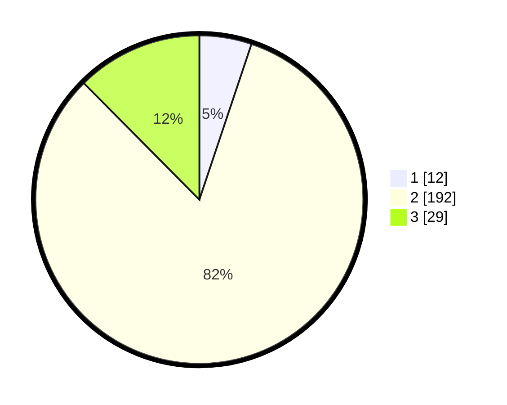

# Hasil

## Grafik

## Tabel

| No. | Nama Paslon    | Suara | Suara (raw) | Persentase |
|:--- |:-------------- | -----:| -----------:| ----------:|
| 1   | ANIES MUHAIMIN | 12    | [12][p-1]   | 5,15       |
| 2   | PRABOWO GIBRAN | 192   | [192][p-2]  | 82,40      |
| 3   | GANJAR MAHFUD  | 29    | [29][p-3]   | 12,45      |

[p-1]: https://github.com/gigit-pemilu/pemilu-2024-35-jawa-timur/blob/main/pilpres/hitung-suara/sub/35-jawa-timur/sub/07-malang/sub/04-sumbermanjing-wetan/sub/2003-sekarbanyu/sub/006-tps/sub/paslon-1.txt
[p-2]: https://github.com/gigit-pemilu/pemilu-2024-35-jawa-timur/blob/main/pilpres/hitung-suara/sub/35-jawa-timur/sub/07-malang/sub/04-sumbermanjing-wetan/sub/2003-sekarbanyu/sub/006-tps/sub/paslon-2.txt
[p-3]: https://github.com/gigit-pemilu/pemilu-2024-35-jawa-timur/blob/main/pilpres/hitung-suara/sub/35-jawa-timur/sub/07-malang/sub/04-sumbermanjing-wetan/sub/2003-sekarbanyu/sub/006-tps/sub/paslon-3.txt

## Foto C Plano

https://sirekap-obj-formc.kpu.go.id/b41a/pemilu/ppwp/35/07/04/20/03/3507042003006-20240219-115108--78771b42-228c-4861-81bd-0a5029c65667.jpg

https://sirekap-obj-formc.kpu.go.id/b41a/pemilu/ppwp/35/07/04/20/03/3507042003006-20240219-115256--bee88865-c1aa-4afd-86e6-12213bf391f4.jpg

https://sirekap-obj-formc.kpu.go.id/b41a/pemilu/ppwp/35/07/04/20/03/3507042003006-20240219-115401--48127206-d2c3-4409-a6ed-eef91e508ba3.jpg

## Metadata

| Key        | Value               |
| ---------- | ------------------- |
| Time Stamp | 2024-02-19 14:00:00 |

